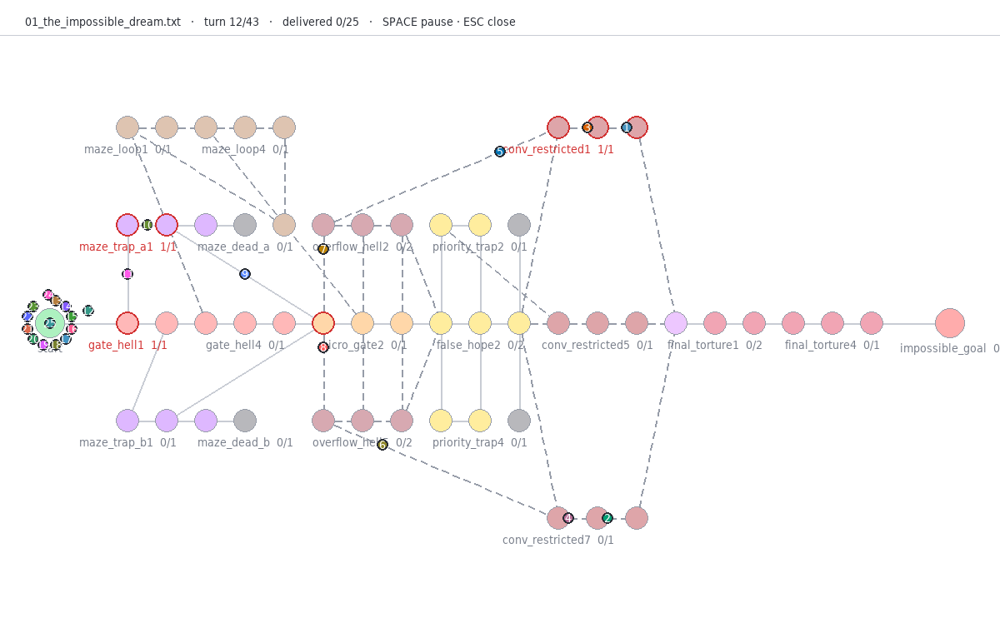
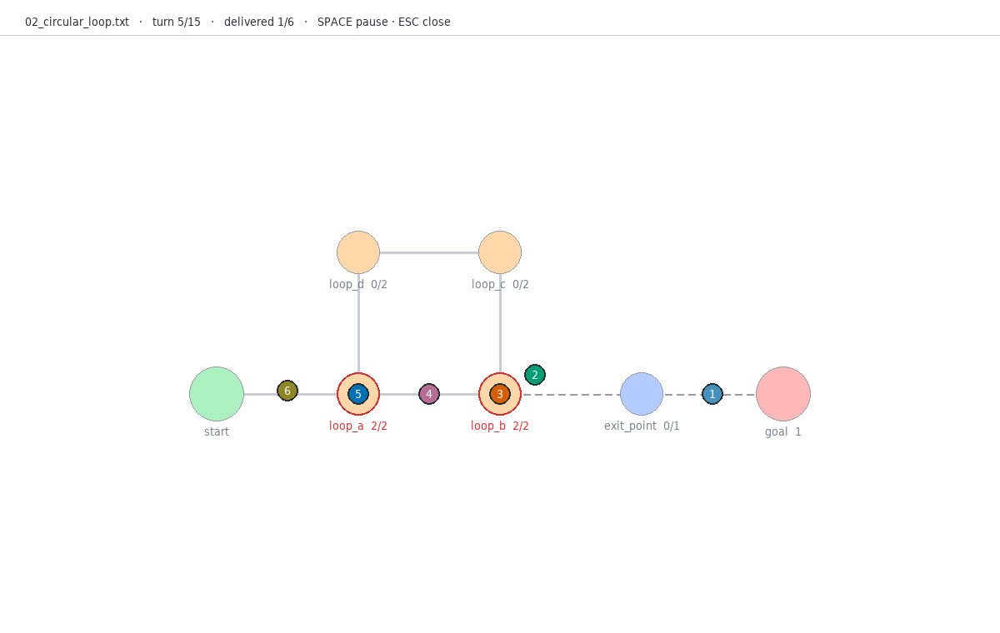
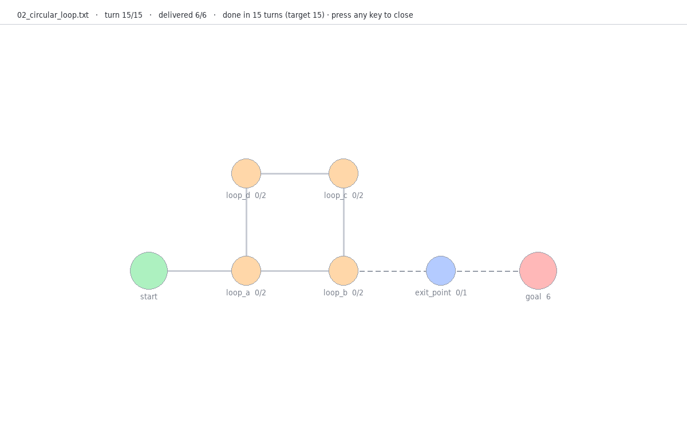

*This project has been created as part of the 42 curriculum by ariarcos.*

# Fly-In 2.0

> Route a whole swarm of drones from `start_hub` to `end_hub` through a graph
> of capacity-limited zones in as few turns as possible — and watch it happen.



## Description

Fly-In reads a map of **zones** (nodes with a type, coordinates and a
capacity) and **connections** (edges with a link capacity), and moves
`nb_drones` drones from the start hub to the end hub turn by turn. Every turn
must respect the rules of the subject: a zone never holds more than
`max_drones`, a connection never carries more than `max_link_capacity`,
`blocked` zones are walls, `priority` zones are preferred, and entering a
`restricted` zone takes two turns spent *in the air* on the connection.

The score is the number of turns. Fly-In plans cooperatively with
**WHCA\*** (Windowed Hierarchical Cooperative A\*, Silver 2005): each drone
searches in *space-time* `(zone, turn)` and books its route in a shared
reservation table, so the drones that plan later simply cannot choose a
colliding move. On the ten official maps it meets every target and beats the
challenger's 45 turns with **43**.

Output follows the subject exactly on `stdout`. The simulation plays in a
**pygame window** while the terminal narrates every turn as a colored event
log with drone colors and a legend, both advancing turn by turn together.
`SPACE` pauses the window, and the log waits for it.

## Instructions

Requirements: **Python ≥ 3.10**, `make`. One runtime dependency,
[`pygame-ce`](https://pyga.me) (the maintained community edition of pygame,
same `import pygame` API), for the graphical window; `flake8`, `mypy` and
`pytest` for development. `make install` installs all of them in `.venv`.

```console
$ make install                                   # creates .venv and installs everything (also plain `make`)
$ make run MAP=maps/oficial_maps/easy/01_linear_path.txt
$ make run MAP=maps/valid/bottleneck.txt ARGS="--delay 1 --metrics"
$ make capacity MAP=maps/valid/bottleneck.txt ARGS=-q  # per-turn capacity usage
$ make debug MAP=maps/valid/bottleneck.txt       # the program under pdb
$ make bench                                     # official benchmarks + config comparison
$ make test                                      # test suite
$ make lint && make lint-strict                  # flake8 + mypy (+ --strict)
$ make clean                                     # tool caches and __pycache__
```

Direct use and options:

```console
$ .venv/bin/python -m fly_in.main MAP [options]
```

| Option | Effect |
|---|---|
| `-w N`, `--window N` | WHCA\* window in turns (default 8) |
| `--view V` | `window`: pygame window + event log · `log`: event log only · `auto` (default): `window` if display available, else `log` |
| `-d S`, `--delay S` | Seconds per turn (defaults: window 0.8, log 0.25; `0` = as fast as possible) |
| `--metrics` | Print secondary metrics on `stderr` |
| `--capacity-info` | After each turn line, print zone and connection usage on `stderr` (`Zone X: Y/Z drones, Connection A-B: Y/Z capacity used`) |
| `-q`, `--quiet` | No visualization at all |

Colors are used only when `stderr` is a terminal and the `NO_COLOR`
variable is not set.

Because the visualization lives on `stderr`, `stdout` stays machine-readable:

```console
$ make run MAP=maps/valid/bottleneck.txt > out.txt   # the window and the log still play
$ wc -l < out.txt                                     # = number of turns
4
```

Invalid maps and bad arguments never produce a traceback: the program prints
`Error: <reason>` on `stderr` and exits with status 1 (2 for argument errors).

## Example

Input — [`maps/valid/bottleneck.txt`](maps/valid/bottleneck.txt): three
drones, one single-capacity zone between start and goal.

```
nb_drones: 3
start_hub: start 0 0
end_hub: goal 4 0
hub: narrow 2 0 [max_drones=1]
connection: start-narrow [max_link_capacity=1]
connection: narrow-goal [max_link_capacity=1]
```

Expected output (`stdout`):

```
D1-narrow
D1-goal D2-narrow
D2-goal D3-narrow
D3-goal
```

On turn 2, D1 leaves `narrow` and D2 enters it in the same turn: *drones
moving out of a zone free up capacity for that same turn*. Four turns is
optimal — `narrow` admits one drone per instant and each needs two turns to
cross.

A `restricted` zone produces two lines per drone, the connection and then the
zone ([`maps/valid/restricted_chain.txt`](maps/valid/restricted_chain.txt)):

```
D1-start-r1
D1-r1
D1-r1-r2
D1-r2
D1-goal
```

## Algorithm and implementation strategy

The pipeline, one module per step (each was built and tested before the next):

1. **Parser** (`fly_in/parsing`) — strict grammar, line-numbered errors, all
   file-wide rules (unique names, one start/end, known zones, no duplicate
   connections) enforced by `Graph`.
2. **Dijkstra** (`pathfinding/dijkstra.py`) — cost of *entering* a zone
   (1, or 2 for `restricted`), `blocked` never expanded, ties broken towards
   more `priority` zones.
3. **Abstract heuristic** (`pathfinding/abstract_distance.py`) — one reverse
   Dijkstra from `end_hub` gives the exact distance of every zone to the goal
   ignoring other drones. It is admissible (other drones can only delay) and it
   knows the topology: dead ends and unreachable zones are pruned.
4. **Reservation table** (`pathfinding/reservation_table.py`) — who occupies
   each zone and each connection at each instant, plus the direction of every
   move. Instant `t` is the world after `t` turns; a move leaving at `T` with
   cost `c` occupies the connection during `T … T+c-1` and the zone at `T+c`.
5. **WHCA\*** (`pathfinding/whca.py`) — A\* over `(zone, turn)` states with
   `f = g + h`. Successors are the neighbours the table allows **plus waiting
   in place** (the only way to yield). The search looks `W` turns ahead;
   beyond the window it trusts `h`, and a window that runs out returns a
   *partial* route, never "no route".
6. **Simulator** (`simulation/`) — every `W/2` turns it forgets the future
   (keeping the bookings of drones in the air) and replans. Each turn has two
   phases, *decide* then *apply*, so the result never depends on list order,
   and a third, *verify*, that recounts occupancy independently of the table.
7. **Output** (`output/formatter.py`) — `D<id>-<zone>` / `D<id>-<connection>`,
   one line per turn, sorted by drone id.

Design decisions worth knowing:

| Decision | Why |
|---|---|
| **Strict `restricted` reading**: the connection is occupied during both transit turns | Literal reading of *"the drone occupies the connection during transit"*. It costs turns on `medium/02` (15 instead of 10), where it is provably optimal: the capacity-1 link admits one drone every two turns |
| **No head-on swaps** on a connection (`would_swap`) | Two drones crossing each other on one link is physically impossible even if the capacity allows two |
| **Provisional bookings** before each planning round | Every drone first books "stay where I am" for the whole window and swaps it for its real route when it plans. Without it, an early planner could book a later drone's zone and leave it with no legal move |
| **Replan every `W/2` turns, and whenever a grounded drone runs out of route** | Always `W/2` turns of cooperation ahead. The second rule is needed on the challenger: drones in a chain of `restricted` zones are airborne at every scheduled replan |
| **Safety limit** `drones × zones × 4` turns | WHCA\* is not complete; a stuck run ends with an error naming every undelivered drone instead of hanging |
| **Planning order by id**, window `W = 8` | Measured below: `id` and `nearest_first` tie on every map; `farthest_first` and `rotating` are worse. The window does not change the result between 4 and 16 |

Complexity: the heuristic costs one Dijkstra, `O((Z + C) log Z)`. Each WHCA\*
search explores at most `Z · (W + 2)` states, each with `deg + 1` successors
checked in `O(1)` against the table, so a planning round costs about
`D · Z · W · deg · log(Z · W)`. Memory is dominated by the table: one entry per
booked `(zone, instant)` and `(connection, instant)`. The challenger (25 drones,
54 zones) is simulated in ~0.25 s.

### Benchmarks

`make bench`, W = 8, planning order by id:

| Level | Map | Drones | Target | **Turns** | Time |
|---|---|---|---|---|---|
| Easy | Linear path | 2 | ≤ 6 | **4** | < 1 ms |
| Easy | Simple fork | 4 | ≤ 8 | **4** | 1 ms |
| Easy | Basic capacity | 4 | ≤ 6 | **4** | < 1 ms |
| Medium | Dead end trap | 5 | ≤ 12 | **8** | 1 ms |
| Medium | Circular loop | 6 | ≤ 15 | **15** | 6 ms |
| Medium | Priority puzzle | 5 | ≤ 12 | **7** | 1 ms |
| Hard | Maze nightmare | 8 | ≤ 30 | **13** | 10 ms |
| Hard | Capacity hell | 12 | ≤ 35 | **16** | 23 ms |
| Hard | Ultimate challenge | 15 | ≤ 45 | **26** | 76 ms |
| Challenger | The Impossible Dream | 25 | beat 45 | **43** | 247 ms |

Configuration comparison — total turns over the ten maps:

| | order id | nearest first | farthest first | rotating |
|---|---|---|---|---|
| W = 4 | **140** | **140** | 230 | 170 |
| W = 8 | **140** | **140** | 266 | 177 |
| W = 16 | **140** | **140** | 276 | 207 |

`farthest_first` loses because of the provisional bookings: the drones behind
plan first and see the ones ahead "standing still" for the whole window.

### Known limitations

- WHCA\* is neither complete nor optimal: drones are planned greedily one
  after another. The safety limit turns a non-converging run into a clear
  error.
- `find_path` on its own cannot see drones that have not planned yet; the
  classic pathological case is documented in
  [`maps/valid/swap_corridor.txt`](maps/valid/swap_corridor.txt). `plan()`
  closes that gap with the provisional bookings.
- Under the strict `restricted` reading two maps cost more turns than under
  the lenient one: `medium/02` 15 vs 10 and `medium/03` 7 vs 6. Both are
  optimal under the strict reading, and running this same algorithm with the
  lenient reading gives exactly 10 and 6: the difference is the rule, not the
  search.

## Visual representation

The simulation itself takes milliseconds; the visual layer is about
*understanding* it. By default `make run` shows it on two screens that
advance **turn by turn together**: a pygame window and an event log in the
terminal. Both read the recorded simulation; neither computes anything, so
what they show is exactly what `stdout` says.

**The pygame window.** A deliberately minimal view, made to check the run
at a glance: white background, `pygame.draw` circles, lines and text, no
image files.



- The **map is laid out from the file's own coordinates**. Zones are flat
  pastel circles with a thin outline, colored by `color=` (named colors,
  `#rrggbb`, or a stable hash-derived hue for any other word) or, without
  it, by type: gray `normal`, yellow `priority`, orange `restricted`, dark
  gray with a cross `blocked`, green start and blue goal.
- Under each zone: its name and `occupied/max_drones`; a full zone turns its
  outline and label red. The goal shows how many drones have been delivered.
- **Drones are saturated dots with a dark outline and their number**, so
  they never blend with a zone of the same hue. They glide between zones
  with a smooth ease-in/ease-out; a drone flying into a `restricted` zone
  waits on the middle of its (dashed) connection for its two turns in the
  air, and a delivered drone shrinks into the goal.
- One status line at the top: map, turn, delivered count and the keys. At
  the end it shows the number of turns against the target until a key is
  pressed.



- **Keys**: `SPACE` pauses and resumes the animation (the terminal log waits
  for it); `ESC`, `Q` or closing the window removes it at once and the run
  carries on in the terminal.

**In the terminal — the event log** (`stderr`):

```
 ▌FLY-IN▐  MISSION LOG ━━━━━━━━━━━━━━━━━━━━━━━━━━━━━━━━━━━━━━━━━━━━━━━━━━━━━━━━
  MAP     bottleneck.txt
  SQUAD   3 drones · 3 zones · 2 links
  ENGINE  WHCA* · window 8
  VIEW    ◉ WINDOW  pygame · SPACE pause · ESC close

  » 3
  » 2
  » 1
  » GO
 ── T01 ────────────────────────────────────────────────────────── ▸ D1-narrow
   ⟳ replan · 3 drones planned · 0 kept in flight · 0.3 ms
   D1   → narrow
   ·    holding at start: D2 D3
   ⚠    narrow is FULL (1/1)
 ── T02 ────────────────────────────────────────────────── ▸ D1-goal D2-narrow
   D1   ★ DELIVERED to goal  ████░░░░░░░░ 1/3
   D2   → narrow
   ·    holding at start: D3
 …
═════════════════════════ MISSION COMPLETE · 4 TURNS ═════════════════════════
  moves 6 · moves/turn 1.50 · avg delivery T3.0 · waits 3 · peak airborne 0
  compute 0 ms · 1 replan · 3/3 delivered · capacities verified every turn
```

Each turn shows its `stdout` line, the replans, every move as an event
(take-offs, landings, deliveries with a progress bar), who is holding where,
and which zones just filled up. It is colored per drone, and plain text when
piped.

**Fallbacks.** Without a display or without a terminal (pipes, CI) the run
uses the event log alone; if pygame is missing or cannot open a window, it
says so and continues in the terminal. It never waits for a window that
cannot appear.

**Why it helps.** The subject's output says *what* each drone does, not
*why*. The window shows the constraints behind each decision — full zones,
two-turn flights, link capacities — on the real layout of the map, with
nothing else competing for attention. The event log adds what the window
leaves out (replans, who is holding where) and colors each drone with its
own color and a legend, making it easy to track individual drones. Together
they reveal the *why* of every move, and the log gives the exact per-turn
detail with the same line as `stdout`, so the two can be checked against each
other. For the raw numbers, `--capacity-info` prints the usage of every zone
and connection after each turn.

## Resources

- D. Silver, *Cooperative Pathfinding*, AIIDE 2005 — the origin of CA\*,
  HCA\* and WHCA\*, and of the space-time reservation table.
- G. Sharon et al., *Conflict-Based Search for Optimal Multi-Agent
  Pathfinding*, AIJ 2015 — for the vocabulary of vertex and edge (swap)
  conflicts.
- P. Hart, N. Nilsson, B. Raphael, *A Formal Basis for the Heuristic
  Determination of Minimum Cost Paths*, 1968 — A\* and admissible heuristics.
- Python documentation: `heapq`, `dataclasses`, `typing.Protocol`,
  `argparse`.
- [pygame-ce documentation](https://pyga.me/docs/): `pygame.draw`,
  `pygame.display`, `pygame.time.Clock`, `pygame.event`.
- ECMA-48 / "ANSI escape code" references for terminal colors, and
  [no-color.org](https://no-color.org) for the `NO_COLOR` convention.
- The Spanish documentation of this repository, all in
  [`entrega/`](entrega/README.md): rules, roadmap, architecture, algorithm,
  test plan, a build guide and a narrative per stage, flow diagrams, the
  defense documents and the subject itself.

**How AI was used.** Claude (Anthropic) was used as a pair programmer:

- to write and maintain the Spanish documentation in `entrega/` (the build
  guides for each stage and the narrative documents);
- to review the parser and domain model and fix the issues found before the
  reservation table;
- to implement, together with their tests, the cooperative search
  (`whca.py`), the simulator (`simulation/`), the output formatter, the
  terminal and pygame visualizations and the benchmark runner, following
  the design written in `entrega/build/`;
- to design the independent invariant validator and to mutation-test the
  suite (introducing bugs on purpose to check that the tests catch them);
- to audit the project against the subject (docstrings, object-oriented
  structure, exception handling, resource management), which led to moving
  every module-level helper into a class and handling closed pipes, and to
  write the defense documents (`entrega/defensa/`) and the flow diagrams
  (`entrega/referencia/07-diagramas.md`);
- to give each drone one stable color (Okabe-Ito, then golden-angle hues)
  shared by the window and the event log, with a legend, and to prepare the
  defense material (per-stage narratives, flow diagrams and the
  `--capacity-info` live-coding guide);
- to map every subject and evaluation-sheet requirement to the command that
  covers it and remove what nothing required or did not work (a terminal HUD,
  a `make` menu with loading screens, turn-by-turn navigation keys and four
  redundant flags), and to check every document against the current code;
- to prepare the delivery: translate every code comment and docstring to
  English, gather all the documentation in `entrega/` and bring it up to date
  with the minimal window and `--capacity-info`.

An earlier version showed the animation in a web browser. It was replaced by
the pygame window so that every delivered line of code is Python that can be
explained and defended in the peer review.

Every design decision is documented with its reasons in `entrega/build/`,
and every piece of AI-generated code was read, run and tested before being
kept.

All the documentation lives in [`entrega/`](entrega/README.md): narratives
for SP00–SP11, flow diagrams for the entire system, the visual architecture
with citations, a checklist against the evaluation sheet, the
`--capacity-info` live-coding guide and a changelog
([`entrega/CAMBIOS.md`](entrega/CAMBIOS.md)).
