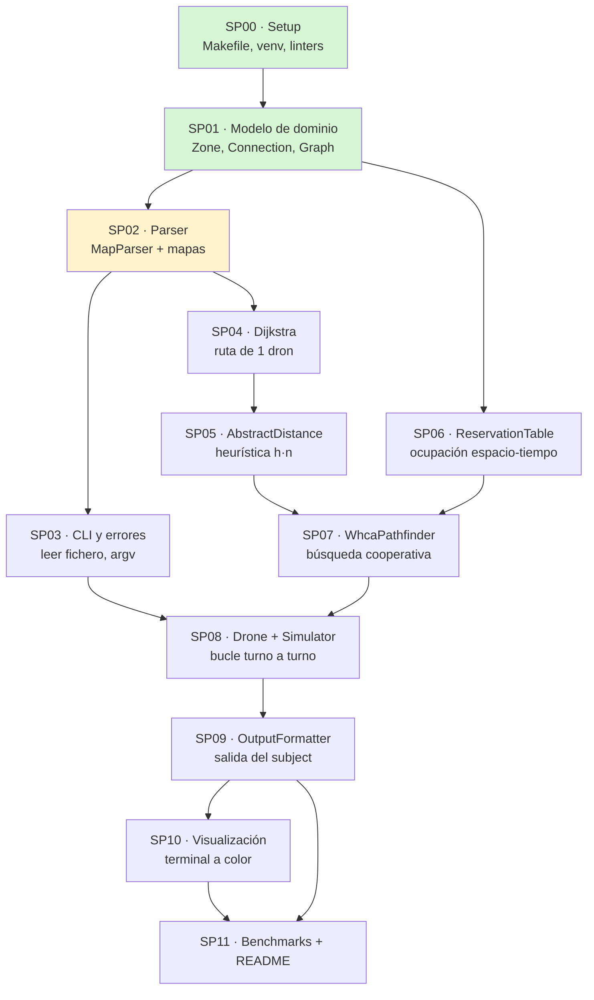

# Roadmap — los 12 subproyectos

El proyecto está partido en **12 subproyectos** (SP). Cada uno construye una
pieza que se puede probar sola, tiene prerequisitos explícitos y termina con un
criterio de salida verificable.

La regla de oro: **no empieces un subproyecto si el criterio de salida de sus
prerequisitos no está verde.** Casi todos los bugs difíciles de este proyecto
son en realidad bugs de una capa inferior que se manifiestan tres capas más
arriba: una heurística mal calculada parece un bug del cooperativo, y una tabla
de reservas que reserva `start_hub` parece un mapa irresoluble.

---

## Grafo de dependencias



Verde = hecho · amarillo = hecho con deuda anotada · sin color = pendiente.

**Las dos ramas paralelas.** Fíjate en que SP03 (CLI) y SP04→SP05 (pathfinding)
no dependen entre sí: después del parser puedes atacar cualquiera de las dos.
Y SP06 (tabla de reservas) solo necesita el modelo de dominio, así que puede
hacerse en cualquier momento. Solo SP07 las une.

---

## La tabla completa

| SP | Construye | Depende de | Criterio de salida |
|---|---|---|---|
| [**SP00**](./build/SP00-setup.md) | Estructura, `Makefile`, `.venv`, `flake8`+`mypy`, `.gitignore` | — | `make lint` y `make lint-strict` pasan sin errores |
| [**SP01**](./build/SP01-modelo-dominio.md) | `Zone`, `Connection`, `Graph` con sus invariantes | SP00 | Puedes construir un grafo a mano y consultar vecinos y costes |
| [**SP02**](./build/SP02-parser.md) | `MapParser`, `MapParseError`, mapas válidos y de error | SP01 | Los 10 mapas de error fallan con la causa correcta; los válidos parsean |
| [**SP03**](./build/SP03-cli-y-errores.md) | `main.py` real: argumentos, lectura de fichero, salida de error limpia | SP02 | `make run MAP=maps/valid/linear.txt` imprime el grafo; ningún input hace crashear con traceback |
| [**SP04**](./build/SP04-dijkstra.md) | `Dijkstra`: ruta de coste mínimo para un dron | SP02 | Ruta óptima verificable a mano; nunca pasa por `blocked`; prefiere `priority` en empates |
| [**SP05**](./build/SP05-heuristica-abstracta.md) | `AbstractDistance`: coste real de cada zona al objetivo | SP04 | `h(end)==0`; `h(start)` coincide con el coste de Dijkstra en mapas de prueba |
| [**SP06**](./build/SP06-tabla-reservas.md) | `ReservationTable`: zonas, enlaces, cruces, ventana | SP01 | Capacidades respetadas; `start`/`end` nunca bloquean; `clear_from` correcto |
| [**SP07**](./build/SP07-whca.md) | `WhcaPathfinder`: A\* en espacio-tiempo con ventana | SP05, SP06 | Un dron replica a Dijkstra; dos drones ante un cuello de botella se alternan sin deadlock |
| [**SP08**](./build/SP08-drone-y-simulador.md) | `Drone`, `DroneState`, `Simulator` con replanificación | SP07, SP03 | Todos los drones llegan; ninguna regla de ocupación se viola en ningún turno; el resultado no depende del orden de la lista |
| [**SP09**](./build/SP09-formato-salida.md) | `OutputFormatter` | SP08 | La salida coincide carácter a carácter con el formato del Cap. VII.5 |
| [**SP10**](./build/SP10-visualizacion.md) | `TerminalRenderer` (+ gráfico opcional) | SP09 | Alguien que no ha leído el código entiende qué pasa turno a turno |
| [**SP11**](./build/SP11-benchmarks-y-readme.md) | Medición, ajuste de `W`/prioridad, `README.md` final | SP09, SP10 | Cumples (o justificas) la tabla de benchmarks; un compañero clona y ejecuta sin preguntarte nada |

---

## Estado actual del repositorio

Lo que ya existe, verificado leyendo el código:

```
fly_in/
├── __init__.py
├── main.py                  # SP00: placeholder, imprime un mensaje
├── models/
│   ├── zone.py              # SP01 ✅ Zone + ALLOWED_ZONE_TYPES
│   ├── connection.py        # SP01 ✅ Connection + other_end() + name
│   ├── graph.py             # SP01 ✅ Graph + invariantes de nombres/roles
│   └── errors.py            # SP02 ✅ MapParseError(línea, contenido, causa)
└── parsing/
    └── map_parser.py        # SP02 ✅ clean_lines, parse_metadata,
                             #         parse_zone_line, parse_connection_line,
                             #         MapParser.parse
maps/
├── valid/     linear.txt · bottleneck.txt · single_drone.txt
└── errors/    10 mapas, uno por regla de validación
test/
└── test_parser.py           # 15 tests, todos pasan
```

**Lo siguiente que toca es SP03 o SP04.** SP03 es más corto y hace que el
proyecto sea ejecutable de verdad por primera vez; SP04 es el que abre toda la
rama del algoritmo. Si tienes una sesión larga por delante, empieza por SP04;
si tienes una tarde suelta, cierra SP03.

## Deuda técnica registrada

Cosas que ya sabemos que hay que corregir, con el subproyecto donde toca
hacerlo. No son bugs "por descubrir": están localizados y documentados.

| Deuda | Dónde | Se arregla en |
|---|---|---|
| `max_drones` negativo en `start_hub`/`end_hub` da error; el subject dice que se ignora | `map_parser.py` | [SP02](./build/SP02-parser.md#deuda-conocida) |
| Falta de `start_hub`/`end_hub` lanza `ValueError` pelado, no `MapParseError` | `map_parser.py` | [SP02](./build/SP02-parser.md#deuda-conocida) |
| Coordenadas negativas se rechazan; el subject solo exige que sean enteras | `map_parser.py` | [SP02](./build/SP02-parser.md#deuda-conocida) |
| `zone_type` es un `str` validado contra un `set`, no un `Enum` | `zone.py` | [SP01](./build/SP01-modelo-dominio.md#decisiones-tomadas) |
| `Zone` no expone `movement_cost()` ni `is_traversable()` | `zone.py` | [SP04](./build/SP04-dijkstra.md) |
| `main.py` no acepta argumentos ni lee ficheros | `main.py` | [SP03](./build/SP03-cli-y-errores.md) |
| Los mensajes de error del parser mezclan español e inglés | `map_parser.py` | [SP03](./build/SP03-cli-y-errores.md) |
