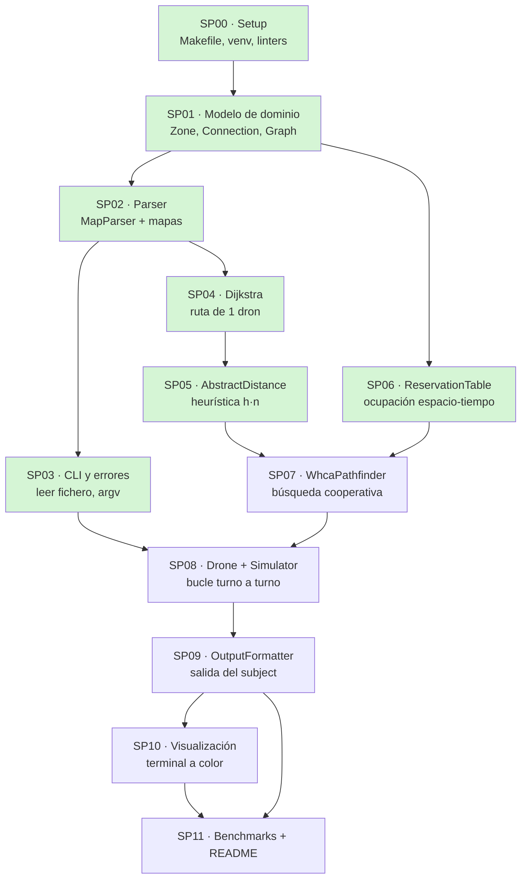

# Roadmap — los 12 subproyectos

El proyecto está partido en **12 subproyectos** (SP). Cada uno construye una
pieza que se puede probar sola, tiene prerequisitos explícitos y termina con un
criterio de salida verificable.

La regla de oro: **no empieces un subproyecto si el criterio de salida de sus
prerequisitos no está verde.** Casi todos los bugs difíciles de este proyecto
son en realidad bugs de una capa inferior que se manifiestan tres capas más
arriba: una heurística mal calculada parece un bug del cooperativo, y una tabla
de reservas que reserva `start_hub` parece un mapa irresoluble.

---

## Grafo de dependencias


```mermaid
flowchart TD
    SP00[SP00 · Setup<br/>Makefile, venv, linters] --> SP01[SP01 · Modelo de dominio<br/>Zone, Connection, Graph]
    SP01 --> SP02[SP02 · Parser<br/>MapParser + mapas]
    SP02 --> SP03[SP03 · CLI y errores<br/>leer fichero, argv]
    SP02 --> SP04[SP04 · Dijkstra<br/>ruta de 1 dron]
    SP04 --> SP05[SP05 · AbstractDistance<br/>heurística h·n]
    SP01 --> SP06[SP06 · ReservationTable<br/>ocupación espacio-tiempo]
    SP05 --> SP07[SP07 · WhcaPathfinder<br/>búsqueda cooperativa]
    SP06 --> SP07
    SP07 --> SP08[SP08 · Drone + Simulator<br/>bucle turno a turno]
    SP03 --> SP08
    SP08 --> SP09[SP09 · OutputFormatter<br/>salida del subject]
    SP09 --> SP10[SP10 · Visualización<br/>terminal a color]
    SP09 --> SP11[SP11 · Benchmarks + README]
    SP10 --> SP11

    style SP00 fill:#d5f5d5
    style SP01 fill:#d5f5d5
    style SP02 fill:#d5f5d5
    style SP03 fill:#d5f5d5
    style SP04 fill:#d5f5d5
    style SP05 fill:#d5f5d5
    style SP06 fill:#d5f5d5
```

Verde = hecho · amarillo = hecho con deuda anotada · sin color = pendiente.

**Las dos ramas paralelas.** Fíjate en que SP03 (CLI) y SP04→SP05 (pathfinding)
no dependen entre sí: después del parser puedes atacar cualquiera de las dos.
Y SP06 (tabla de reservas) solo necesita el modelo de dominio, así que puede
hacerse en cualquier momento. Solo SP07 las une.

---

## La tabla completa

| SP | Construye | Depende de | Criterio de salida |
|---|---|---|---|
| [**SP00**](./build/SP00-setup.md) | Estructura, `Makefile`, `.venv`, `flake8`+`mypy`, `.gitignore` | — | `make lint` y `make lint-strict` pasan sin errores |
| [**SP01**](./build/SP01-modelo-dominio.md) | `Zone`, `Connection`, `Graph` con sus invariantes | SP00 | Puedes construir un grafo a mano y consultar vecinos y costes |
| [**SP02**](./build/SP02-parser.md) | `MapParser`, `MapParseError`, mapas válidos y de error | SP01 | Los 10 mapas de error fallan con la causa correcta; los válidos parsean |
| [**SP03**](./build/SP03-cli-y-errores.md) | `main.py` real: argumentos, lectura de fichero, salida de error limpia | SP02 | `make run MAP=maps/valid/linear.txt` imprime el grafo; ningún input hace crashear con traceback |
| [**SP04**](./build/SP04-dijkstra.md) | `Dijkstra`: ruta de coste mínimo para un dron | SP02 | Ruta óptima verificable a mano; nunca pasa por `blocked`; prefiere `priority` en empates |
| [**SP05**](./build/SP05-heuristica-abstracta.md) | `AbstractDistance`: coste real de cada zona al objetivo | SP04 | `h(end)==0`; `h(start)` coincide con el coste de Dijkstra en mapas de prueba |
| [**SP06**](./build/SP06-tabla-reservas.md) | `ReservationTable`: zonas, enlaces, cruces, ventana | SP01 | Capacidades respetadas; `start`/`end` nunca bloquean; `clear_from` correcto |
| [**SP07**](./build/SP07-whca.md) | `WhcaPathfinder`: A\* en espacio-tiempo con ventana | SP05, SP06 | Un dron replica a Dijkstra; dos drones ante un cuello de botella se alternan sin deadlock |
| [**SP08**](./build/SP08-drone-y-simulador.md) | `Drone`, `DroneState`, `Simulator` con replanificación | SP07, SP03 | Todos los drones llegan; ninguna regla de ocupación se viola en ningún turno; el resultado no depende del orden de la lista |
| [**SP09**](./build/SP09-formato-salida.md) | `OutputFormatter` | SP08 | La salida coincide carácter a carácter con el formato del Cap. VII.5 |
| [**SP10**](./build/SP10-visualizacion.md) | `ReplayRecorder`, `EventLog`, `Scene`, `PygameView`, `Session` (ventana pygame + log de eventos) | SP09 | Alguien que no ha leído el código entiende qué pasa turno a turno |
| [**SP11**](./build/SP11-benchmarks-y-readme.md) | Medición, ajuste de `W`/prioridad, `README.md` final | SP09, SP10 | Cumples (o justificas) la tabla de benchmarks; un compañero clona y ejecuta sin preguntarte nada |

---

## Estado actual del repositorio

**Proyecto completo: SP00–SP11 hechos.** Verificado ejecutando el código (433
tests verdes, `make lint` y `make lint-strict` limpios, `flake8` a 79
columnas) y repetido en una copia limpia del repositorio.

```
fly_in/
├── main.py                  # SP03/SP09/SP10 ✅ argumentos, errores limpios,
│                            #        stdout solo con líneas de turno,
│                            #        --view, --metrics, --delay
├── benchmarks.py            # SP11 ✅ objetivos oficiales + make bench
├── models/
│   ├── zone.py              # SP01 ✅ Zone, ZoneType, UNLIMITED, movement_cost(),
│   │                        #        is_traversable()
│   ├── connection.py        # SP01 ✅ Connection + other_end() + name
│   ├── graph.py             # SP01 ✅ Graph + invariantes + índices O(1):
│   │                        #        neighbors(), connection_between()
│   └── errors.py            # SP02 ✅ MapError, MapParseError, MapValidationError
├── parsing/
│   └── map_parser.py        # SP02 ✅ parser con metadatos estrictos
├── pathfinding/
│   ├── dijkstra.py          # SP04 ✅ ruta de un dron + distances_from()
│   ├── abstract_distance.py # SP05 ✅ heurística h(n) por Dijkstra inverso
│   ├── reservation_table.py # SP06 ✅ ocupación espacio-temporal + release()
│   └── whca.py              # SP07 ✅ WhcaPathfinder, Step, criterios de orden
├── simulation/
│   ├── drone.py             # SP08 ✅ Drone, DroneState
│   ├── simulator.py         # SP08 ✅ Simulator, Move, observadores: bucle en
│   │                        #        dos fases, replanificación, verificación
│   ├── metrics.py           # SP11 ✅ métricas secundarias desde la traza
│   └── errors.py            # SP08 ✅ SimulationError
├── output/
│   └── formatter.py         # SP09 ✅ OutputFormatter
└── visualization/
    ├── palette.py           # SP10 ✅ colores (cualquier nombre), ANSI, 16/24 bits
    ├── recorder.py          # SP10 ✅ grabador: posiciones y línea por turno
    ├── scene.py             # SP10 ✅ fotogramas precalculados (sin pygame)
    ├── pygame_view.py       # SP10 ✅ la ventana pygame
    ├── event_log.py         # SP10 ✅ log de eventos de la terminal
    └── session.py           # SP10 ✅ elige la vista; ventana y log a la par
maps/
├── valid/         9 mapas pequeños, uno por comportamiento
├── errors/        10 mapas, uno por regla de validación
└── oficial_maps/  los 10 mapas oficiales (easy/medium/hard/challenger)
test/
├── test_parser.py            # SP01/SP02
├── test_cli.py               # SP03 (+ stdout limpio, --delay, stderr cerrado)
├── test_dijkstra.py          # SP04
├── test_abstract_distance.py # SP05
├── test_reservation_table.py # SP06
├── test_whca.py              # SP07
├── test_simulator.py         # SP08 + validador de invariantes
├── test_output_format.py     # SP09
├── test_visualization.py     # SP10
├── test_session.py           # SP10 · vistas, log, escena y ventana pygame
└── test_metrics.py           # SP11 + objetivos oficiales
```

Dijkstra y `AbstractDistance` se han verificado además contra una
implementación independiente (Bellman-Ford) en los 10 mapas oficiales y en
cientos de grafos aleatorios, y el desempate por `priority` contra fuerza bruta.

**Resultados:** los 10 mapas oficiales cumplen su objetivo (tabla completa en
[SP11](./build/SP11-benchmarks-y-readme.md#decisiones-tomadas)); el challenger
se resuelve en 43 turnos.

**Antes de entregar:** confirmar el login de la primera línea del
[`README.md`](../README.md) (`ariarcos`) y revisar la sección *How AI was
used*.

## Deuda técnica registrada

Cosas que ya sabemos que hay que corregir, con el subproyecto donde toca
hacerlo. No son bugs "por descubrir": están localizados y documentados.

Ninguna pendiente.

Resuelto en SP07: un dron que planificaba antes podía reservar entrar en la
zona de otro que aún no había planificado y dejarlo sin salida. `plan()` hace
ahora una reserva provisional de la posición de todos antes de planificar. Ver
[SP07](./build/SP07-whca.md#resuelto-en-plan-la-reserva-provisional).

Resuelto antes de SP06: `zone_type` como `Enum ZoneType`, `max_drones` ignorado en start/end, errores de
archivo como `MapValidationError`, coordenadas negativas, `movement_cost()` /
`is_traversable()`, CLI real, mensajes de error en inglés, fichero vacío sin
traceback, metadatos estrictos, `start_hub`/`end_hub` no `blocked`, vecinos en
O(1), `.pyc` fuera de git y `docs/build/` fuera del `.gitignore`.
