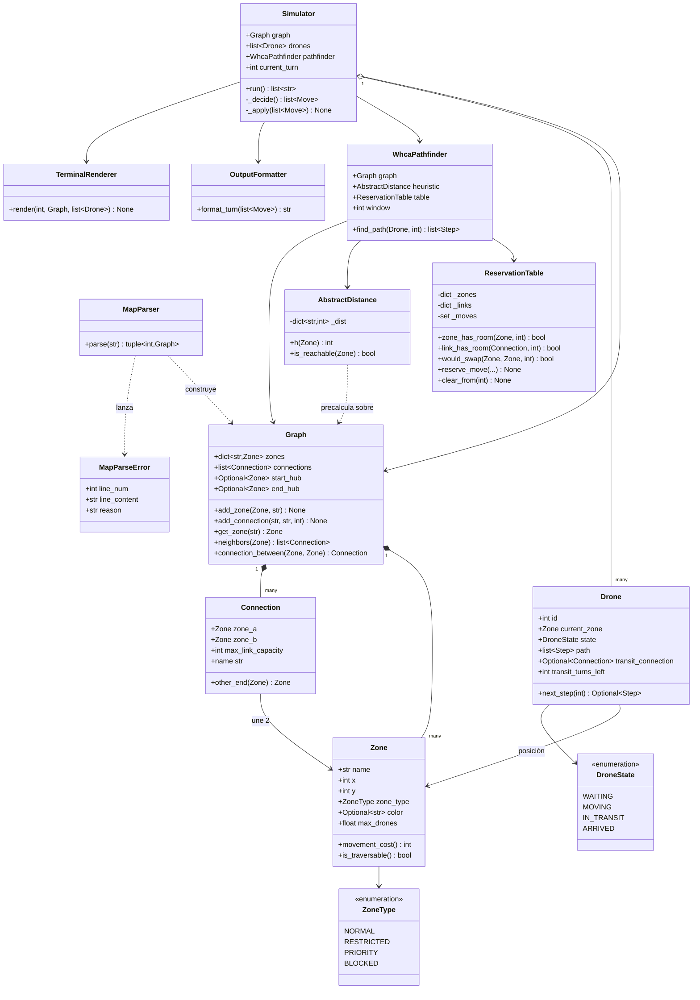
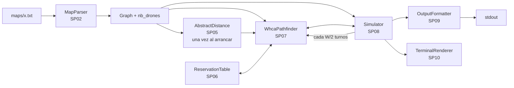

# Arquitectura — diseño orientado a objetos

## Principios

1. **Separación estricta en cuatro capas**: parseo → pathfinding → simulación →
   presentación. Cada una se puede testear sin las demás. Esta es la razón por
   la que los subproyectos se pueden cerrar de uno en uno.
2. **Sin librerías de grafos.** Prohibido por el subject. `Zone`, `Connection` y
   `Graph` son tuyos.
3. **El `Graph` es inmutable tras el parseo.** Lo que cambia turno a turno es el
   *estado de ocupación*, y ese estado vive en `ReservationTable` y `Simulator`,
   nunca dentro de `Zone`.
4. **Type hints en todo.** Cada función, cada atributo. `mypy --strict` debe
   pasar.
5. **Los errores llevan contexto.** Ningún `raise ValueError("error")`: siempre
   qué línea, qué valor y qué se esperaba.

⚠️ **No lo des por sentado — por qué el estado de ocupación no va en `Zone`**
Es tentador poner `self.drones_inside: list[Drone]` dentro de `Zone`. No lo
hagas. El pathfinding necesita preguntar *"¿estará libre esta zona en el turno
17?"*, que es una pregunta sobre el **futuro**, no sobre el presente. Una zona
no tiene un ocupante: tiene una **historia temporal** de ocupantes, y esa
historia pertenece a la tabla de reservas. Además, un `Graph` sin estado se
reutiliza entre tests y entre replanificaciones sin resetear nada.

---

## Estructura de módulos

Estado actual y destino. Cada archivo indica en qué subproyecto nace.

```
fly_in/
├── main.py                        # SP03 — punto de entrada, argumentos, orquestación
├── models/                        # El dominio. Sin lógica de algoritmo.
│   ├── zone.py                    # SP01 ✅ Zone, ZoneType
│   ├── connection.py              # SP01 ✅ Connection
│   ├── graph.py                   # SP01 ✅ Graph
│   └── errors.py                  # SP02 ✅ MapParseError (+ SimulationError en SP08)
├── parsing/
│   └── map_parser.py              # SP02 ✅ MapParser
├── pathfinding/                   # Se crea en SP04
│   ├── dijkstra.py                # SP04 — Dijkstra, ruta de un dron
│   ├── abstract_distance.py       # SP05 — AbstractDistance, la heurística h(n)
│   ├── reservation_table.py       # SP06 — ReservationTable
│   └── whca.py                    # SP07 — WhcaPathfinder, SearchNode
├── simulation/                    # Se crea en SP08
│   ├── drone.py                   # SP08 — Drone, DroneState
│   └── simulator.py               # SP08 — Simulator
├── output/                        # Se crea en SP09
│   └── formatter.py               # SP09 — OutputFormatter
└── visualization/                 # Se crea en SP10
    ├── terminal_view.py           # SP10 — TerminalRenderer
    └── graphic_view.py            # SP10 — GraphicRenderer (opcional)
```

⚠️ **No lo des por sentado — cada carpeta necesita su `__init__.py`**
`fly_in/pathfinding/` sin `__init__.py` no es un paquete importable. Cuando
crees una carpeta nueva, crea el `__init__.py` vacío en el mismo commit, o el
`import fly_in.pathfinding.dijkstra` fallará y perderás diez minutos buscando
dónde está el typo. Los subproyectos lo recuerdan en su primer paso.

**Por qué las carpetas vacías no están en el repo.** No existen todavía porque
un archivo vacío no aporta nada y confunde a quien lee el repo (parece que hay
código donde no lo hay). Cada subproyecto empieza creando los suyos.

---

## Diagrama de clases



---

## El flujo completo, de fichero a salida



Lee el diagrama así: el parser corre **una vez**, `AbstractDistance` corre **una
vez**, y el `Simulator` llama al pathfinder **cada `W/2` turnos** para
replanificar contra la tabla de reservas actualizada.

---

## Decisiones de diseño, justificadas

Esta tabla es tu guion para la peer-review. Cada fila es una pregunta que te
pueden hacer y su respuesta preparada.

| Decisión | Alternativas | Por qué esta |
|---|---|---|
| Nodo de búsqueda `(zona, turno)` en vez de solo `zona` | Recalcular Dijkstra puro cada turno para cada dron | En espacio-tiempo, "otro dron está aquí en el turno T" se convierte en un obstáculo más que la búsqueda evita de forma natural — sin detección de colisiones a posteriori |
| Ocupación en `ReservationTable`, no en `Zone` | Lista de drones dentro de cada `Zone` | El pathfinding pregunta por el futuro, no por el presente; y mantiene `Graph` inmutable y reutilizable |
| `Connection` como objeto | Diccionario de adyacencia `dict[str, list[str]]` | Guarda `max_link_capacity`, expone `other_end()` y tiene un `name` estable — que es justo lo que hace falta para la salida `D1-hub-roof1` |
| Planificación **secuencial** por dron | Búsqueda conjunta de los N drones a la vez (espacio de estados producto) | La búsqueda conjunta es exponencial en el número de drones; con 25 drones es inviable. CA\* secuencial es la solución estándar del paper de Silver |
| **WHCA\*** (con ventana) en vez de CA\* puro | CA\*, HCA\* | La ventana acota el coste de búsqueda y **resuelve los bloqueos de forma natural** al replanificar: sin ella habría que detectar y tratar los deadlocks como caso especial. Ver [`04-algoritmo.md`](./04-algoritmo.md) |
| Heurística = Dijkstra inverso desde `end_hub` | Distancia euclídea entre coordenadas `x`/`y` | La euclídea ignora la topología y mete a los drones en callejones sin salida. El Dijkstra inverso da el coste **real** mínimo de cada zona al objetivo, es admisible, y cuesta una sola ejecución al arrancar |
| Errores de parseo como excepción con línea y causa | Devolver `None` / lista de errores acumulada | El subject exige parar el programa con un mensaje que indique línea y causa *(Cap. VII.4)*. Una excepción tipada lo hace imposible de ignorar por accidente |
| Dos fases (decidir → aplicar) en el simulador | Aplicar movimientos según se recorre la lista de drones | La regla "las salidas liberan capacidad en el mismo turno" haría que el resultado dependiera del orden de la lista. Con dos fases es determinista |

*(Añade aquí tus propias decisiones a medida que avances — especialmente el
valor de `W` que elijas y el criterio de prioridad entre drones, que son las dos
que más se prestan a "¿y por qué no de la otra forma?".)*
