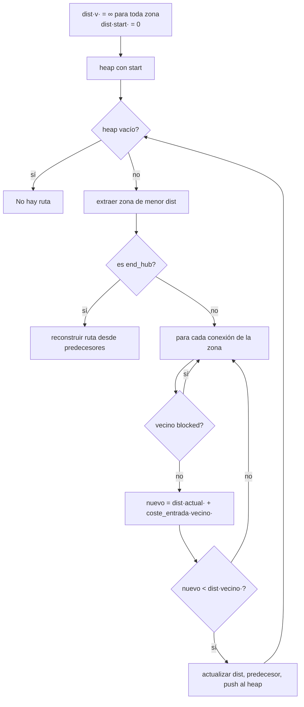

# El algoritmo — de Dijkstra a WHCA\*

Este documento es la **teoría**. Explica qué algoritmo usamos, por qué, y qué
problema resuelve cada escalón. El *cómo implementarlo* está en los
subproyectos [SP04](./build/SP04-dijkstra.md) a [SP07](./build/SP07-whca.md).

Referencia: Silver, D. (2005). *Cooperative Pathfinding*. AAAI AIIDE.
<https://cdn.aaai.org/ojs/18726/18726-52-22369-1-10-20210928.pdf>

---

## 0. Por qué esto no es "un Dijkstra y ya"

El problema que plantea el subject **no** es "encontrar el camino más corto".
Es: *encontrar N caminos que no se estorben entre sí, minimizando el turno en
que llega el último dron*.

La diferencia es enorme. Con un solo dron, la ruta óptima es la más corta. Con
varios drones y capacidades limitadas, la ruta más corta para todos es
normalmente **la peor solución global**: todos se amontonan en el mismo pasillo,
se bloquean, y el último llega tardísimo. La solución buena reparte los drones
entre rutas alternativas, y a veces hace que un dron **espere a propósito** o dé
un rodeo para que otro pase.

Esto tiene nombre propio en la literatura: **MAPF**, Multi-Agent Path Finding.
Resolverlo de forma óptima es NP-difícil. Lo que vamos a construir es la
aproximación estándar y práctica.

---

## 1. Escalón 1 — Dijkstra ([SP04](./build/SP04-dijkstra.md))

Un dron, grafo estático, sin nadie más. Búsqueda de coste mínimo.

**El coste de una arista lo fija el tipo de la zona destino:**

| Tipo de zona destino | Coste | ¿Se expande? |
|---|---|---|
| `normal` | 1 | sí |
| `priority` | 1 (preferida en empates) | sí |
| `restricted` | 2 | sí |
| `blocked` | — | **nunca** |



**Complejidad:** `O((V + E) log V)` con heap binario.

⚠️ **No lo des por sentado — por qué Dijkstra y no BFS**
BFS encuentra el camino con menos *aristas*. Aquí las aristas tienen costes
distintos (una `restricted` cuesta 2), así que "menos saltos" ≠ "menos turnos".
BFS te daría rutas subóptimas en cuanto hubiera una `restricted` de por medio.

### Cómo se implementa la preferencia por `priority`

`priority` cuesta lo mismo que `normal`, así que no puedes meterla en el coste
sin romper la correspondencia coste↔turnos. Se implementa como **criterio de
desempate**: la clave del heap es una tupla

```
(coste_total, -numero_de_zonas_priority_en_la_ruta, contador_de_desempate)
```

Python compara tuplas elemento a elemento: primero minimiza el coste; solo si
empata, el `-num_priority` hace ganar a la ruta con **más** zonas `priority`
(negado, porque el heap saca el mínimo); y el contador final garantiza que
nunca se intente comparar objetos `Zone` entre sí.

⚠️ **No lo des por sentado — el contador de desempate no es opcional**
Si dos entradas del heap empatan en los dos primeros elementos, Python pasa a
comparar el tercero. Si ahí hay un `Zone`, obtienes
`TypeError: '<' not supported between instances of 'Zone'`. Un entero
incremental global como tercer elemento lo hace imposible.

---

## 2. Escalón 2 — el tiempo como dimensión: Cooperative A\*

Con varios drones, la idea central es que **el nodo de búsqueda deja de ser
`zona` y pasa a ser `(zona, turno)`**.

Eso lo cambia todo: "el dron 2 estará en `corridorA` en el turno 5" se convierte
en un obstáculo del espacio de búsqueda, exactamente igual que una zona
`blocked` — pero solo en el turno 5. La búsqueda lo esquiva **sola**, sin que
tengas que escribir ninguna detección de colisiones.

El mecanismo son tres piezas:

1. Una **tabla de reservas** global: qué `(zona, turno)` y qué `(conexión,
   turno)` están ocupados y por quién ([SP06](./build/SP06-tabla-reservas.md)).
2. Los drones planifican **de uno en uno**. Cada uno busca esquivando las
   reservas de los anteriores.
3. Al terminar, la ruta del dron se **graba** en la tabla antes de planificar el
   siguiente.

Y una consecuencia que a menudo se olvida:

⚠️ **No lo des por sentado — "esperar" es un vecino más**
Desde `(zona, turno)`, uno de los sucesores es `(la misma zona, turno + 1)`. Si
no lo incluyes, un dron ante un pasillo temporalmente ocupado **no encuentra
ninguna ruta** y tu algoritmo concluirá que el mapa es irresoluble. Esperar es
justo el mecanismo por el que un dron cede el paso, y el subject lo lista como
movimiento válido explícito *(Cap. VII.3: "Stay in place")*.

⚠️ **No lo des por sentado — cierra por `(zona, turno)`, no por `zona`**
La lista de cerrados de un A\* normal guarda zonas visitadas. Aquí eso sería un
bug: la misma zona en el turno 3 y en el turno 9 son **estados distintos**, y a
veces la solución pasa por volver a un sitio más tarde. Cierra por la tupla.

---

## 3. Escalón 3 — WHCA\*: la ventana

CA\* tal cual tiene dos problemas serios:

| Problema | Consecuencia |
|---|---|
| Cada dron planifica su ruta **entera** hasta el final | Con 25 drones el espacio `(zona, turno)` explota. Y una reserva tomada para el turno 3 condiciona hasta el turno 40 |
| Una heurística mala (distancia en línea recta) ignora la topología | Los drones se meten en callejones sin salida y la búsqueda expande nodos inútiles a mansalva |

El paper de Silver resuelve los dos en dos pasos:

| Algoritmo | Qué añade |
|---|---|
| **CA\*** | Espacio-tiempo + tabla de reservas |
| **HCA\*** | Heurística **abstracta**: la distancia real al objetivo ignorando a los demás drones, precalculada una vez |
| **WHCA\*** | **Ventana** temporal: cada dron solo coopera dentro de los próximos `W` turnos; más allá, confía en la heurística |

### Por qué la heurística abstracta nos sale casi gratis

Ya vas a implementar Dijkstra en SP04. Ejecútalo **una sola vez desde `end_hub`
hacia atrás** sobre todo el grafo y obtienes el coste mínimo real de *cada* zona
hasta el objetivo. Esa tabla es tu `h(n)`:

- **es admisible** (nunca sobreestima: es el coste real sin otros drones),
- **conoce la topología**: guía a los drones alrededor de las zonas `blocked` y
  fuera de los callejones sin salida,
- cuesta **una** ejecución extra de Dijkstra al arrancar, no `V` ejecuciones.

Ver [SP05](./build/SP05-heuristica-abstracta.md), que incluye el detalle
delicado: al recorrer hacia atrás, el coste que sumas sigue siendo el de **entrar
en la zona que estás expandiendo**, no el de la que dejas.

### Por qué la ventana resuelve los deadlocks sin código especial

Este es el argumento más importante de toda la elección de diseño.

Sin ventana, si dos drones se bloquean mutuamente, tienes que **detectar** el
deadlock y **tratarlo** como caso especial: código frágil, difícil de probar y
lleno de casos raros.

Con ventana, replanificas cada `W/2` turnos con la tabla de reservas
actualizada. Un dron que quedó atrapado detrás de otro simplemente obtiene una
ruta nueva en la siguiente ventana, con la información nueva. El deadlock deja
de ser un caso especial y pasa a ser "una replanificación más".

### El precio: qué pierdes

WHCA\* **no garantiza optimalidad global ni completitud**. Existen
configuraciones patológicas —dos drones que deben intercambiar posiciones en un
pasillo de una sola zona sin apartadero— donde la ventana no basta y el
algoritmo puede no converger.

Por eso [SP08](./build/SP08-drone-y-simulador.md) impone un **límite de turnos
de seguridad** con un mensaje de error claro: el subject dice que un programa que
se cuelga durante la review cuenta como no funcional *(Cap. III.1)*.

⚠️ **Documenta esta limitación en el README.** Saber exactamente dónde falla tu
algoritmo es una de las cosas que mejor demuestra que lo entiendes. "No es
completo, y este es el contraejemplo" vale mucho más en una review que "funciona
siempre".

### Elegir `W`

| `W` | Efecto |
|---|---|
| 4–8 | Búsquedas muy rápidas, muchas replanificaciones, resultado más subóptimo |
| 8–16 | Punto dulce para grafos de decenas de zonas |
| > 32 | Se acerca a CA\* completo: mejor calidad, coste creciente |

Hazlo **configurable** por línea de comandos. Poder decir en la review *"con
W=8 resuelvo hard 2 en 28 turnos; con W=16 en 25, pero tarda el triple"*
responde literalmente a una de las preguntas que el subject sugiere al evaluador
*("What optimizations did you implement?", Cap. VII.7)*.

---

## 4. La prioridad entre drones

Los drones planifican de uno en uno, y **quien planifica primero se lleva las
mejores reservas**. El criterio de orden importa, y no es obvio cuál es mejor:

| Criterio | Ventaja | Inconveniente |
|---|---|---|
| **Por ID** | Determinista y trivial | El dron 1 acapara siempre la ruta buena; el último sale siempre perjudicado |
| **Por `h(posición)` descendente** | Los que están más lejos eligen primero. Suele reducir el turno del último en llegar — que es exactamente tu métrica | Menos intuitivo de explicar |
| **Rotatorio** | Reparte la ventaja entre ventanas | Más difícil de depurar: la misma entrada puede dar trazas distintas por turno |

**Prueba dos y quédate con el que mejor puntúe**, y anota la comparación en
[`05-plan-de-pruebas.md`](./05-plan-de-pruebas.md). Un evaluador valora
muchísimo más *"probé A y B; B daba 3 turnos menos en hard 2"* que *"elegí B"*.

---

## 5. Complejidad

| Pieza | Coste |
|---|---|
| Dijkstra de un dron | `O((V + E) log V)` |
| `AbstractDistance` (una vez al arrancar) | `O((V + E) log V)` |
| Una búsqueda WHCA\* de un dron | `O((V·W + E·W) log(V·W))` — el tiempo es una dimensión más, acotada por la ventana |
| Simulación completa | `N` drones × `T/(W/2)` replanificaciones × coste de una búsqueda |

Anota en el plan de pruebas cómo escala **en la práctica** con tus mapas: el
subject pregunta explícitamente por la complejidad y por si cacheas o
recalculas rutas *(Cap. VII.1)*.
