# Diagramas de flujo del proyecto

Todos los diagramas de lo construido **hasta SP06**, sacados del código real
(no del plan). Hay uno por subproyecto y tres vistas de cómo se relacionan.
Lo que aún no existe (SP07–SP11) aparece con línea discontinua y en gris.

**Cómo leerlos**

| Forma | Significa |
|---|---|
| Rectángulo | Un paso que siempre se ejecuta |
| Rombo | Una decisión (`if`) |
| Estadio `([ ])` | Inicio o fin: lo que devuelve la función |
| Hexágono `{{ }}` | Una excepción que se lanza |
| Línea discontinua `-.->` | Algo que ocurrirá en un subproyecto futuro |

---

## Índice

- [Relación 1 — dependencias entre subproyectos](#relación-1--dependencias-entre-subproyectos)
- [Relación 2 — flujo de datos del programa](#relación-2--flujo-de-datos-del-programa)
- [Relación 3 — dependencias entre módulos](#relación-3--dependencias-entre-módulos-imports)
- [SP00 — Setup y Makefile](#sp00--setup-y-makefile)
- [SP01 — Modelo de dominio](#sp01--modelo-de-dominio)
- [SP02 — Parser](#sp02--parser)
- [SP03 — CLI y errores](#sp03--cli-y-errores)
- [SP04 — Dijkstra](#sp04--dijkstra)
- [SP05 — Heurística abstracta](#sp05--heurística-abstracta)
- [SP06 — Tabla de reservas](#sp06--tabla-de-reservas)

---

## Relación 1 — dependencias entre subproyectos

Una flecha `A → B` significa "B no se puede empezar sin A verde".

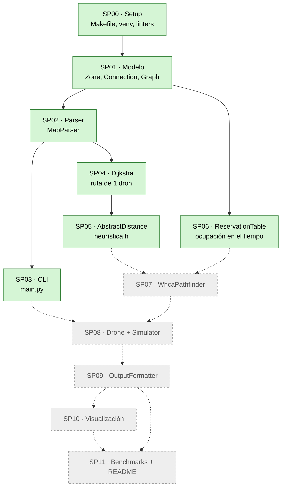

**Lo que hay que ver aquí:**
- Tras el parser el trabajo se abre en **dos ramas independientes**: la del
  algoritmo (SP04 → SP05) y la de la ocupación (SP06, que solo necesita el
  modelo). SP07 es el primer punto donde se juntan.
- SP03 (CLI) no lo necesita nadie hasta SP08, que es cuando el programa
  empieza a simular de verdad.

---

## Relación 2 — flujo de datos del programa

Qué recorre un mapa desde el archivo hasta la pantalla. Verde: lo que ya pasa
hoy al ejecutar `make run`. Gris: lo que se añadirá.

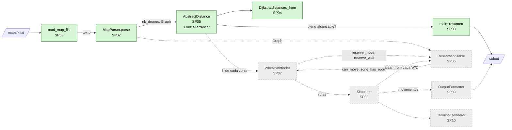

**Lo que hay que ver aquí:**
- El parser y la heurística corren **una sola vez**. Lo que se repite en
  bucle (a partir de SP07/SP08) es el ciclo tabla ⇄ buscador ⇄ simulador.
- `ReservationTable` (SP06) ya existe y está probada, pero todavía nadie la
  usa desde `main`: su primer cliente será SP07.

---

## Relación 3 — dependencias entre módulos (imports)

Quién importa a quién, verificado con `grep` sobre el código. Las flechas van
de "el que importa" a "el importado": ninguna vuelve hacia arriba, así que no
hay dependencias circulares.

```mermaid
flowchart TD
    main["main.py<br/>SP03"]
    parser["parsing/map_parser.py<br/>SP02"]
    dijkstra["pathfinding/dijkstra.py<br/>SP04"]
    heur["pathfinding/abstract_distance.py<br/>SP05"]
    table["pathfinding/reservation_table.py<br/>SP06"]
    graph["models/graph.py"]
    conn["models/connection.py"]
    zone["models/zone.py"]
    errors["models/errors.py"]

    main --> parser
    main --> heur
    main --> errors
    parser --> graph
    parser --> zone
    parser --> errors
    heur --> dijkstra
    heur --> graph
    heur --> zone
    dijkstra --> graph
    dijkstra --> zone
    table --> graph
    table --> conn
    table --> zone
    graph --> conn
    graph --> zone
    conn --> zone
```

**Lo que hay que ver aquí:**
- `models/` no importa nada de fuera de `models/`: el dominio no sabe que
  existen el parser ni el pathfinding. Por eso se puede testear solo.
- `reservation_table.py` no importa `dijkstra` ni `abstract_distance`: SP06 es
  independiente de SP04/SP05, igual que en la Relación 1.

---

## SP00 — Setup y Makefile

Qué hace cada regla del `Makefile`.

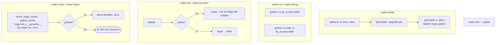

**Por qué `clean` no borra `.venv`:** el subject dice que `clean` borra
archivos temporales y cachés. El entorno no es temporal: borrarlo obliga a
reinstalar. Para eso existe `fclean`.

---

## SP01 — Modelo de dominio

### `Graph.add_zone(zone, role)`

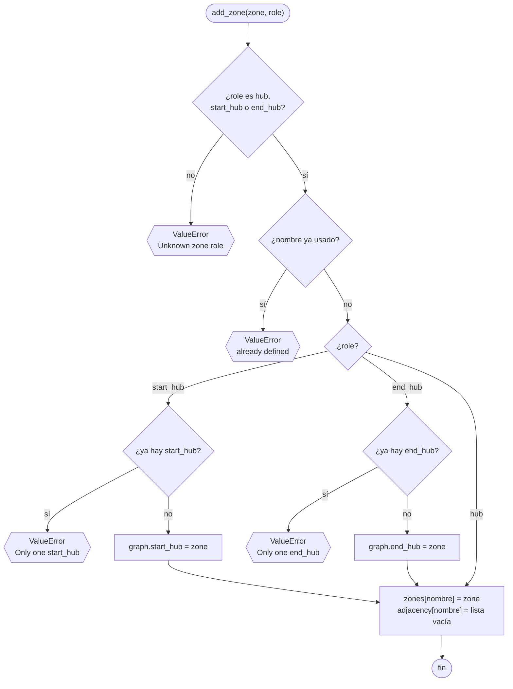

### `Graph.add_connection(origin, destination, capacidad)`

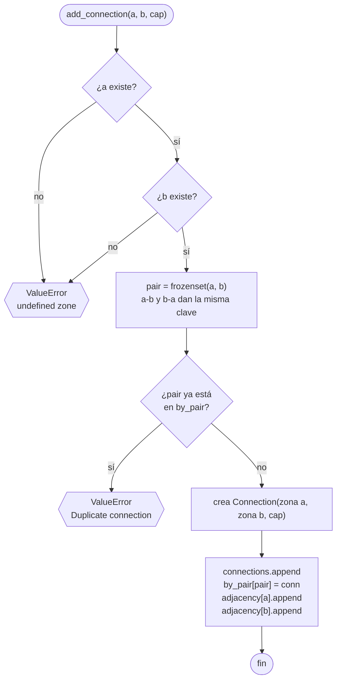

### Las dos consultas O(1)

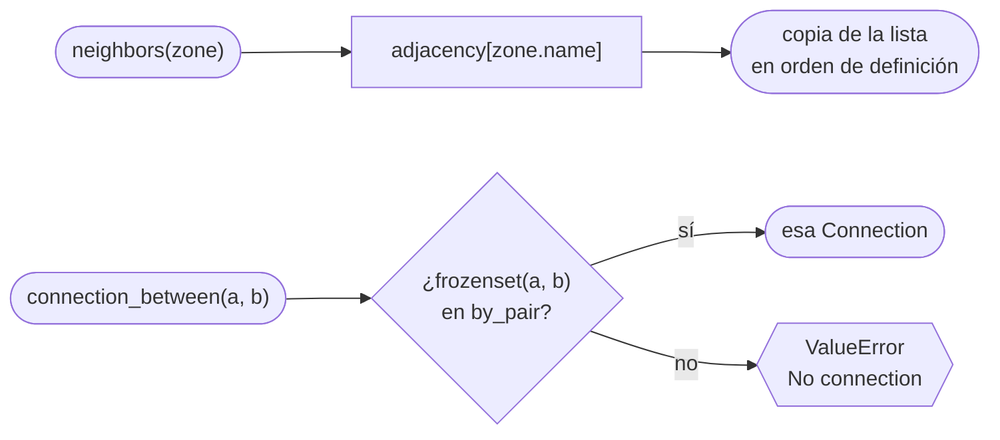

### Métodos de `Zone` y `Connection`

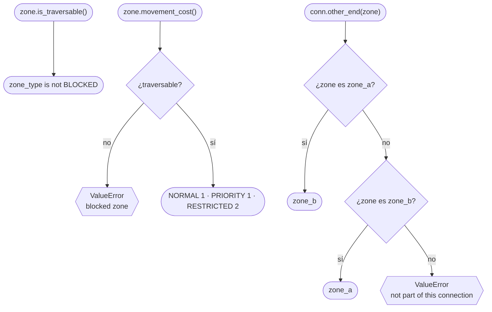

**Por qué las reglas viven en `Graph` y no en el parser:** el parser mira una
línea cada vez y no recuerda las anteriores. `Graph` sí lo sabe todo, así que
es imposible construir un grafo inválido venga de donde venga (parser, test o
intérprete).

---

## SP02 — Parser

### `MapParser.parse(texto)`: el archivo entero

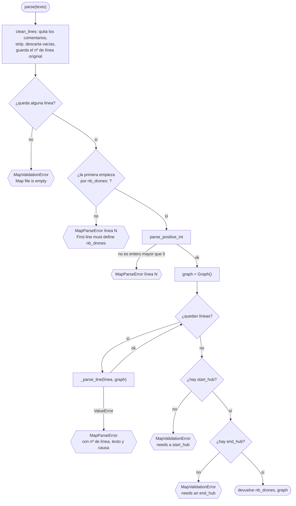

**Por qué dos excepciones distintas:** `MapParseError` señala **una línea**
concreta. `MapValidationError` es un fallo del archivo **en conjunto** (vacío,
falta el start…): no hay una línea a la que apuntar. Las dos heredan de
`MapError`, que es lo único que captura `main`.

### `_parse_line`: una línea de zona o de conexión

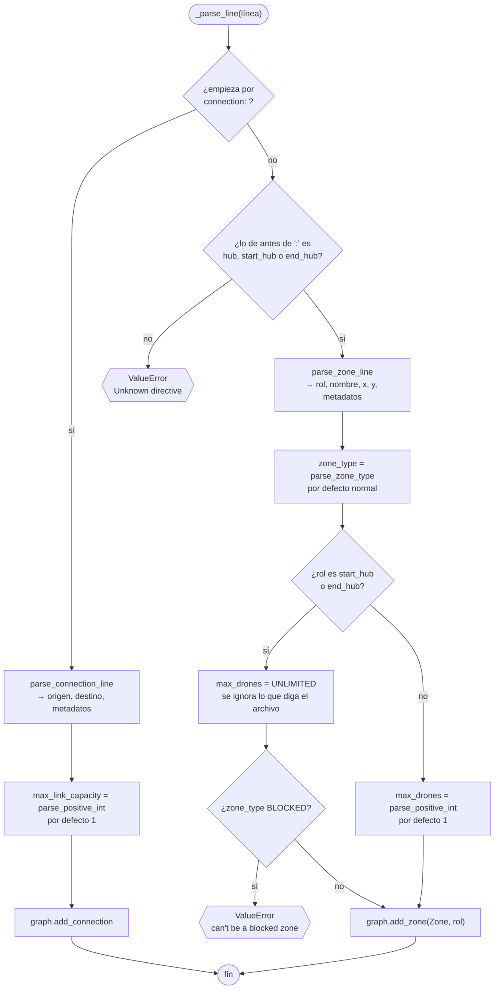

### `parse_zone_line` y `parse_connection_line`

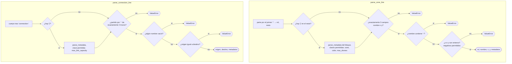

### `parse_metadata`: validación estricta de `[k=v ...]`

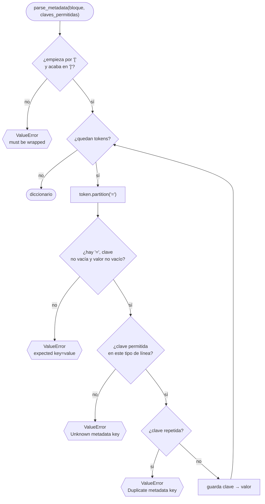

**Por qué rechazar claves repetidas:** `[zone=blocked zone=normal]` haría la
zona transitable en silencio (gana la última). El subject exige metadatos
*"syntactically valid"*, y es mejor un error claro que un mapa que no hace lo
que parece.

---

## SP03 — CLI y errores

`main()` es la **frontera de excepciones**: ningún error de mapa sale como
traceback.

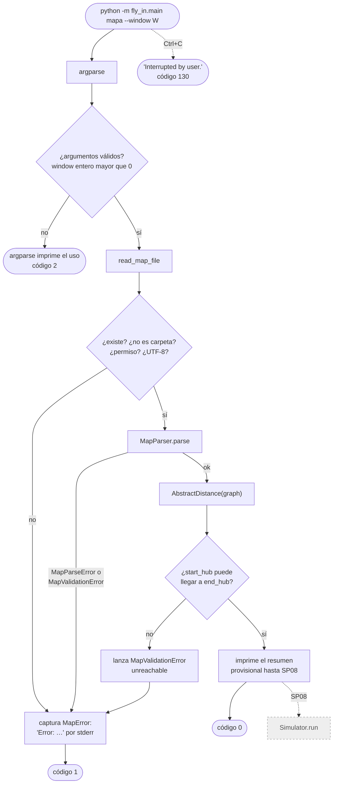

**Por qué comprobar la alcanzabilidad aquí y no en SP08:** sin esta
comprobación, un mapa sin ruta posible haría que el simulador diera vueltas
hasta su límite de seguridad. Aquí se detecta al instante, con un mensaje que
dice exactamente qué pasa.

---

## SP04 — Dijkstra

### `find_path(origin, target)`: la ruta de un dron

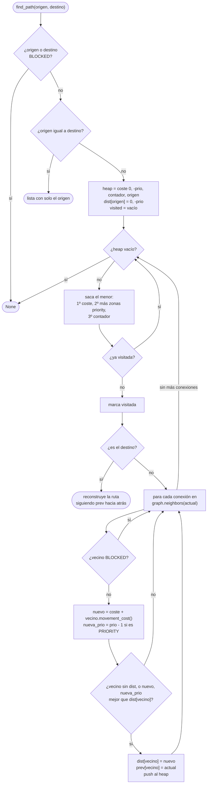

**Por qué la clave es una tupla de tres:** `priority` cuesta lo mismo que
`normal`, así que la preferencia no puede ir en el coste sin romper "coste =
turnos". Va como **desempate**: Python compara tuplas elemento a elemento. El
contador final evita comparar dos `Zone`, que daría `TypeError`.

### `distances_from(origin, reverse)`: coste a todas las zonas

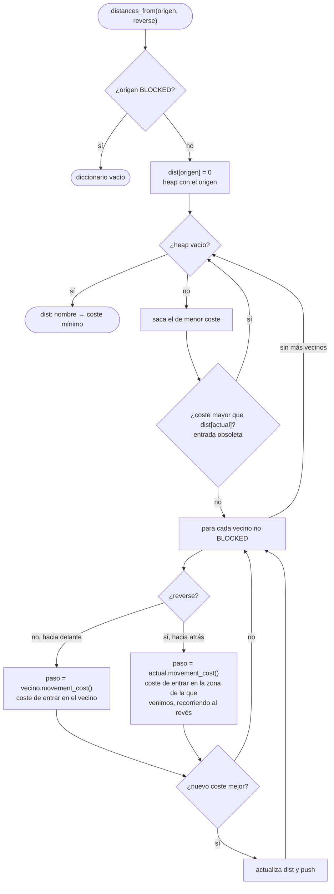

**Por qué `reverse` suma el coste de `actual`:** el coste depende de la zona en
la que **entras**. Al recorrer desde `end_hub` hacia atrás, el paso de `vecino`
a `actual` en la ruta real es entrar en `actual`. Sumar el del vecino daría
costes desplazados una zona.

---

## SP05 — Heurística abstracta

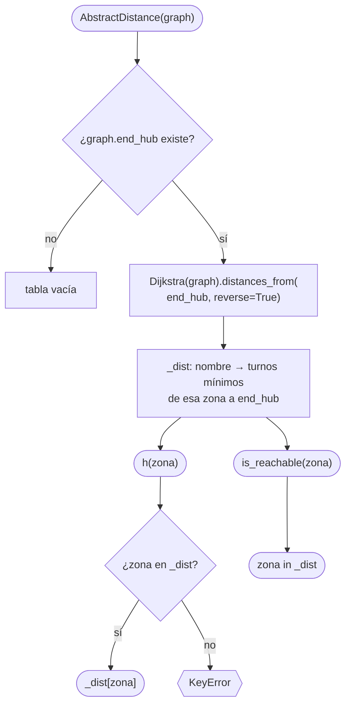

**Por qué una sola ejecución desde `end_hub` y no una por zona:** un Dijkstra
hacia atrás da de golpe la distancia real de **todas** las zonas al objetivo.
Lanzar uno desde cada zona costaría `V` veces más.

**Por qué no la distancia en línea recta entre coordenadas:** ignora las zonas
`blocked` y los callejones sin salida. La de Dijkstra es la real sin otros
drones: nunca sobreestima (es admisible) y conoce la topología.

**Por qué las inalcanzables no están en la tabla:** su ausencia **es** la
información. Guardarlas como `inf` metería un `float` en una suma de enteros
(`f = g + h`) y rompería mypy.

---

## SP06 — Tabla de reservas

### La convención de tiempo

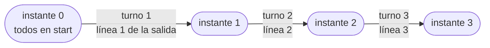

- Zona `(z, t)` = quién está en `z` **en la foto** `t`.
- Conexión `(c, t)` = quién está cruzando `c` **entre** la foto `t` y la `t+1`.

### Qué ocupa un movimiento que sale en el instante T

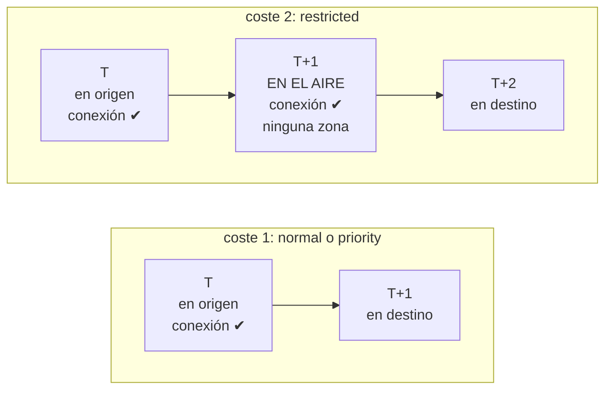

### `can_move(frm, to, turn)`: la pregunta completa

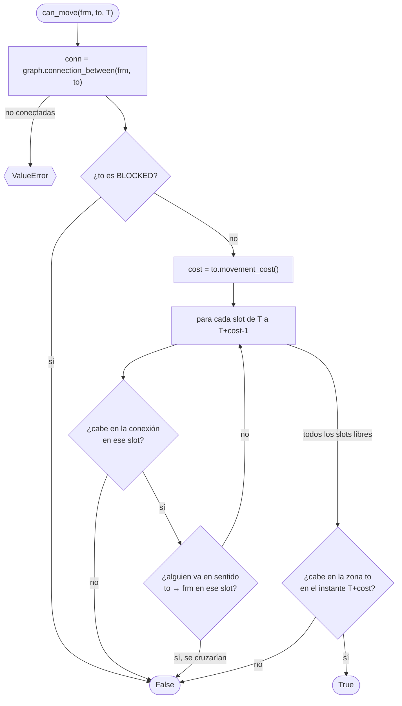

**Por qué una sola función:** comprueba las tres cosas que ocupa un movimiento
(conexión, sentido y zona de llegada) en **todos** los instantes del trayecto.
Si SP07 hiciera las comprobaciones sueltas, podría olvidar una o comprobar solo
el primer instante de un tránsito `restricted`.

### `reserve_move` y `reserve_wait`: escribir sin dejar nada a medias

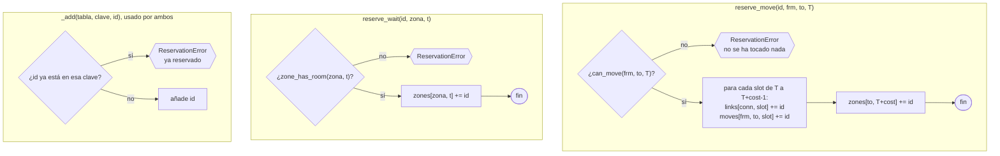

**Por qué primero pregunta y después escribe:** si escribiera la conexión y
luego descubriera que la zona de llegada está llena, quedaría una conexión
ocupada por un movimiento que nunca ocurre. Los demás drones esquivarían un
fantasma.

### `clear_from(turn, keep)`: replanificar

```mermaid
flowchart TD
    A(["clear_from(T, keep)"]) --> B["para zones, links y moves:<br/>construye un diccionario nuevo"]
    B --> C{"para cada clave:<br/>¿su instante es menor que T?"}
    C -->|"sí, es pasado"| D["se conserva entera"]
    C -->|"no, es futuro"| E["se conservan solo los ids<br/>que están en keep"]
    E --> F{"¿queda algún id?"}
    F -->|"sí"| G["se guarda la clave"]
    F -->|"no"| H["la clave desaparece"]
    D --> Z(["la tabla nueva sustituye a la vieja"])
    G --> Z
    H --> Z
```

### Por qué existe `keep`: un dron en el aire al replanificar

```mermaid
sequenceDiagram
    participant S as Simulator (SP08)
    participant T as ReservationTable
    participant D1 as D1 (en el aire)
    participant D2 as D2
    Note over D1: instante 4: despega hacia r (restricted)
    D1->>T: reserve_move(1, start, r, 4)<br/>conexión en 4 y 5, r en 6
    Note over S: instante 5: toca replanificar
    S->>T: clear_from(5, keep={1})
    Note over T: se borra el futuro de todos<br/>salvo D1: conexión en 5 y r en 6 siguen
    S->>D2: replanifica
    D2->>T: can_move(start, r, 5)?
    T-->>D2: False: conexión ocupada y r reservada en 6
    Note over D1: instante 6: aterriza en r con sitio garantizado
```

Sin `keep`, `clear_from(5)` borraría la llegada de D1. D2 podría ocupar `r` en
el 6, y D1 no tendría dónde aterrizar ni podría esperar en el aire.

### Cómo usarán SP07 y SP08 la tabla (futuro)

```mermaid
flowchart TD
    S0["Simulator, cada W/2 turnos"] -.-> S1["clear_from(T, keep = drones en el aire)"]
    S1 -.-> S2["para cada dron, en orden de prioridad"]
    S2 -.-> W1["WhcaPathfinder.find_path"]
    W1 -.->|"expande vecinos"| Q1["can_move(zona, vecino, t)"]
    W1 -.->|"expande 'esperar'"| Q2["zone_has_room(zona, t+1)"]
    W1 -.->|"ruta elegida"| R1["reserve_move / reserve_wait<br/>con el id del dron"]
    R1 -.-> S2

    classDef todo fill:#eeeeee,stroke:#999,color:#555,stroke-dasharray:4
    class S0,S1,S2,W1,Q1,Q2,R1 todo
```
