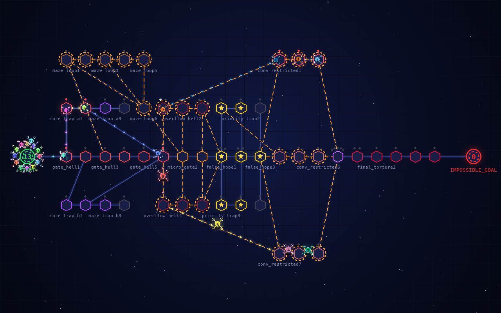
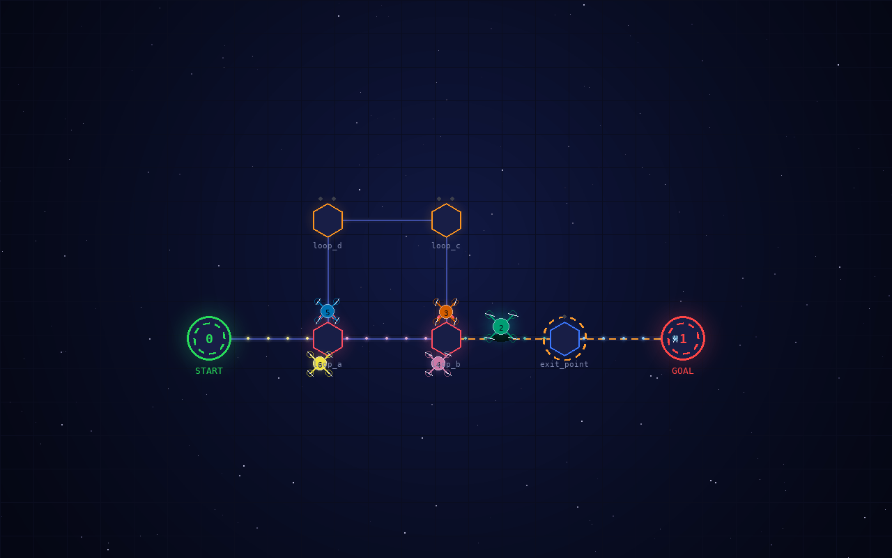
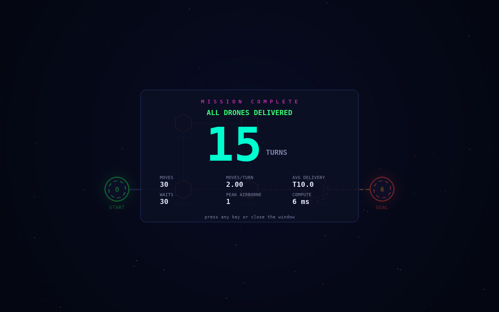

# SP10 contado de principio a fin

Continúa [`10-narrativa-sp09.md`](./10-narrativa-sp09.md). Con SP09 el
programa ya es **correcto**: resuelve el mapa y lo dice en el formato exacto.
Este documento cuenta cómo se volvió **visible**: una ventana pygame con el
mapa y los drones, y un log de eventos a color en la terminal, avanzando turno
a turno a la vez. No es decoración: el subject la exige.

> **Estado.** Implementado en [`fly_in/visualization/`](../fly_in/visualization/)
> y cubierto por [`test/test_visualization.py`](../test/test_visualization.py) y
> [`test/test_session.py`](../test/test_session.py). La guía de pasos es
> [`SP10-visualizacion.md`](./build/SP10-visualizacion.md). Las capturas son
> salidas reales del programa.



---

## 1. El problema: entender sin leer el código

La representación visual está dentro de la parte obligatoria *(Cap. VII.1)*,
cuenta en la evaluación (*"Quality and usefulness of visual representation"*,
Cap. VII.6) y el `README.md` tiene que explicar *cómo mejora la experiencia*
(Cap. VIII). El criterio de salida de la guía lo resume en una frase: alguien
que no ha leído el código tiene que poder ver una ejecución y **entender qué
pasa turno a turno**.

Eso descarta la versión fácil, una lista de posiciones por turno. Lo que hay
que entender en este proyecto son **esperas**: por qué D3 no sale todavía, por
qué D2 da un rodeo, por qué D5 pasa dos turnos en el aire. Y las esperas solo
se explican enseñando **capacidades**: `narrow is FULL (1/1)` explica una
espera; `narrow: D3` no explica nada.

Hay además tres restricciones que no se pueden romper:

- **`stdout` es de SP09.** Todo lo visual va a `stderr` o a la ventana.
- **pygame solo dibuja.** Es la única dependencia (`pygame-ce`), no sabe nada
  de grafos ni de rutas (Cap. V), y el programa funciona sin ella.
- **Nunca un crash por algo decorativo.** El `color=` del mapa admite
  *cualquier* palabra (Cap. VI), y si no hay ventana posible la partida sigue
  en la terminal.

---

## 2. Simular primero, enseñar después

El simulador no sabe que existe una pantalla. Tiene un único punto de
enganche: `run(observer)`, que tras aplicar cada turno llama a
`observer.on_turn(turn, moves, drones)`. Cualquier objeto con ese método es un
observador: `SimulationObserver` es un `Protocol`, igual que `DroneLike` en
SP07.

El observador que usa `FlyIn.run` es `ReplayRecorder`: anota dónde está cada
dron y la línea de `stdout` de cada turno. La simulación del challenger tarda
0,25 s; enseñarla, bastante más. Así que primero se simula entero y después se
**enseña** lo grabado con `Session.play`. Grabar primero tiene otra ventaja:
para animar un dron *entre* dos turnos hay que saber de dónde sale y adónde
llega.

`ObserverGroup` reparte cada turno entre varios observadores. Hoy no lo usa
nadie en el programa: es el enganche que necesita el `--capacity-info` del
live coding para sumar un segundo observador sin tocar el simulador. Y el
simulador **descuenta el tiempo que pasa dentro de los observadores** al medir
su tiempo de cálculo: los 247 ms del challenger son cálculo.

La regla de la guía, *la visualización no calcula nada*, se cumple así: la
ventana y el log leen la grabación y no deciden nada. Si la pantalla y la
salida no coincidieran, el fallo estaría en el simulador, porque no hay dos
lógicas que puedan separarse.

---

## 3. La paleta: cualquier palabra es un color

`Palette.resolve(name, frame)` convierte el `color=` de una zona en RGB, en
tres niveles:

1. **Nombres conocidos** (una tabla de ~30: `red`, `crimson`, `gold`,
   `turquoise`…) y `#rrggbb`.
2. **`rainbow`**, que aparece en el challenger: un tono que **gira con cada
   fotograma**.
3. **Cualquier otra cosa** (`turquesa`, `x`, `unicornio`): un tono vivo
   derivado del hash SHA-256 del nombre. Es estable (la misma palabra da
   siempre el mismo color, en todas las ejecuciones) y nunca falla.

Los códigos de escape de la terminal los escribe **un único objeto**,
`Painter`, que cierra siempre con `RESET` (el color nunca se queda pegado al
prompt). Si la terminal anuncia truecolor (`COLORTERM=truecolor`) usa RGB de
24 bits; si no, busca el más cercano de los 16 colores estándar. Con el color
desactivado devuelve el texto tal cual: el resto del código no necesita saber
si hay color.

Los drones también tienen color propio, con `Palette.drone_color(id)`: D1 a
D7 toman la paleta Okabe-Ito (pensada para que se distinga con daltonismo), y
a partir de D8 los tonos avanzan 0,618 vueltas (el ángulo áureo) de un id al
siguiente, así que dos drones consecutivos nunca se parecen. El mismo dron
tiene el mismo color en la ventana, en la leyenda del log y en cada línea del
log (`test_each_drone_has_one_color_in_the_log`).

---

## 4. El log de eventos en la terminal

`EventLog` escribe en `stderr` un bloque por turno. Es lo que se ve siempre,
con ventana o sin ella. Así queda `maps/valid/bottleneck.txt` (sin color):

```
 ▌FLY-IN▐  MISSION LOG ━━━━━━━━━━━━━━━━━━━━━━━━━━━━━━━━━━━━━━━━━━━━━━━━━━━━━━━━
  MAP     bottleneck.txt
  SQUAD   3 drones · 3 zones · 2 links
  ENGINE  WHCA* · window 8
  VIEW    terminal log
  DRONES: D1 D2 D3

 ── T01 ────────────────────────────────────────────────────────── ▸ D1-narrow
   ⟳ replan · 3 drones planned · 0 kept in flight · 0.3 ms
   D1   → narrow
   ·    holding at start: D2 D3
   ⚠    narrow is FULL (1/1)
 ── T02 ────────────────────────────────────────────────── ▸ D1-goal D2-narrow
   D1   ★ DELIVERED to goal  ████░░░░░░░░ 1/3
   D2   → narrow
   ·    holding at start: D3
 ── T03 ────────────────────────────────────────────────── ▸ D2-goal D3-narrow
   D2   ★ DELIVERED to goal  ████████░░░░ 2/3
   D3   → narrow
 ── T04 ──────────────────────────────────────────────────────────── ▸ D3-goal
   D3   ★ DELIVERED to goal  ████████████ 3/3

═════════════════════════ MISSION COMPLETE · 4 TURNS ═════════════════════════
  moves 6 · moves/turn 1.50 · avg delivery T3.0 · waits 3 · peak airborne 0
  compute 0 ms · 1 replan · 3/3 delivered · capacities verified every turn
```

Cada elemento responde a una pregunta:

| Elemento | La pregunta que responde |
|---|---|
| Cabecera: mapa, drones, zonas, conexiones, ventana `W`, vista | ¿Qué estoy mirando? |
| Leyenda `DRONES:` con el color de cada uno | ¿Quién es quién? |
| `── T02 ── ▸ D1-goal D2-narrow` | ¿Qué línea de `stdout` corresponde a este turno? Une lo que se ve con lo que se entrega |
| `⟳ replan` con drones planificados, en el aire y milisegundos | ¿Cuándo recalcula el algoritmo y cuánto le cuesta? |
| `→`, `◆ takes off`, `◆ lands on`, `★ DELIVERED` con barra | ¿Qué acaba de hacer cada dron? |
| `holding at start: D2 D3` | ¿Quién espera, y dónde? |
| `⚠ narrow is FULL (1/1)` | **¿Por qué espera?** Sale solo el turno en que la zona se llena |
| `MISSION COMPLETE` y las métricas | ¿Cómo ha ido? |

La última línea, *capacities verified every turn*, no es un adorno: `_verify`
(SP08) recuenta zonas y conexiones en **cada** turno, y si algo no cuadrara la
simulación se habría detenido antes.

---

## 5. La ventana pygame

### 5.1 La escena: calcular una vez, dibujar muchas

La ventana dibuja 60 fotogramas por segundo. Todo lo que depende solo de la
simulación se calcula **una vez** en `Scene` (`scene.py`):

- `spots[k][dron]`: dónde va cada dron en cada turno. En una zona normal y
  solo, al centro; si comparte zona (o es un hub), en su hueco de un anillo
  alrededor; en el aire, en el punto medio de la conexión; entregado, en el
  objetivo.
- `used[k]`: qué conexiones se recorren de `k-1` a `k` y en qué sentido.
- `occupants`, `delivered`, `airborne` y los turnos con replanificación.

`scene.py` no importa pygame: se prueba sin pantalla.

### 5.2 El dibujo

`PygameView` dibuja cada fotograma por capas: fondo (un degradado radial y una
rejilla, precalculados), estrellas que titilan, conexiones, zonas, drones,
efectos, etiquetas y, si toca, una tarjeta. Todo con primitivas de
`pygame.draw`; no hay imágenes. La ventana abre a 1280 × 800 (o al 92 % × 88 %
de la pantalla si es más pequeña).

- **Zonas** hexagonales con un halo de su color. La decoración cuenta el
  tipo: anillo ámbar a trazos que gira en las `restricted`, estrella dorada en
  las `priority`, cruz roja en las `blocked`, plataformas con una baliza que
  late en los hubs; el número del hub es cuántos drones tiene (en `end_hub`,
  los entregados). Encima de cada zona, **puntos de capacidad** que se llenan;
  la zona entera late en rojo al llenarse.
- **Drones** con forma de cuadricóptero, hélices que giran y estela. El que va
  hacia una `restricted` **se eleva**, proyecta una sombra y se queda sobre su
  conexión los dos turnos de vuelo.
- **Conexiones** con un flujo de luz que avanza en el sentido del viaje, del
  color del dron que las usa; las que llevan a una `restricted`, a trazos.
- **Efectos**: chispas y un "+1" en cada entrega, y un anillo rosa ("WHCA\*
  REPLAN") en cada replanificación.
- **Tarjetas**: el *mission briefing* con la cuenta atrás 3-2-1-GO (la
  terminal cuenta a la vez) y la final, con los turnos y las métricas de los
  movimientos ejecutados.

La ventana no repite el turno ni la línea de `stdout`: esa información está en
el log, justo al lado, turno a turno.



Tres piezas hacen que vaya fluido: `Glow` precalcula cada halo una sola vez
(círculos concéntricos que se suman al fondo), `Fonts` guarda los textos ya
dibujados (lo más caro de pygame) y `Scene` ya tiene los fotogramas.



### 5.3 Terminal y ventana a la par

`Session._play_log` recorre los turnos y en cada uno hace dos cosas seguidas:
escribe en la terminal el bloque del turno `k` y le pide a la ventana que anime
el turno `k` durante `--delay` segundos (`PygameView.play_turn`). Como las dos
cosas las hace el mismo bucle, en un solo hilo, van a la par sin ninguna
sincronización.

En la ventana, `SPACE` pausa y reanuda la animación (y con ella el log, que
espera a la ventana), y `ESC`, `Q` o cerrar la ventana la quitan en el acto;
la terminal sigue sola hasta el final.

---

## 6. Qué vista se ve

| Situación | Vista | Qué se ve |
|---|---|---|
| `stderr` es una terminal y hay pantalla gráfica | `window` | Ventana + log, turno a turno a la vez (0,8 s por turno) |
| Sin pantalla gráfica, o `stderr` va a un fichero o una tubería | `log` | Solo el log (0,25 s por turno; sin pausas si no hay terminal) |
| `--view window` o `--view log` | la pedida | Se fuerza una de las dos |
| `-q` / `--quiet` | ninguna | Solo las líneas de `stdout` |

`--delay` fija los segundos por turno (0 para verlo de golpe). El color se
apaga con la variable `NO_COLOR` (una convención muy extendida) y siempre que
`stderr` no sea una terminal: los códigos ANSI en un fichero son basura
ilegible.

Nunca se queda esperando:

- `--view auto` solo abre la ventana con **terminal y pantalla gráfica**
  (`DISPLAY`/`WAYLAND_DISPLAY` en Linux). Con una tubería, en CI o en los
  tests, la vista es el log.
- Si pygame no está instalado o no puede abrir la ventana, se avisa y la
  partida sigue en la terminal.
- La tarjeta final espera una tecla, pero como mucho 20 s (`END_HOLD`), y con
  `--delay 0` no espera.

---

## 7. De dónde viene

La visualización pasó por cuatro versiones antes de esta:

1. Un **HUD en la terminal**: el mapa dibujado con caracteres y paneles de
   zonas y eventos, a pantalla completa.
2. Una **repetición en HTML** escrita en un fichero.
3. La **animación en el navegador, en vivo**, con un servidor local: unas 750
   líneas de JavaScript, un servidor HTTP y varios hilos.
4. **Ventana pygame + HUD**, con navegación por turnos.

Se quedó lo que se puede defender línea a línea en Python y lo que pide la
hoja de evaluación (*"colored terminal output and/or graphical interface"*):
la ventana y el log. El HUD, el HTML, el navegador y la navegación por turnos
se retiraron; la navegación, además, no llegó a funcionar: las teclas
guardaban el turno pedido, pero nada lo leía.

---

## 8. Lo que salió al probarlo

- **El saludo de pygame.** Al importarse, pygame escribe una línea por
  **`stdout`**. Habría sido la primera línea de la salida del programa, y la
  corrección habría fallado. `Session` define `PYGAME_HIDE_SUPPORT_PROMPT`
  antes del import, y un test ejecuta el programa sin esa variable en el
  entorno para comprobar que `stdout` queda limpio.
- **pygame 2.6.1 en Python 3.14.** El módulo de fuentes viene roto, y el error
  es un `NotImplementedError`, no un `pygame.error`: habría tumbado el
  programa. Se cambió a **pygame-ce** (la edición comunitaria, mantenida
  activamente, con el mismo `import pygame`) y `open()` captura también ese
  error: si algo falla al abrir, la partida sigue en la terminal.
- **Revisión con capturas reales** (pygame dibuja en memoria con el driver
  `dummy` de SDL): las hélices de los drones pequeños parecían rayones (ahora
  son anillos con una pala que gira), las etiquetas del challenger se pegaban
  unas a otras (ahora dejan un margen) y el halo detrás de los números grandes
  dejaba anillos visibles (se quitó).

---

## 9. Cómo se prueba

`test/test_visualization.py`:

- cualquier `color=` se resuelve (`turquesa`, `#ff8800`, `rainbow`, `x`), y
  `rainbow` cambia con el fotograma;
- `Painter` siempre cierra con `RESET`; sin truecolor usa los 16 colores;
- la grabación tiene un fotograma por turno más el inicial, con las
  posiciones correctas (tierra, aire, entregado).

`test/test_session.py`:

- la elección de vista (`-q` gana; `auto` sin terminal o sin pantalla da
  `log`);
- el log cuenta bien los cuellos de botella y los tránsitos, y sin color no
  lleva ni un código ANSI;
- cada dron tiene un solo color en todo el log, el mismo que en la ventana;
- la escena coloca bien a cada dron y cuenta bien, sin pygame;
- la ventana de verdad, con el driver `dummy`: dibuja todos los turnos de los
  19 mapas, avanza a la par que el log, `SPACE` pausa y reanuda, cerrarla no
  para la partida, sin pygame o sin ventana se sigue en la terminal, la
  tarjeta final no espera para siempre, el `with` cierra pygame y pygame no
  escribe nada en `stdout`.

En `test/test_cli.py`, `stdout` sigue conteniendo solo las líneas de turno
con la visualización activa.

---

## 10. Lo que este diseño no garantiza

- **Anchura de algunos símbolos del log.** `★` y `◆` son de anchura "ambigua"
  en Unicode: en terminales configuradas para CJK ocupan dos columnas y
  desalinean las cabeceras de turno.
- **Mapas muy densos en la ventana.** Con muchas zonas juntas el radio de zona
  baja hasta 9 px y las etiquetas se omiten donde no caben; la información
  completa sigue en el log.

---

## 11. Resumen: quién hace qué

| Pieza | Responsabilidad |
|---|---|
| `Simulator.run(observer)` | Avisar tras cada turno; descontar el tiempo del observador |
| `ReplayRecorder` | Posiciones y línea de `stdout` de cada turno |
| `ObserverGroup` | Repartir un turno entre varios observadores (el enganche del live coding) |
| `Session` | Elegir vista; reproducir la partida en la ventana y en el log a la vez; caer a la terminal si no hay ventana |
| `Scene` | Los fotogramas precalculados, sin pygame |
| `PygameView` | La ventana: abrir, animar cada turno, pausar, tarjeta final, cerrar (context manager) |
| `Projection` / `Glow` / `Fonts` | Mapa a píxeles; halos precalculados; textos en caché |
| `EventLog` | El log de eventos de la terminal |
| `Palette` / `Painter` | Nombre → RGB (tabla, `#hex`, `rainbow`, hash); ANSI con `RESET` siempre, fallback a 16 colores |
| `FlyIn` (`main.py`) | Elegir vista (`--view`), color y ritmo según terminal, pantalla, `NO_COLOR`, `-q` y `--delay` |

Continúa en [`12-narrativa-sp11.md`](./12-narrativa-sp11.md): medir, ajustar y
entregar.
