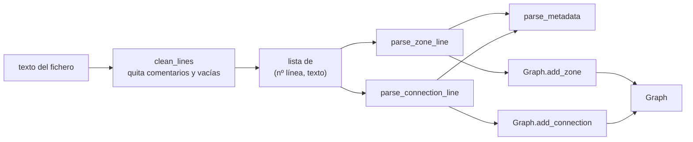

# SP02 — El parser ✅

> **Estado:** hecho y probado (`test/test_parser.py`, más de 80 casos). Las
> divergencias con el subject documentadas al final ya se han corregido, y los
> metadatos se validan de forma estricta: sin claves ni valores vacíos, sin
> claves repetidas y solo claves válidas para el tipo de línea
> (`zone`/`color`/`max_drones` en zonas, `max_link_capacity` en conexiones).
> `start_hub`/`end_hub` no pueden ser `blocked`.

**Objetivo:** convertir un archivo de texto en `(nb_drones, Graph)` válido, o
fallar con un error que diga **qué línea** y **por qué**.

**Prerequisitos:** [SP01](./SP01-modelo-dominio.md) verde.

**Criterio de salida:** los 10 mapas de `maps/errors/` fallan con la causa
correcta; los de `maps/valid/` parsean sin excepción.

---

## La arquitectura del parser: cuatro funciones y una clase

La clave del diseño es que **cada función hace una sola transformación** y se
puede probar sola en el intérprete:



| Función | Entrada | Salida |
|---|---|---|
| `clean_lines(str)` | El fichero entero | `[(nº_línea_original, texto_limpio)]` |
| `parse_metadata(str)` | `"[zone=restricted color=red]"` | `{"zone": "restricted", "color": "red"}` |
| `parse_zone_line(str)` | `"hub: roof1 3 4 [zone=restricted]"` | `("hub", "roof1", 3, 4, {...})` |
| `parse_connection_line(str)` | `"connection: a-b [max_link_capacity=2]"` | `("a", "b", {...})` |
| `MapParser.parse(str)` | El fichero entero | `(nb_drones, Graph)` |

---

## Paso 1 — `clean_lines()`: normalizar antes de parsear

Tres operaciones, en este orden:

1. `strip()` de la línea,
2. cortar por el primer `#` (comentario de cola de línea) y `strip()` otra vez,
3. descartar si queda vacía.

⚠️ **No lo des por sentado — conserva el número de línea ORIGINAL**
Después de filtrar comentarios y líneas vacías, el índice dentro de tu lista ya
no coincide con el número de línea del fichero. Si reportas el índice, dirás
*"línea 4"* cuando el usuario ve el problema en la línea 9 de su editor, y le
harás perder el tiempo. Por eso `clean_lines()` devuelve **tuplas** con el
número capturado `enumerate(lines, start=1)` **antes** de filtrar nada.

⚠️ **No lo des por sentado — `splitlines()`, no `split("\n")`**
`splitlines()` maneja `\r\n` (ficheros creados en Windows) y `\r`. `split("\n")`
te dejaría un `\r` colgando al final de cada línea, y `"roof1\r"` no es igual a
`"roof1"` — obtendrías un error de "zona no definida" incomprensible.

## Paso 2 — `parse_metadata()`: los corchetes

```
"[zone=restricted color=red]"  →  {"zone": "restricted", "color": "red"}
```

Algoritmo: verificar que empieza por `[` y acaba por `]`, quitar los corchetes,
`split()` por espacios, y para cada token exigir que contenga `=`, partiendo por
el **primer** `=` (`split("=", 1)`).

⚠️ **No lo des por sentado — `split("=", 1)` y no `split("=")`**
Con el límite a 1, un valor que contenga un `=` (`color=a=b`) se parte solo por
el primero: clave `color`, valor `a=b`. Sin el límite, obtendrías tres trozos y
un `IndexError`. Es defensa barata contra entradas raras.

**Un `[]` vacío es válido** y devuelve un diccionario vacío. El subject dice que
los metadatos son opcionales, no que los corchetes no puedan estar vacíos.

**Los espacios alrededor del `=` no están soportados** (`[zone = normal]`
falla), porque el troceado es por espacios. La gramática del subject escribe los
pares sin espacios, así que es una interpretación legítima — pero **anótala**,
porque es una decisión, no una casualidad.

## Paso 3 — `parse_zone_line()`

`"hub: roof1 3 4 [zone=restricted]"` → `("hub", "roof1", 3, 4, {...})`

El orden de las operaciones importa:

1. Partir por el **primer** `:` → rol + resto.
2. Si hay `[`, cortar ahí: la parte izquierda son los datos básicos, la derecha
   va a `parse_metadata()`. **Hazlo antes de trocear por espacios**, o los
   espacios dentro de los corchetes te romperán el recuento.
3. `split()` del resto → deben ser **exactamente 3** tokens: nombre, x, y.
4. Validar el nombre (sin `-`; los espacios son imposibles por construcción, ya
   que se troceó por espacios).
5. `int()` de las coordenadas.
6. Convertir `zone=` en `ZoneType` con `parse_zone_type()` (error claro si no es válido).

⚠️ **No lo des por sentado — corta los corchetes antes de contar tokens**
`"roof1 3 4 [zone=restricted color=red]"` troceado por espacios da 6 tokens, no
3. Si validas "exactamente 3 valores" antes de aislar los metadatos, todo mapa
con dos etiquetas fallará. Aislar primero, contar después.

## Paso 4 — `parse_connection_line()`

`"connection: a-b [max_link_capacity=2]"` → `("a", "b", {...})`

Mismo patrón: aislar metadatos, luego `split("-")` del cuerpo y exigir
**exactamente 2** partes. Que sean exactamente 2 es lo que garantiza que no
había guiones en los nombres, así que la regla del subject se valida sola aquí.

Validaciones extra: ningún extremo vacío (`connection: -b`), y origen ≠ destino
(una conexión de una zona consigo misma no tiene sentido físico).

## Paso 5 — `MapParser.parse()`: el orquestador

```python
@staticmethod
def parse(map_content: str) -> Tuple[int, Graph]:
```

1. `clean_lines()`. Si no queda nada → fichero vacío.
2. La **primera** línea limpia debe empezar por `nb_drones:` → entero positivo.
3. Para cada línea siguiente: despachar por prefijo a `connection:` /
   `hub:` / `start_hub:` / `end_hub:`, o error de directiva desconocida.
4. Validar metadatos numéricos (`max_drones`, `max_link_capacity` positivos).
5. Delegar los invariantes globales al `Graph` (nombres únicos, roles, etc.).
6. Al final: comprobar que hay `start_hub` y `end_hub`.

**El patrón que hace que todos los errores lleven contexto:**

```python
for num_line, content in cleaned[1:]:
    try:
        ...  # todo el trabajo de esta línea
    except Exception as e:
        raise MapParseError(num_line, content, str(e))
```

Un único `try` alrededor del cuerpo del bucle. Las funciones internas y el
`Graph` lanzan `ValueError` con un mensaje descriptivo y **sin saber nada del
número de línea** — es el bucle, que sí lo sabe, quien lo envuelve. Así ninguna
función de bajo nivel necesita recibir el número de línea como parámetro.

⚠️ **No lo des por sentado — `except Exception` es deliberado aquí**
Normalmente capturar `Exception` a secas es mala práctica. En este punto
concreto es justo lo que se quiere: **cualquier** fallo procesando una línea es,
por definición, un error de formato de esa línea, y el subject exige que se
reporte con línea y causa. Un `int("tres")` que lanza `ValueError`, un
`KeyError` inesperado: todos deben salir como `MapParseError`. Es la traducción
literal de *"Any other parsing error must stop the program and return a clear
error message indicating the line and cause"*.

## Paso 6 — `MapParseError`

`fly_in/models/errors.py`

```python
class MapParseError(Exception):
    def __init__(self, line_num: int, line_content: str, reason: str):
        self.line_num = line_num
        self.line_content = line_content
        self.reason = reason
        super().__init__(f"Line {line_num}: '{line_content}' -> {reason}")
```

Guarda los tres campos **por separado** además de componer el mensaje. Así
[SP03](./SP03-cli-y-errores.md) puede formatear el error para el usuario final
como quiera (con color, con un cursor bajo la columna) sin tener que parsear el
string de vuelta.

---

## Paso 7 — Los mapas de prueba

Uno por regla de validación. Cada uno es mínimo: contiene **un solo** error, el
que da nombre al archivo, para que el test no pueda pasar por el motivo
equivocado.

| Mapa | Regla que viola |
|---|---|
| `missing_nb_drones.txt` | Primera línea no es `nb_drones:` |
| `no_start.txt` | Falta `start_hub` |
| `two_starts.txt` | Dos `start_hub` |
| `duplicate_zone_name.txt` | Nombre repetido |
| `dash_in_name.txt` | Guion en el nombre de zona |
| `invalid_zone_type.txt` | `zone=invalido` |
| `negative_capacity.txt` | `max_drones=-1` |
| `duplicate_connection.txt` | `a-b` y luego `b-a` |
| `connection_unknown_zone.txt` | Conexión a zona no definida |
| `malformed_metadata.txt` | Etiqueta sin `=` |

Y tres válidos: `linear.txt` (caso feliz), `bottleneck.txt` (cuello de botella,
clave para SP07) y `single_drone.txt` (mínimo absoluto).

⚠️ **No lo des por sentado — el test comprueba la CAUSA, no solo que falle**
```python
with pytest.raises(MapParseError) as excinfo:
    MapParser.parse(content)
assert "Duplicate connection" in str(excinfo.value)
```
Sin el `assert` del fragmento, el test pasaría igual si el mapa fallara por un
typo tuyo en otra línea. Comprobar el mensaje es lo que hace que el test pruebe
lo que dice probar.

---

## Criterio de salida ✅

```console
$ make test
15 passed
```

- [x] 9 mapas de error lanzan `MapParseError` con la causa correcta
- [x] `no_start.txt` lanza `MapValidationError`
- [x] 4 mapas válidos parsean y producen el grafo esperado
- [x] `make lint-strict` pasa

---

## Deuda conocida (resuelta)

Tres divergencias con el subject, detectadas leyendo el PDF y corregidas:

### 1. `max_drones` en `start_hub`/`end_hub` se ignora, no se valida

*(Cap. VII.4)*: *"The `max_drones` capacity is **ignored** on the `start_hub` and
`end_hub` zones (…) If such metadata is present on those two zones, it is
ignored and **is not a validation error**."*

`MapParser.parse` mira el rol **antes** de validar `max_drones`: en
`start_hub`/`end_hub` usa `UNLIMITED` (= `float("inf")`, definido en `zone.py`), y solo valida `max_drones > 0` para `hub` normal.
Cubierto por `maps/valid/ignored_capacity.txt`.

### 2. La falta de `start_hub`/`end_hub` lanza `MapValidationError`

`fly_in/models/errors.py` define ahora una raíz común:

```python
class MapError(Exception):
    """Raíz de todos los errores de mapa."""

class MapParseError(MapError):
    """Fallo atribuible a una línea concreta."""

class MapValidationError(MapError):
    """Fallo del archivo en conjunto (falta start_hub, end_hub inalcanzable…)."""
```

[SP03](./SP03-cli-y-errores.md) captura `MapError` y cubre los dos casos con un
único `except`.

### 3. Las coordenadas negativas ya no se rechazan

`parse_zone_line` ya no comprueba `x < 0 or y < 0`. El subject solo dice que
*"the zones coordinates will always be integers"* *(Cap. VI)*, nunca que sean no
negativas, y solo se usan para dibujar.

### 4. Mensajes unificados a inglés

Las dos últimas cadenas en español (`"La línea debe contener ':'"`, `"La línea
debe empezar con 'connection:'"`) y el `"Waiting 3 values"` (ahora `"Expected 3
values"`) quedaron en inglés, consistentes con el resto de mensajes del
parser.
