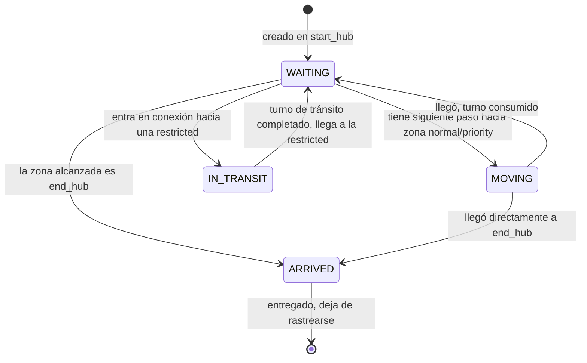

# SP08 — `Drone` y `Simulator`: el bucle turno a turno ⬜

**Objetivo:** ejecutar la simulación: avanzar turno a turno, mover los drones,
replanificar cada `W/2` turnos, y terminar cuando todos han llegado.

**Prerequisitos:** [SP07](./SP07-whca.md) y [SP03](./SP03-cli-y-errores.md)
verdes.

**Criterio de salida:** todos los drones llegan; ninguna regla de ocupación se
viola en ningún turno; el resultado **no depende del orden de la lista de
drones**.

---

## Paso 0 — Crear el paquete

```console
$ mkdir -p fly_in/simulation && touch fly_in/simulation/__init__.py
```

## Paso 1 — `Drone` y `DroneState`

`fly_in/simulation/drone.py`

```python
class DroneState(Enum):
    WAITING = auto()      # en una zona, sin movimiento este turno
    MOVING = auto()       # se mueve a una zona adyacente este turno
    IN_TRANSIT = auto()   # en una conexión hacia una restricted, llega el turno que viene
    ARRIVED = auto()      # en end_hub: entregado, deja de rastrearse


class Drone:
    """Un agente que recorre el grafo de start_hub a end_hub."""

    def __init__(self, drone_id: int, start: Zone) -> None:
        self.id = drone_id
        self.current_zone = start
        self.state = DroneState.WAITING
        self.path: list[Step] = []
        self.transit_connection: Optional[Connection] = None
        self.transit_turns_left = 0
```



⚠️ **No lo des por sentado — `IN_TRANSIT` no puede interrumpirse**
*(Cap. VII.3)*: *"the drone MUST reach its destination during the next turn. It
can't wait extra turns on the connection."* Un dron en tránsito **no toma
decisiones** el turno siguiente: llega, y punto. Si tu fase de decisión le
pregunta a un dron `IN_TRANSIT` qué quiere hacer, ya has abierto la puerta a que
espere en el aire. Sáltatelo: los drones `IN_TRANSIT` se resuelven automáticamente.

Y como corolario: la zona destino de una `restricted` **tiene que estar
garantizada libre en el turno de llegada** desde el momento en que el dron entra
en la conexión. Eso ya lo garantiza la reserva de
[SP06](./SP06-tabla-reservas.md), que ocupa la zona destino en `T+cost` en el
mismo momento en que reserva la conexión. Si esa reserva falta, un dron puede
quedarse sin sitio donde aterrizar, y no hay recuperación posible.

## Paso 2 — El bucle, con las dos fases

```
función run():
    turno ← 0
    salida ← []

    mientras queden drones sin entregar:

        # (a) replanificar al inicio de cada media ventana
        si turno % (W // 2) == 0:
            tabla.clear_from(turno)
            para cada dron en orden_de_prioridad(drones_activos):
                dron.path ← pathfinder.find_path(dron, turno)
                grabar dron.path en la tabla

        # (b) FASE 1 — DECIDIR (nadie se mueve todavía)
        movimientos ← []
        para cada dron activo:
            si dron.state es IN_TRANSIT:
                movimientos.append(llegada_forzosa(dron))
            si no:
                paso ← dron.siguiente_paso(turno)
                si paso existe y es legal contra el estado del turno:
                    movimientos.append((dron, paso))

        # (c) FASE 2 — APLICAR (todos a la vez)
        para cada (dron, paso) en movimientos:
            aplicar el movimiento, actualizar estado del dron
            si dron.current_zone es end_hub: dron.state ← ARRIVED

        salida.append(formatear(movimientos))
        turno ← turno + 1

        si turno > LIMITE_SEGURIDAD:
            lanzar SimulationError("la simulación no converge")

    devolver salida
```

### Por qué dos fases, en concreto

⚠️ **No lo des por sentado — esto no es una preferencia estética**
La regla del subject es: *"Drones moving out of a zone free up capacity for that
same turn"* *(Cap. VII.3)*. O sea: si el dron A está en `narrow` (capacidad 1) y
se va este turno, el dron B puede entrar en `narrow` **este mismo turno**.

Si aplicas los movimientos según recorres la lista:

- Si procesas B antes que A, ves `narrow` ocupada → B espera. **Mal.**
- Si procesas A antes que B, ves `narrow` libre → B entra. **Bien.**

El resultado depende del orden de la lista, que es un detalle de implementación
arbitrario. Separando decidir de aplicar, **todas** las decisiones se toman
contra el mismo estado (el del turno T, conociendo las salidas previstas), y el
resultado es el mismo con la lista en cualquier orden.

Ese es exactamente el test de cierre que verifica que lo hiciste bien.

### Cómo se cuentan las salidas en la fase 1

Para decidir si B puede entrar en `narrow`, la fase 1 necesita saber que A se va
a ir. Dos formas:

| Forma | Cómo |
|---|---|
| **Confiar en la tabla de reservas** | El pathfinder ya reservó `(narrow, T)` para B y `(narrow, T-1)` para A. La fase 1 solo ejecuta lo planificado |
| **Recalcular la ocupación del turno** | Contar los drones que están en cada zona, restar los que salen, sumar los que entran |

**Recomendación: la primera, con la segunda como verificación.** Si el pathfinder
de SP07 hizo bien su trabajo, la ruta de cada dron **ya es legal** y la fase 1 se
limita a ejecutarla. Recalcular sería duplicar la lógica de capacidades en dos
sitios que pueden divergir.

Pero **verifica** en modo debug: si al aplicar un movimiento detectas una
violación de capacidad, es un bug de SP06 o SP07 y quieres saberlo de inmediato,
no descubrirlo tres mapas después. Un `assert` o un `SimulationError` explícito
aquí vale su peso en oro.

## Paso 3 — La replanificación

```python
if turn % (self.window // 2) == 0:
    self.table.clear_from(turn)
    for drone in self._planning_order(active_drones):
        drone.path = self.pathfinder.find_path(drone, turn)
        self._record(drone.path)
```

**Por qué `W // 2` y no `W`:** si replanificas justo cuando la ventana se agota,
los drones llegan al límite sin margen de reacción. Replanificando a mitad de
ventana, siempre tienen `W/2` turnos de cooperación por delante. Es el mismo
principio que el *receding horizon control*.

⚠️ **No lo des por sentado — los drones `IN_TRANSIT` no se replanifican**
Un dron en el aire tiene su llegada comprometida: no puedes darle una ruta
nueva a mitad de trayecto porque no puede parar ni dar media vuelta. Exclúyelos
del bucle de replanificación y respeta la reserva que ya tienen. Si los incluyes,
`clear_from(turno)` borrará la reserva de su zona de aterrizaje y otro dron
podrá ocuparla — dejando al primero sin sitio donde llegar.

Es un bug sutil, devastador, y **muy** difícil de diagnosticar a posteriori.

## Paso 4 — El límite de seguridad

```python
MAX_TURNS_FACTOR = 4

limit = nb_drones * len(graph.zones) * MAX_TURNS_FACTOR
```

⚠️ **Ponlo. No es opcional.** WHCA\* no es completo: existen configuraciones
donde no converge (ver [SP07](./SP07-whca.md), `swap_corridor.txt`). Sin límite,
tu programa **se cuelga** durante la evaluación, y el subject dice que un
programa que se cuelga cuenta como no funcional *(Cap. III.1)*.

Un límite generoso y un `SimulationError` con un mensaje claro es infinitamente
mejor que un cuelgue:

```python
class SimulationError(Exception):
    """La simulación no pudo completarse."""
```

El mensaje debe decir qué pasó y con qué drones: *"No converge tras 340 turnos.
Drones sin entregar: D3 (en narrow), D7 (en corridorA)."* Eso es depurable; "se
colgó" no lo es.

## Paso 5 — Detectar lo imposible antes de empezar

Antes del primer turno, comprueba con `AbstractDistance` que `end_hub` es
alcanzable desde `start_hub`. Si no lo es, el mapa no tiene solución y debes
decirlo en el turno 0, con un mensaje claro — no tras 340 turnos de dar vueltas.

```python
if not self.heuristic.is_reachable(graph.start_hub):
    raise SimulationError(
        "end_hub no es alcanzable desde start_hub en este mapa"
    )
```

Cuesta dos líneas y convierte un cuelgue confuso en un error comprensible.

---

## Tests de cierre (`test/test_simulator.py`)

- [ ] `single_drone.txt`: 1 dron, 1 turno, llega
- [ ] `linear.txt`: los 2 drones llegan; el número de turnos coincide con el cálculo a mano
- [ ] `bottleneck.txt`: los 3 drones llegan sin violar `max_drones=1` en `narrow`
- [ ] **Independencia del orden:** ejecuta el mismo mapa con `drones` en orden
      normal y en orden invertido → **mismo número de turnos**. *(El test que
      verifica que las dos fases están bien.)*
- [ ] Todos los drones acaban en `ARRIVED`
- [ ] Ningún dron `IN_TRANSIT` permanece más de un turno en la conexión
- [ ] Mapa sin ruta posible → `SimulationError` en el turno 0, no un cuelgue
- [ ] **Validador de invariantes** ([`05-plan-de-pruebas.md`](../05-plan-de-pruebas.md#4-verificación-de-invariantes--el-test-que-más-bugs-caza))
      aplicado a la traza completa de **todos** los mapas

El último es el de mayor retorno de todo el proyecto: un validador independiente
que recorre la traza y comprueba todas las reglas del Cap. VII. Caza regresiones
de SP06, SP07, SP08 y SP09 de una sola vez.

---

## Criterio de salida

- [ ] Los 8 tests pasan
- [ ] El validador de invariantes pasa en todos los mapas de `maps/valid/`
- [ ] El límite de seguridad existe y su mensaje nombra los drones atascados
- [ ] `make lint-strict` pasa

## Decisiones a anotar

- Factor del límite de seguridad y por qué ese
- ¿La fase 1 confía en la tabla o recalcula la ocupación?
- ¿Qué pasa si un dron recibe una ruta parcial que se agota antes de la siguiente
  replanificación? *(Debe esperar en el sitio, no quedarse sin estado definido.)*
- Cadencia de replanificación: `W//2` u otra
