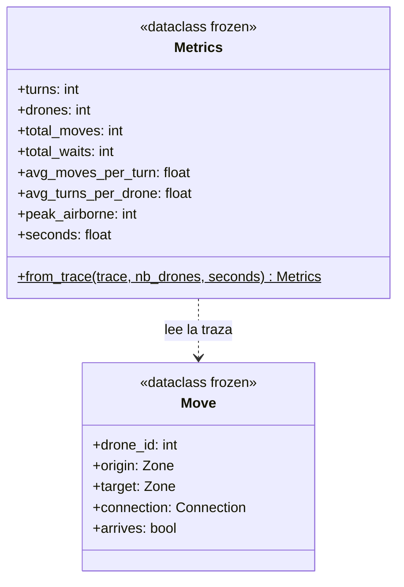
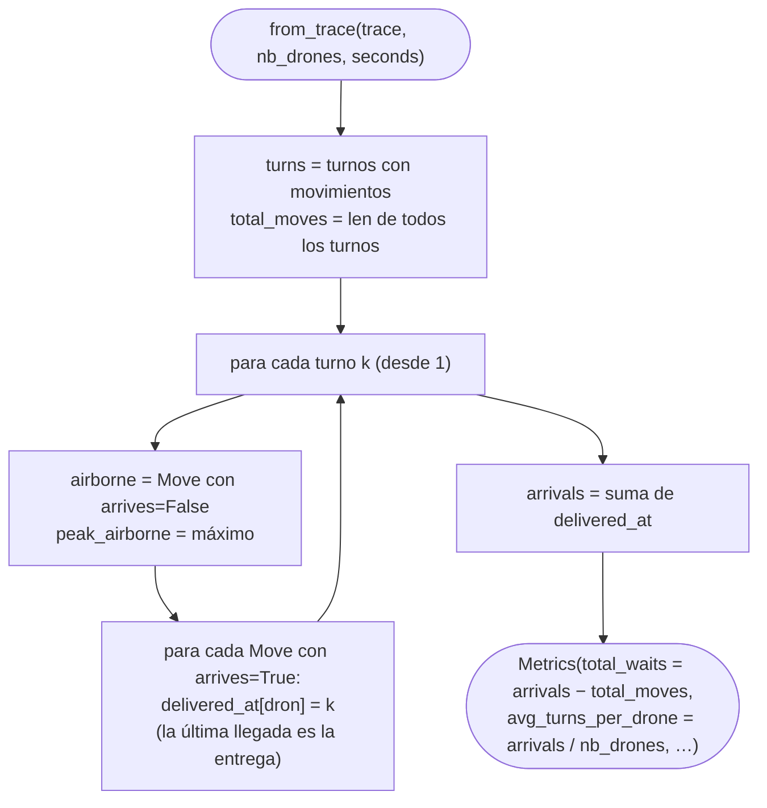

# E.1 — Métricas: `Metrics.from_trace`

`Metrics` ([`fly_in/simulation/metrics.py`](../../fly_in/simulation/metrics.py))
resume una simulación terminada. Se calcula **desde la traza** (la lista de
`Move` de cada turno), no desde el estado interno del simulador: son las
mismas cifras que obtendría alguien que solo leyera la salida.

## La clase



| Campo | Cálculo | Qué dice |
|---|---|---|
| `turns` | Turnos con algún movimiento | La nota del subject: líneas de salida |
| `drones` | `nb_drones` | — |
| `total_moves` | Número total de `Move` | Turnos-dron en marcha (un tránsito a `restricted` son 2) |
| `total_waits` | Suma de turnos de entrega − `total_moves` | Turnos-dron parado antes de entregar |
| `avg_moves_per_turn` | `total_moves / turns` | Cuánto paralelismo hay |
| `avg_turns_per_drone` | Turno medio de entrega | Cuánto tarda el dron típico, no solo el último |
| `peak_airborne` | Máximo de `Move` con `arrives=False` en un turno | Uso de las zonas `restricted` |
| `seconds` | Lo mide quien llama | Tiempo de cálculo, sin animación |

## `from_trace`, paso a paso



**Por qué `total_waits = arrivals − total_moves`:** un dron que entrega en el
turno `k` ha pasado `k` turnos en juego, y en cada uno o se movía o esperaba.
Sumando por drones: turnos en juego = movimientos + esperas.

## Ejemplo a mano: `maps/valid/bottleneck.txt`

D1 entrega en el turno 2, D2 en el 3 y D3 en el 4. Cada uno se mueve dos
turnos: 6 movimientos. Turno medio de entrega: (2 + 3 + 4) / 3 = 3. Esperas:
9 − 6 = 3. Es `test_bottleneck_metrics_by_hand`.

## Dónde se usa

- `FlyIn.run`: con `--metrics` se imprimen en `stderr`, y siempre en el
  resumen del log y en la tarjeta final de la ventana.
- `BenchmarkSuite.measure` (E.2).

## Verificación

```console
$ python -m fly_in.main maps/valid/bottleneck.txt -q --metrics 2>&1 | tail -8
turns: 4
drones: 3
total_moves: 6
total_waits: 3
avg_moves_per_turn: 1.50
avg_turns_per_drone: 3.00
peak_airborne: 0
compute_ms: 0.4
```
