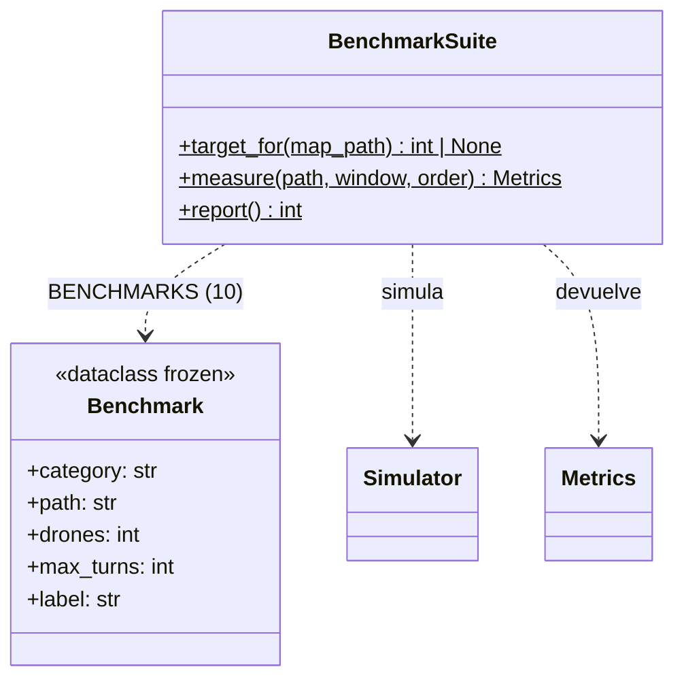
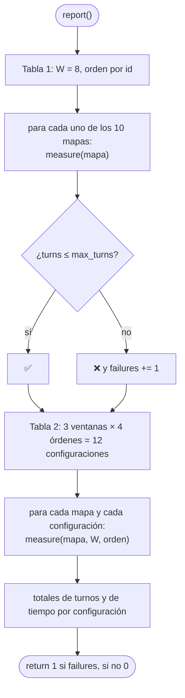

# E.2 — Benchmarks: `BenchmarkSuite`

[`fly_in/benchmarks.py`](../../fly_in/benchmarks.py) corre los 10 mapas
oficiales contra los objetivos del subject (Cap. VII.7) y compara
configuraciones. Se lanza con `make bench` o `python -m fly_in.benchmarks`; no
tiene argumentos.

## Las piezas

| Nombre | Qué es |
|---|---|
| `BENCHMARKS` | Los 10 mapas con su máximo de turnos. El challenger pide *batir* 45, así que su máximo es 44 (`< 45`) |
| `ORDERS` | Los cuatro criterios de orden de planificación: `id`, `nearest`, `farthest`, `rotating` (`PlanningOrders`, SP07) |
| `WINDOWS` | Las ventanas de WHCA\* que se comparan: 4, 8 y 16 |
| `target_for(path)` | El objetivo si el mapa es oficial (por nombre de fichero), o `None`. `FlyIn.run` lo usa para el PAR de la ventana |
| `measure(path, window=8, order="id")` | Parsea, simula y devuelve `Metrics` con el tiempo de cálculo |
| `report()` | Imprime las dos tablas; devuelve 1 si algún mapa no cumple |

## `report()`

## Resultado actual

| Mapa | Drones | Turnos | Objetivo |
|---|---|---|---|
| easy/01_linear_path | 2 | 4 | ≤ 6 |
| easy/02_simple_fork | 4 | 4 | ≤ 8 |
| easy/03_basic_capacity | 4 | 4 | ≤ 6 |
| medium/01_dead_end_trap | 5 | 8 | ≤ 12 |
| medium/02_circular_loop | 6 | 15 | ≤ 15 |
| medium/03_priority_puzzle | 5 | 7 | ≤ 12 |
| hard/01_maze_nightmare | 8 | 13 | ≤ 30 |
| hard/02_capacity_hell | 12 | 16 | ≤ 35 |
| hard/03_ultimate_challenge | 15 | 26 | ≤ 45 |
| challenger/01_the_impossible_dream | 25 | 43 | < 45 |

Total de turnos en los 10 mapas por configuración:

| | id | nearest | farthest | rotating |
|---|---|---|---|---|
| W = 4 | **140** | **140** | 230 | 170 |
| W = 8 | **140** | **140** | 266 | 177 |
| W = 16 | **140** | **140** | 276 | 207 |

Por eso la configuración por defecto es W = 8 y orden por id: empata con
`nearest_first`, es la más simple de explicar y W no cambia el resultado entre
4 y 16.

## Tests

`test/test_metrics.py`: `test_every_benchmark_file_exists_with_its_drone_count`,
`test_default_configuration_meets_every_target` (los 10 mapas) y
`test_target_lookup`.
