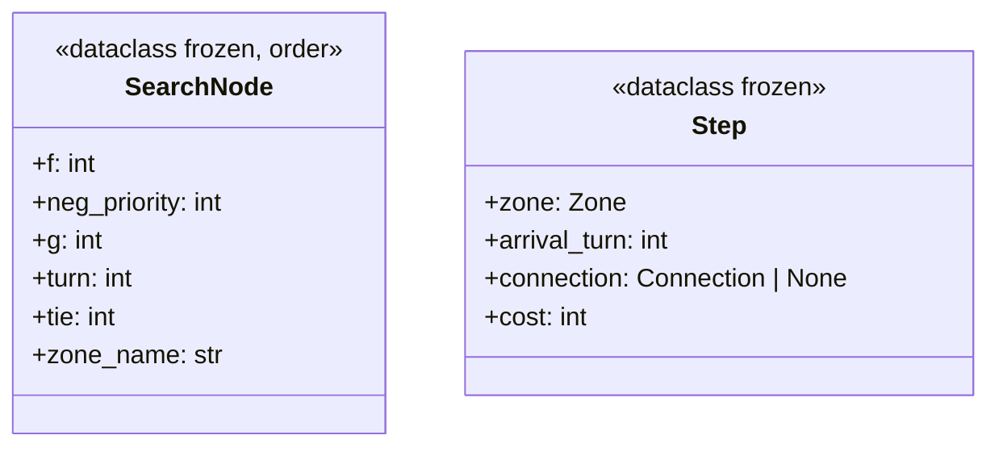
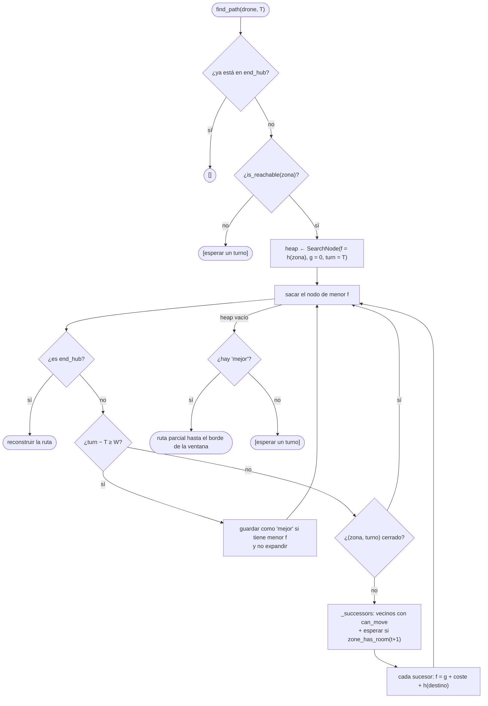
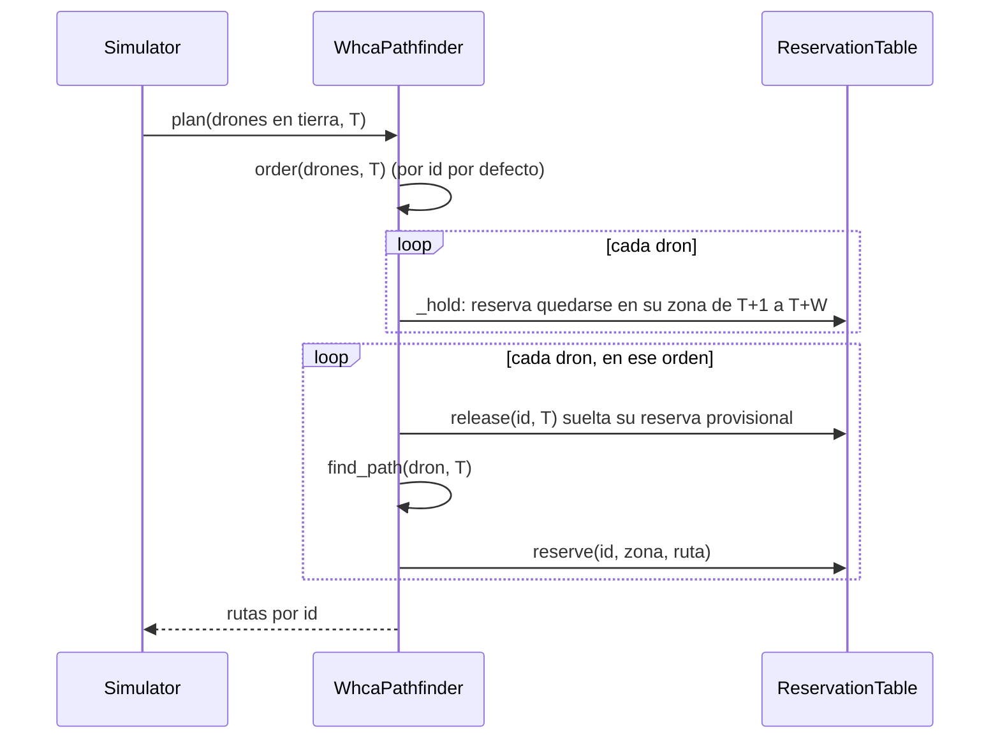

# E.3 — WHCA\*: A\* en espacio-tiempo

`WhcaPathfinder` ([`fly_in/pathfinding/whca.py`](../../fly_in/pathfinding/whca.py))
es la búsqueda cooperativa: un A\* cuyos estados son `(zona, turno)` y que
respeta las reservas de los drones que ya planificaron
([`reservation_table.py`](../../fly_in/pathfinding/reservation_table.py)).

## De zona a (zona, turno)

En Dijkstra (SP04) el estado es una zona: visitarla dos veces no sirve de
nada. Con varios drones no basta: estar en `hub1` en el turno 3 y en el turno 7
son situaciones distintas, porque otro dron puede ocuparla en uno y no en el
otro. Con el turno en el estado:

- **esperar** es un sucesor más: `(z, t) → (z, t+1)`, el único modo de ceder
  el paso;
- las reservas de los demás son **obstáculos que solo existen en ciertos
  turnos**, y una colisión simplemente no está entre los estados alcanzables.

## El nodo de búsqueda



El orden de los campos **es** el orden del montículo: primero `f = g + h`;
ante empate, la ruta con más zonas `priority` (`neg_priority`, como en
Dijkstra); luego `g`, `turn` y `tie`, un contador que favorece al nodo
descubierto antes. `zone_name` va detrás de `tie`, así que nunca se compara.
Un `Step` con `connection = None` es una espera.

## `find_path(drone, start_turn)`



- El objetivo se mira **antes** que la ventana: llegar justo en el último
  turno de la ventana cuenta como llegar.
- Más allá de la ventana la búsqueda confía en `h`: si se agota, devuelve una
  ruta **parcial** al mejor nodo del borde. Nunca devuelve "sin ruta".
- `_successors` descarta zonas `blocked` y las que no llevan al objetivo
  (`is_reachable`), y pregunta a la tabla `can_move(zona, vecino, turno)`, que
  comprueba la zona de llegada, la conexión en cada turno del trayecto y que
  no haya un cruce de frente (`would_swap`).

## `plan(drones, start_turn)`: todos los drones



Cada ruta se graba **antes** de planificar la siguiente: el siguiente dron ve
al anterior como obstáculo. La reserva provisional (`_hold`) evita que el
primero en planificar reserve entrar en la zona de uno que todavía no ha
planificado y no tendría por dónde salir.

## Ventana y replanificación

El simulador (SP08) replanifica cada `W // 2` turnos (como mínimo cada
turno), y antes si a un dron en tierra se le acaba la ruta. Al replanificar
olvida el futuro de la tabla (`clear_from`) salvo las reservas de los drones
en el aire (`keep`): no pueden parar ni volver.

```
W = 8:  turno 0      4      8      12
        [---- 8 ----]
               [---- 8 ----]
                      [---- 8 ----]
```

Siempre quedan W/2 turnos de cooperación por delante. En los 10 mapas
oficiales el resultado es el mismo con W = 4, 8 o 16.

## La heurística

`h(zona)` es `AbstractDistance.h` (SP05): el coste real de la zona al
objetivo si el dron estuviera solo. No depende del turno. Es **admisible**:
los demás drones solo pueden retrasar a uno, nunca adelantarlo, así que `h`
nunca sobreestima.

## Lo que no garantiza

WHCA\* **no es completo ni óptimo**: planifica a los drones uno detrás de
otro, con prioridad fija, y el primero se lleva las mejores reservas. Por eso
el simulador tiene un límite de seguridad (`drones × zonas × 4` turnos) que
convierte un caso que no converge en un error con los drones no entregados,
en lugar de colgarse.

## Criterios de orden (`PlanningOrders`)

| Criterio | Orden |
|---|---|
| `by_id` (por defecto) | id ascendente |
| `nearest_first(h)` | menor `h` primero; empata con `by_id` en los 10 mapas |
| `farthest_first(h)` | mayor `h` primero; pierde por la reserva provisional |
| `rotating` | por id, empezando en una posición que avanza con el turno |

## Tests

`test/test_whca.py` (50 tests): un dron replica a Dijkstra en los 19 mapas,
dos drones se turnan en un cuello de botella, la ventana pequeña da rutas
parciales, el tránsito a `restricted` reserva la conexión dos turnos, nadie se
cruza de frente, la reserva provisional no deja a nadie encerrado y cada
criterio de orden ordena como dice.
