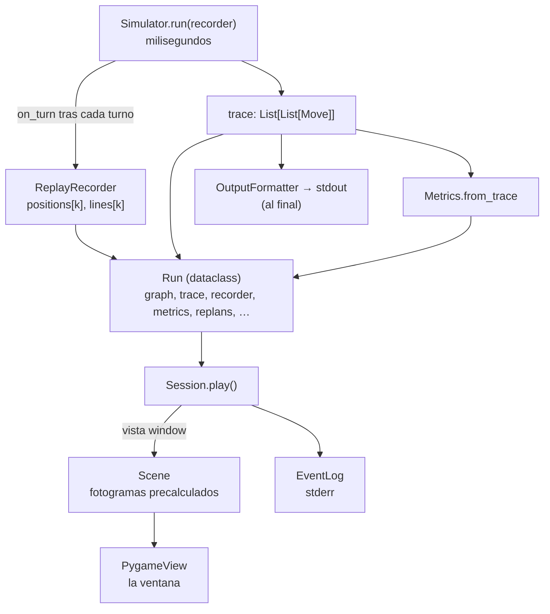
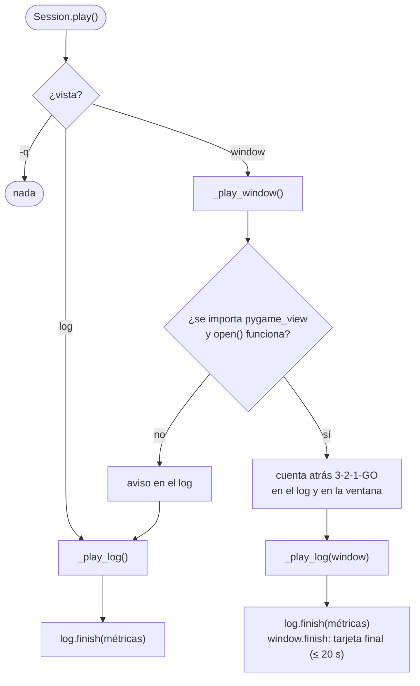
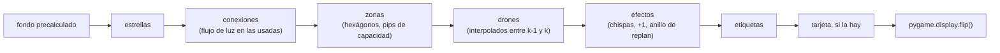

# E.4 — De la simulación a la pantalla

Cómo pasa la partida del simulador a la ventana pygame y al log de la
terminal. La regla que lo ordena todo: **primero se simula entero, después se
enseña lo grabado**, y la visualización no calcula nada.

## Las capas



## `ReplayRecorder`: un fotograma por turno

Es un observador del simulador
([`recorder.py`](../../fly_in/visualization/recorder.py)). En cada
`on_turn(turn, moves, drones)` añade:

- `positions[k]`: dónde está cada dron, por id, como lista corta:
  `["z", zona]` en tierra, `["a", origen, destino]` en el aire, `["d"]`
  entregado;
- `lines[k]`: la línea de `stdout` de ese turno.

`positions[0]` y `lines[0]` son el estado inicial (todos en `start_hub`).

## `Scene`: calcular una vez, dibujar muchas

[`scene.py`](../../fly_in/visualization/scene.py) no importa pygame. Al crearse
convierte la grabación en listas indexadas por fotograma:

| Atributo | Qué es |
|---|---|
| `points` | Coordenadas `(x, y)` de cada zona |
| `spots[k][dron]` | Un `Spot`: el punto donde va (centro de la zona, su hueco en un anillo si comparte zona o es un hub, o el punto medio de la conexión si está en el aire) |
| `occupants[k]` | Qué drones hay en cada zona |
| `used[k]` | `LinkUse`: qué conexiones se recorren de `k-1` a `k`, en qué sentido y con qué dron |
| `delivered[k]`, `airborne[k]` | Contadores |
| `replan_turns` | Turnos que empiezan con una replanificación |

y ofrece `is_hub(nombre)` y `newly_delivered(k)`.

## `Session`: la reproducción



`_play_log` recorre los turnos: para cada `k` escribe el bloque del log
(`EventLog.turn`) y, si hay ventana abierta, la anima
(`PygameView.play_turn(k, pace)`); sin ventana, espera `pace` segundos. Como
las dos cosas las hace el mismo bucle en un solo hilo, van a la par sin
sincronización. Si el usuario cierra la ventana, se avisa una vez y el log
sigue solo.

## `PygameView._paint(k, progreso)`: un fotograma



`play_turn(k, segundos)` llama a `_paint` a 60 fotogramas por segundo con el
progreso de 0 a 1 (curva cúbica); `SPACE` congela el progreso.

## `EventLog`: el log de la terminal

[`event_log.py`](../../fly_in/visualization/event_log.py):

| Método | Qué escribe |
|---|---|
| `briefing(vista)` | Cabecera: mapa, drones, zonas, conexiones, ventana, vista y la leyenda de colores |
| `countdown(valor)` | `» 3`, `» 2`, `» 1`, `» GO` |
| `turn(k, moves, posiciones, replans)` | La cabecera `── Tk ── ▸ línea de stdout`, las replanificaciones, cada movimiento, quién espera y las zonas que se acaban de llenar |
| `finish(métricas, replans)` | `MISSION COMPLETE · N TURNS` y las métricas |
| `note(texto)` | Avisos (sin pygame, ventana cerrada…) |

Todo pasa por `Painter`, así que sin terminal o con `NO_COLOR` sale texto
plano.

## Verificación

```console
$ python -m fly_in.main maps/valid/bottleneck.txt --view log -d 0
```

enseña el log completo (cabecera, 4 turnos y `MISSION COMPLETE · 4 TURNS`) y
después las 4 líneas de `stdout`.
