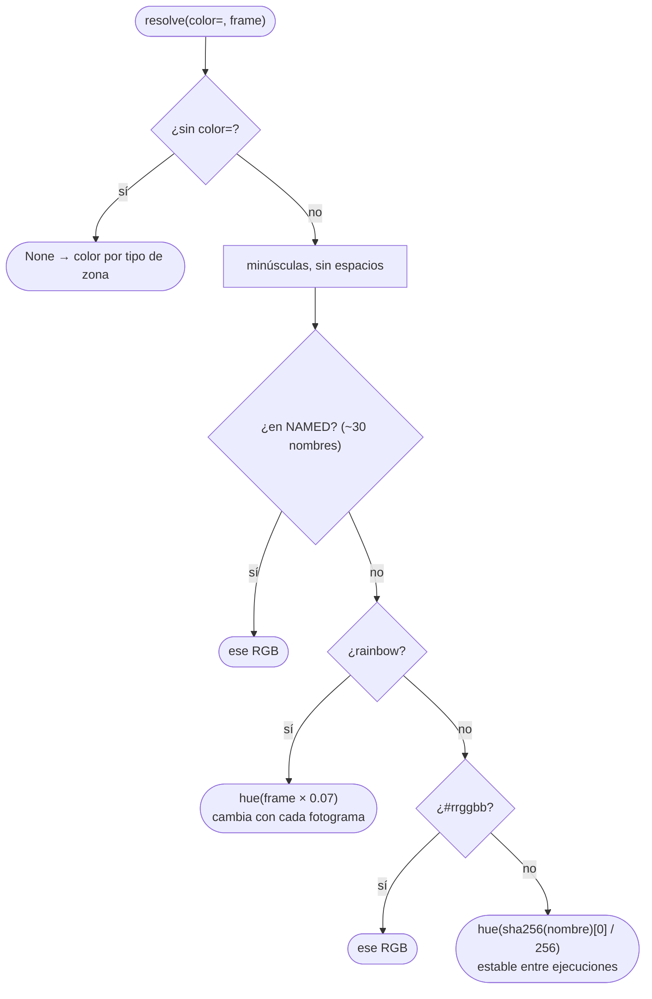
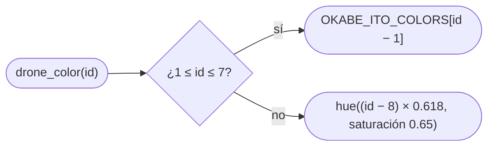
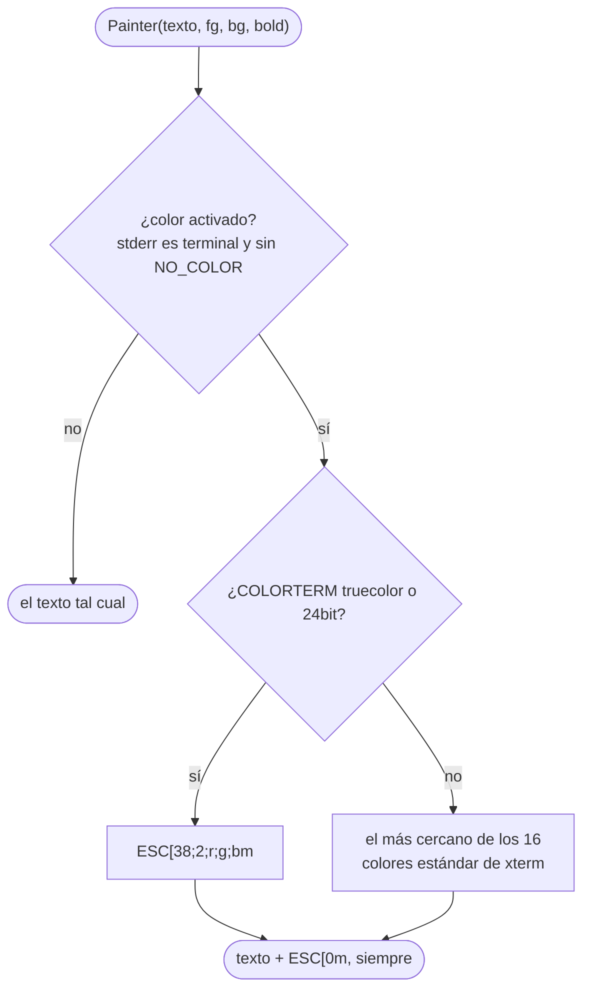

# E.5 — Colores: zonas, drones y terminal

Todo el color sale de [`fly_in/visualization/palette.py`](../../fly_in/visualization/palette.py):
`Palette` convierte nombres e ids en RGB, y `Painter` convierte RGB en códigos
ANSI para la terminal. La ventana pygame usa los RGB directamente.

## El color de una zona: `Palette.resolve(name, frame)`

Ninguna rama lanza una excepción: el subject admite cualquier palabra como
color (Cap. VI). La ventana, además, aclara los colores muy oscuros
(`PygameView._visible`) para que se vean sobre el fondo.

## El color de un dron: `Palette.drone_color(id)`

D1 a D7 usan los siete colores de la paleta Okabe-Ito (pensada para
distinguirse con daltonismo) sin el negro, que no se vería sobre el fondo. Desde
D8 los tonos avanzan 0,618 vueltas (el ángulo áureo) de un id al siguiente:

| Dron | RGB |
|---|---|
| D1 | (86, 180, 233) azul cielo |
| D2 | (0, 158, 115) verde azulado |
| D3 | (213, 94, 0) bermellón |
| D4 | (204, 121, 167) púrpura rojizo |
| D5 | (0, 114, 178) azul |
| D6 | (240, 228, 66) amarillo |
| D7 | (230, 159, 0) naranja |
| D8 | (255, 89, 89) |
| D9 | (89, 137, 255) |

Es la **misma función** en la ventana (dron, estela, flujo de la conexión) y en
el log (leyenda, etiqueta de cada movimiento, lista de quién espera), así que
cada dron tiene un solo color en todas partes.

## De RGB a la terminal: `Painter`

`Painter` es el **único** sitio que escribe códigos ANSI, y siempre cierra con
`RESET`: el color nunca se queda pegado al prompt. `FlyIn.make_painter` decide
si está activado.

## Tests

- `test/test_visualization.py`: `test_any_color_name_resolves`,
  `test_unknown_color_is_stable_and_no_color_is_none`,
  `test_rainbow_changes_with_the_frame`, `test_painter_always_resets`,
  `test_painter_disabled_emits_plain_text`,
  `test_basic_palette_fallback_uses_16_colors`,
  `test_first_seven_drones_use_distinct_okabe_ito_colors` (los siete son
  Okabe-Ito y ninguna pareja está a menos de 60 de distancia RGB).
- `test/test_session.py`: `test_log_without_color_has_no_ansi`,
  `test_each_drone_has_one_color_in_the_log`.
