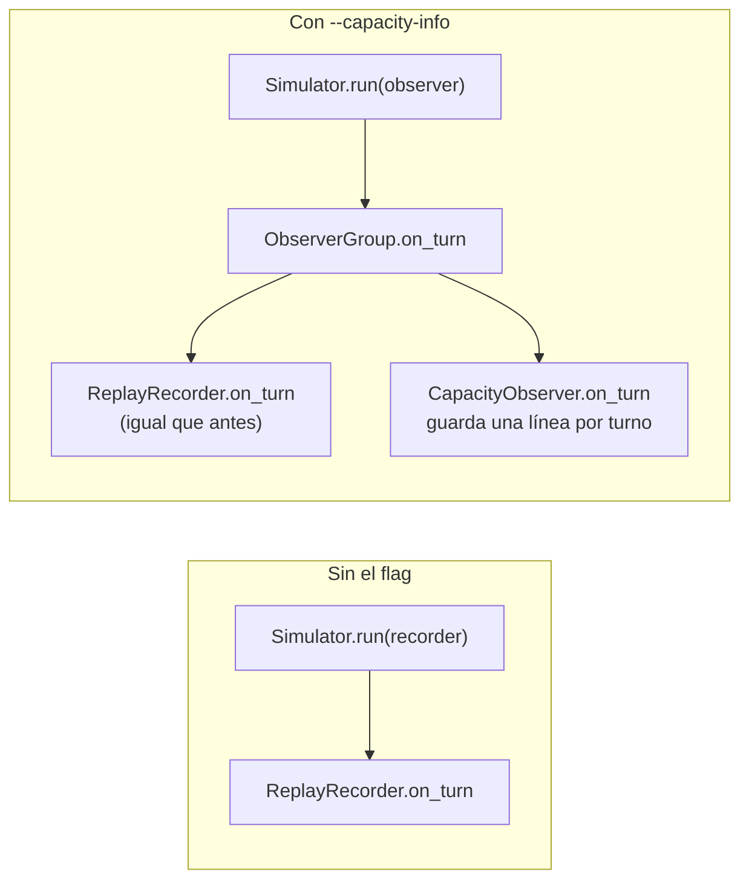
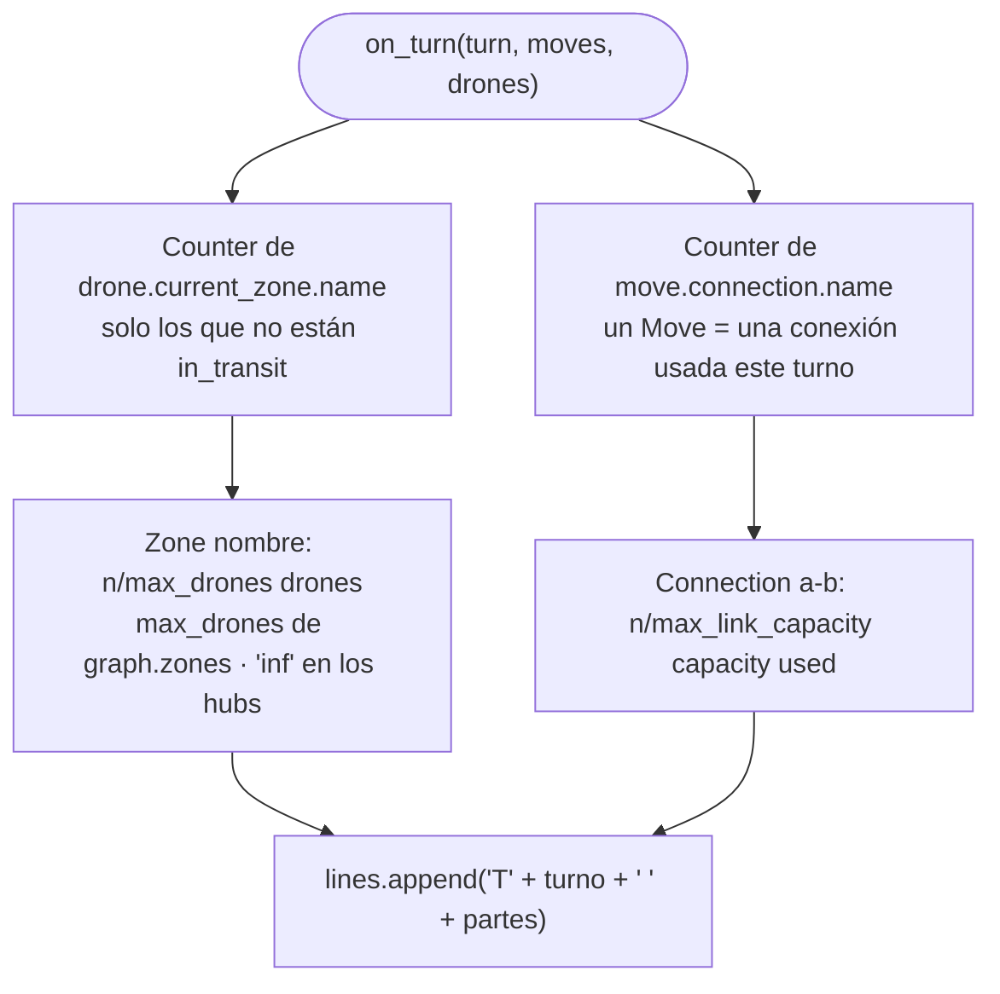
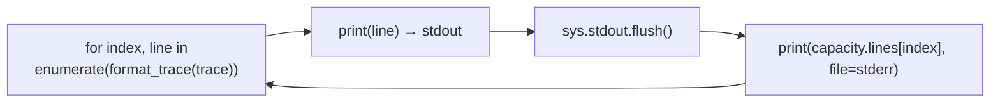

# E.6 — `--capacity-info`: el flujo

La hoja de evaluación propone como modificación en directo un flag
`--capacity-info` que enseñe, turno a turno, `Zone X: Y/Z drones, Connection
A-B: Y/Z capacity used`. **Ya está implementado y probado en el código
entregado.** Este diagrama describe esa versión; la variante de ensayo (que
escribe en `stderr` mientras simula) está en
[`../ensayo/`](../ensayo/), y el guion para enseñarlo o reescribirlo delante
del evaluador, en [`guia-live-coding.md`](../defensa/guia-live-coding.md).

## Antes y después en `FlyIn.run`



Sin el flag, `observer` es el mismo `recorder` de siempre: el comportamiento
no cambia ni un byte.

## Un turno dentro de `CapacityObserver.on_turn`



## La salida: intercalada con `stdout`



En una terminal, cada línea `T<k> …` sale justo debajo de la línea de su
turno. Redirigiendo `stdout` (`> salida.txt`), el fichero sigue teniendo solo
las líneas del subject.

| Pregunta | Respuesta |
|---|---|
| ¿Por qué no hereda de `SimulationObserver`? | Es un `Protocol`: basta con tener `on_turn` con esa firma, y mypy lo comprueba |
| ¿Por qué `stderr`? | `stdout` solo lleva las líneas del subject (Cap. VII.5) |
| ¿Por qué guarda las líneas en vez de imprimirlas? | La simulación termina antes de enseñarse; guardándolas, `run` las escribe junto a la línea de `stdout` de su turno, después de la ventana o el log |
| ¿Cuenta el tránsito a una `restricted`? | Sí: hay un `Move` en cada uno de los dos turnos, así que la conexión aparece ocupada los dos |
| ¿Dónde están los entregados? | En `end_hub` (`current_zone`): la meta muestra cuántos han llegado |
| ¿Y si un turno no tuviera movimientos? | `format_trace` no escribe línea para un turno vacío y el índice se desalinearía. Con WHCA\* no ocurre (comprobado en todos los mapas con W = 1, 2, 4, 8 y 16), pero es lo primero que tocar si se cambia el simulador |

## Cambios en el código

| Fichero | Cambio |
|---|---|
| `fly_in/simulation/capacity_observer.py` | Nuevo: `CapacityObserver` (49 líneas con docstrings) |
| `fly_in/main.py`, imports | `CapacityObserver`, `ObserverGroup` y `SimulationObserver` |
| `fly_in/main.py`, `build_parser` | `--capacity-info`, `store_true` |
| `fly_in/main.py`, `run` | `observer = ObserverGroup(recorder, capacity)` si se pide el flag; las líneas de capacidad se escriben tras cada línea de `stdout` |
| `Makefile` | Regla `make capacity` (`MAP=… ARGS=…`) |
| `test/test_capacity_observer.py` | 14 tests (5 funciones, una parametrizada sobre los 10 mapas oficiales) |

## Verificación

```console
$ make capacity MAP=maps/valid/bottleneck.txt ARGS=-q
D1-narrow
T1 Zone narrow: 1/1 drones, Zone start: 2/inf drones, Connection start-narrow: 1/1 capacity used
D1-goal D2-narrow
T2 Zone goal: 1/inf drones, Zone narrow: 1/1 drones, Zone start: 1/inf drones, Connection narrow-goal: 1/1 capacity used, Connection start-narrow: 1/1 capacity used
D2-goal D3-narrow
T3 Zone goal: 2/inf drones, Zone narrow: 1/1 drones, Connection narrow-goal: 1/1 capacity used, Connection start-narrow: 1/1 capacity used
D3-goal
T4 Zone goal: 3/inf drones, Connection narrow-goal: 1/1 capacity used
```

Sin el flag y con `-q`, `stderr` está vacío y `stdout` tiene solo las 4
líneas del subject.
