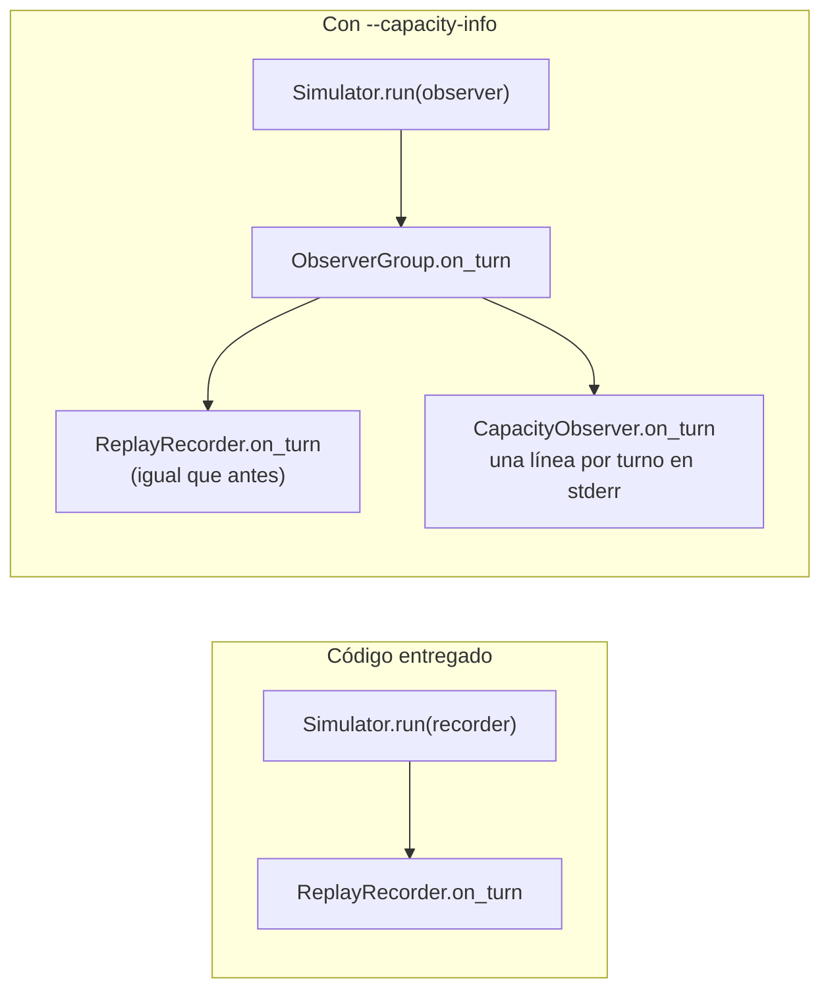
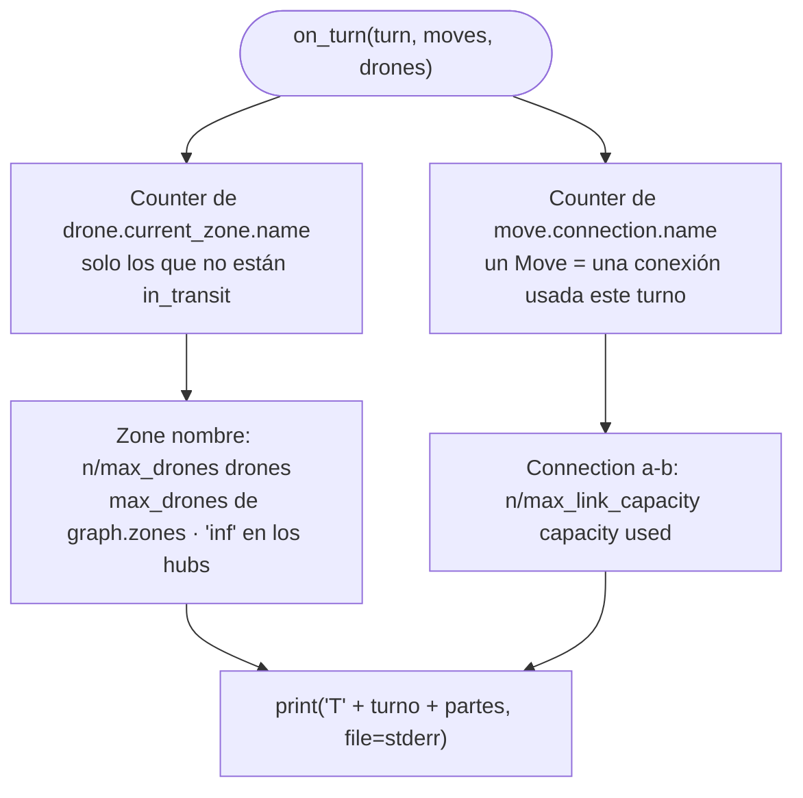

# E.6 — Live coding: el flujo de `--capacity-info`

El flag no está en el código entregado; este diagrama describe la solución
de [`../ensayo/diff-flag.patch`](../ensayo/diff-flag.patch). El guion paso a
paso está en [`../guia-live-coding.md`](../guia-live-coding.md).

## Antes y después en `FlyIn.run`



Sin el flag, `observer` es el mismo `recorder` de siempre: el comportamiento
no cambia ni un byte.

## Un turno dentro de `CapacityObserver.on_turn`



| Pregunta | Respuesta |
|---|---|
| ¿Por qué no hereda de `SimulationObserver`? | Es un `Protocol`: basta con tener `on_turn` con esa firma, y mypy lo comprueba |
| ¿Por qué `stderr`? | `stdout` solo lleva las líneas del subject (Cap. VII.5) |
| ¿Cuenta el tránsito a una `restricted`? | Sí: hay un `Move` en cada uno de los dos turnos, así que la conexión aparece ocupada los dos |
| ¿Dónde están los entregados? | En `end_hub` (`current_zone`): la meta muestra cuántos han llegado |
| ¿Por qué las líneas salen antes de la animación? | `FlyIn.run` simula entero y después enseña lo grabado; el observador escribe mientras simula |

## Cambios en el código

| Fichero | Cambio |
|---|---|
| `fly_in/simulation/capacity_observer.py` | Nuevo: `CapacityObserver` (47 líneas con docstrings) |
| `fly_in/main.py` línea 23 | Importar `CapacityObserver`, `ObserverGroup` y `SimulationObserver` |
| `fly_in/main.py` `build_parser` | `--capacity-info`, `store_true` |
| `fly_in/main.py` `run` | `observer = ObserverGroup(recorder, CapacityObserver(graph, sys.stderr))` si se pide el flag |
| `test/test_capacity_observer.py` | Opcional: 12 tests |

## Verificación

```console
$ python -m fly_in.main maps/valid/bottleneck.txt --capacity-info -q 2>&1 | head -1
T1 Zone narrow: 1/1 drones, Zone start: 2/inf drones, Connection start-narrow: 1/1 capacity used
$ python -m fly_in.main maps/valid/bottleneck.txt -q 2>&1 | wc -l
4
```

Sin el flag y con `-q`, las 4 líneas son solo las del subject: `stderr` está
vacío.
