# Diagramas de flujo del proyecto

Todos los diagramas del proyecto, **de SP00 a SP11**, sacados del código real
(no del plan). Hay tres grupos:

1. **Relaciones**: cómo encajan los subproyectos, los datos y los módulos.
2. **Flujos transversales**: lo que atraviesa varios subproyectos a la vez,
   como la ejecución completa de `make run`, los canales de salida, las
   excepciones, los estados de un dron, una replanificación, los observadores
   y el bucle de la ventana.
3. **Un apartado por subproyecto**, con el detalle de sus funciones. El de
   SP10 (visualización) es el más largo, porque es la parte con más piezas:
   tres vistas, una escena precalculada y el bucle de la ventana.

Las narrativas ([SP06-SP07](../narrativas/SP06-SP07-narrativa.md),
[SP08](../narrativas/SP08-narrativa.md), [SP09](../narrativas/SP09-narrativa.md),
[SP10](../narrativas/SP10-narrativa.md), [SP11](../narrativas/SP11-narrativa.md))
cuentan con palabras lo que estos diagramas dibujan. Las preguntas de evaluación sobre la visualización y sus respuestas
están en [13](../defensa/13-defensa-visualizacion.md), y la comprobación norma a norma
del subject en [14](../defensa/14-cumplimiento-subject.md).

**Cómo leerlos**

| Forma | Significa |
|---|---|
| Rectángulo | Un paso que siempre se ejecuta |
| Rombo | Una decisión (`if`) |
| Estadio `([ ])` | Inicio o fin: lo que devuelve la función |
| Hexágono `{{ }}` | Una excepción que se lanza |
| Paralelogramo `[/ /]` | Una entrada o salida: fichero, `stdout`, `stderr`, ventana |
| Línea discontinua `-.->` | Una llamada opcional (p. ej. el observador de la visualización) |

---

## Índice

**Relaciones**
- [Relación 1 — dependencias entre subproyectos](#relación-1--dependencias-entre-subproyectos)
- [Relación 2 — flujo de datos del programa](#relación-2--flujo-de-datos-del-programa)
- [Relación 3 — dependencias entre módulos](#relación-3--dependencias-entre-módulos-imports)
- [Relación 4 — mapa de clases](#relación-4--mapa-de-clases)

**Flujos transversales**
- [F1 — `make run` de principio a fin](#f1--make-run-de-principio-a-fin)
- [F2 — Los dos canales de salida](#f2--los-dos-canales-de-salida-stdout-y-stderr)
- [F3 — Frontera de excepciones y códigos de salida](#f3--frontera-de-excepciones-y-códigos-de-salida)
- [F4 — La vida de un dron](#f4--la-vida-de-un-dron-máquina-de-estados)
- [F5 — Una replanificación](#f5--una-replanificación-paso-a-paso)
- [F6 — Quién observa la simulación en cada vista](#f6--quién-observa-la-simulación-en-cada-vista)
- [F7 — Un solo hilo: el bucle de la ventana](#f7--un-solo-hilo-el-bucle-de-la-ventana)
- [F8 — Recursos y su liberación](#f8--recursos-y-su-liberación)

**Subproyectos**
- [SP00 — Setup y Makefile](#sp00--setup-y-makefile)
- [SP01 — Modelo de dominio](#sp01--modelo-de-dominio)
- [SP02 — Parser](#sp02--parser)
- [SP03 — CLI y errores](#sp03--cli-y-errores)
- [SP04 — Dijkstra](#sp04--dijkstra)
- [SP05 — Heurística abstracta](#sp05--heurística-abstracta)
- [SP06 — Tabla de reservas](#sp06--tabla-de-reservas)
- [SP07 — WHCA\*](#sp07--whca)
- [SP08 — Simulador](#sp08--simulador)
- [SP09 — Formato de salida](#sp09--formato-de-salida)
- [SP10 — Visualización](#sp10--visualización)
- [SP11 — Benchmarks y entrega](#sp11--benchmarks-y-entrega)

---

## Relación 1 — dependencias entre subproyectos

Una flecha `A → B` significa "B no se puede empezar sin A verde". Todos están
hechos.

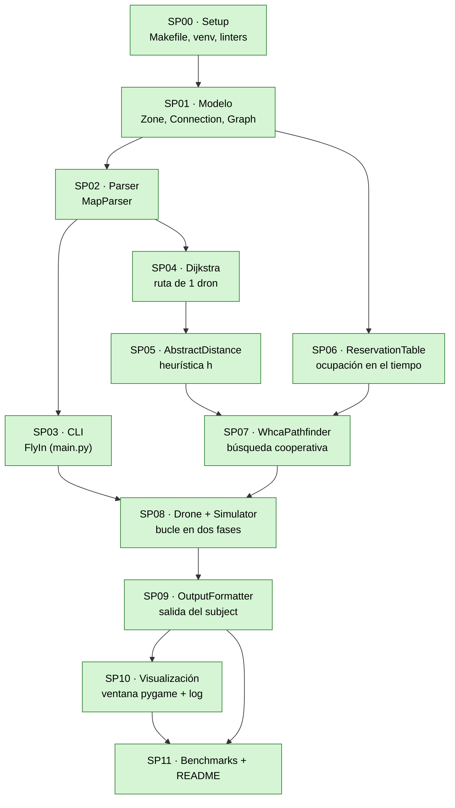
```mermaid
flowchart TD
    SP00["SP00 · Setup<br/>Makefile, venv, linters"] --> SP01["SP01 · Modelo<br/>Zone, Connection, Graph"]
    SP01 --> SP02["SP02 · Parser<br/>MapParser"]
    SP02 --> SP03["SP03 · CLI<br/>FlyIn (main.py)"]
    SP02 --> SP04["SP04 · Dijkstra<br/>ruta de 1 dron"]
    SP04 --> SP05["SP05 · AbstractDistance<br/>heurística h"]
    SP01 --> SP06["SP06 · ReservationTable<br/>ocupación en el tiempo"]
    SP05 --> SP07["SP07 · WhcaPathfinder<br/>búsqueda cooperativa"]
    SP06 --> SP07
    SP07 --> SP08["SP08 · Drone + Simulator<br/>bucle en dos fases"]
    SP03 --> SP08
    SP08 --> SP09["SP09 · OutputFormatter<br/>salida del subject"]
    SP09 --> SP10["SP10 · Visualización<br/>ventana pygame + log"]
    SP09 --> SP11["SP11 · Benchmarks + README"]
    SP10 --> SP11

    classDef done fill:#d5f5d5,stroke:#2e7d32,color:#000
    class SP00,SP01,SP02,SP03,SP04,SP05,SP06,SP07,SP08,SP09,SP10,SP11 done
```

**Lo que hay que ver aquí:**
- Tras el parser el trabajo se abre en **dos ramas independientes**: la del
  algoritmo (SP04 → SP05) y la de la ocupación (SP06, que solo necesita el
  modelo). SP07 es el primer punto donde se juntan.
- SP03 (CLI) no lo necesita nadie hasta SP08, que es cuando el programa
  empieza a simular de verdad.

---

## Relación 2 — flujo de datos del programa

Qué recorre un mapa desde el archivo hasta la pantalla al ejecutar `make run`.

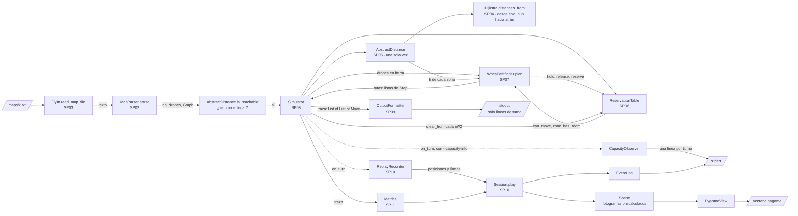
```mermaid
flowchart LR
    F[/"maps/x.txt"/] --> R["FlyIn.read_map_file<br/>SP03"]
    R -->|"texto"| P["MapParser.parse<br/>SP02"]
    P -->|"nb_drones, Graph"| RCH["AbstractDistance.is_reachable<br/>¿se puede llegar?"]
    RCH -->|"sí"| SIM["Simulator<br/>SP08"]
    SIM --> AD["AbstractDistance<br/>SP05 · una sola vez"]
    AD --> DJ["Dijkstra.distances_from<br/>SP04 · desde end_hub hacia atrás"]
    SIM --> RT["ReservationTable<br/>SP06"]
    SIM -->|"drones en tierra"| W["WhcaPathfinder.plan<br/>SP07"]
    AD -->|"h de cada zona"| W
    RT -->|"can_move, zone_has_room"| W
    W -->|"hold, release, reserve"| RT
    W -->|"rutas: listas de Step"| SIM
    SIM -->|"clear_from cada W/2"| RT
    SIM -->|"traza: List of List of Move"| O["OutputFormatter<br/>SP09"]
    SIM -->|"traza"| MT["Metrics<br/>SP11"]
    SIM -.->|"on_turn"| REC["ReplayRecorder<br/>SP10"]
    SIM -.->|"on_turn, con --capacity-info"| CAP["CapacityObserver"]
    CAP -->|"una línea por turno"| ERR
    REC -->|"posiciones y líneas"| SES["Session.play<br/>SP10"]
    MT --> SES
    SES --> LOG["EventLog"]
    SES --> SC["Scene<br/>fotogramas precalculados"]
    SC --> PV["PygameView"]
    PV --> WIN[/"ventana pygame"/]
    LOG --> ERR[/"stderr"/]
    O --> OUT[/"stdout<br/>solo líneas de turno"/]
```

**Lo que hay que ver aquí:**
- El parser y la heurística corren **una sola vez**. Lo que se repite en
  bucle es el ciclo tabla ⇄ buscador ⇄ simulador, cada `W/2` turnos.
- La visualización cuelga del simulador por líneas discontinuas: son
  observadores opcionales y el simulador no sabe nada de ellos.
- Con las vistas `window` y `log` **primero se simula entero y después se
  enseña lo grabado** (`ReplayRecorder` → `Session`).
- `stdout` recibe **solo** lo que produce `OutputFormatter`.

---

## Relación 3 — dependencias entre módulos (imports)

Quién importa a quién, sacado de las líneas `from fly_in…` de cada fichero.
Las flechas van de "el que importa" a "el importado": ninguna vuelve hacia
arriba, así que no hay dependencias circulares. (Se omiten casi todas las
flechas hacia `models/`, que importa casi todo el mundo.)

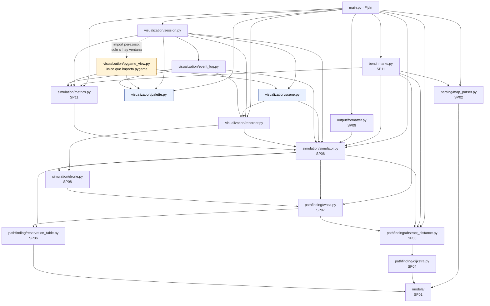
```mermaid
flowchart TD
    main["main.py · FlyIn"]
    bench["benchmarks.py<br/>SP11"]
    fmt["output/formatter.py<br/>SP09"]
    session["visualization/session.py"]
    pgv["visualization/pygame_view.py<br/>único que importa pygame"]
    scene["visualization/scene.py"]
    elog["visualization/event_log.py"]
    rec["visualization/recorder.py"]
    palette["visualization/palette.py"]
    sim["simulation/simulator.py<br/>SP08"]
    drone["simulation/drone.py<br/>SP08"]
    metrics["simulation/metrics.py<br/>SP11"]
    whca["pathfinding/whca.py<br/>SP07"]
    table["pathfinding/reservation_table.py<br/>SP06"]
    heur["pathfinding/abstract_distance.py<br/>SP05"]
    dijkstra["pathfinding/dijkstra.py<br/>SP04"]
    parser["parsing/map_parser.py<br/>SP02"]
    models["models/<br/>SP01"]

    main --> bench & fmt & session & rec & palette & sim & metrics & parser & heur
    bench --> sim & metrics & whca & heur & parser
    fmt --> sim
    session --> elog & rec & scene & palette & sim & metrics
    session -. "import perezoso,<br/>solo si hay ventana" .-> pgv
    pgv --> scene & palette & metrics
    scene --> rec & sim
    elog --> rec & palette & sim & metrics
    rec --> sim & drone
    metrics --> sim
    sim --> drone & whca & table & heur
    drone --> whca
    whca --> table & heur
    heur --> dijkstra
    parser --> models
    dijkstra --> models
    table --> models

    classDef leaf fill:#e8f0ff,stroke:#3050a0,color:#000
    classDef ext fill:#fff3d6,stroke:#b07000,color:#000
    class palette,scene leaf
    class pgv ext
```

**Lo que hay que ver aquí:**
- `models/` no importa nada de fuera de `models/`: el dominio no sabe que
  existen el parser ni el pathfinding.
- `simulation/` no importa `output/` ni `visualization/`: la simulación se
  puede usar (y testear) sin pantalla. La dependencia va al revés.
- `reservation_table.py` no importa `dijkstra` ni `abstract_distance`: SP06 es
  independiente de SP04/SP05, igual que en la Relación 1.
- **pygame solo entra por un sitio** (en naranja): `pygame_view.py`, y
  `session.py` lo importa dentro de un método, solo cuando va a abrir la
  ventana. Sin pygame instalado, todo lo demás funciona (y los tests de la
  escena, en azul con la paleta, no necesitan pantalla).

---

## Relación 4 — mapa de clases

Todas las clases del paquete y cómo se usan entre ellas. El proyecto no tiene
funciones sueltas: todo vive en una clase (Cap. V, *"completely
object-oriented"*); ver [14](../defensa/14-cumplimiento-subject.md).

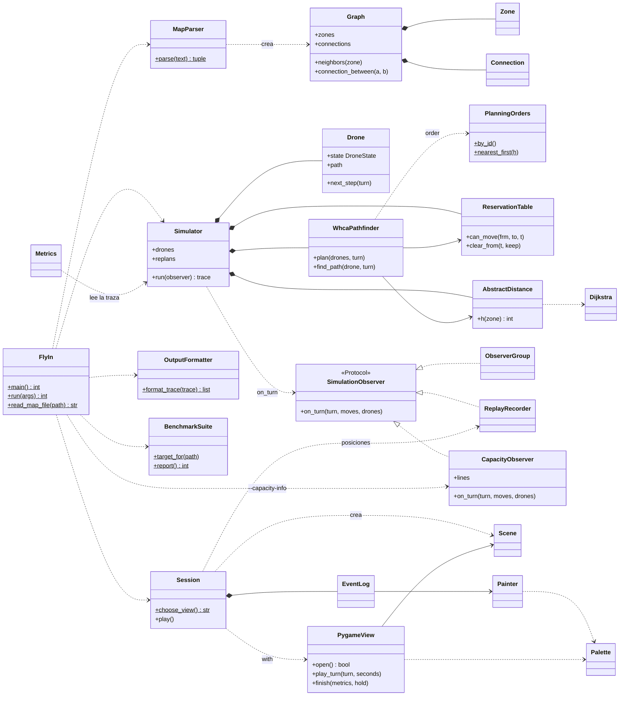
```mermaid
classDiagram
    direction LR
    class FlyIn {
        +main()$ int
        +run(args)$ int
        +read_map_file(path)$ str
    }
    class MapParser {
        +parse(text)$ tuple
    }
    class Graph {
        +zones
        +connections
        +neighbors(zone)
        +connection_between(a, b)
    }
    class Zone
    class Connection
    class Simulator {
        +drones
        +replans
        +run(observer) trace
    }
    class Drone {
        +state DroneState
        +path
        +next_step(turn)
    }
    class WhcaPathfinder {
        +plan(drones, turn)
        +find_path(drone, turn)
    }
    class PlanningOrders {
        +by_id()$
        +nearest_first(h)$
    }
    class ReservationTable {
        +can_move(frm, to, t)
        +clear_from(t, keep)
    }
    class AbstractDistance {
        +h(zone) int
    }
    class Dijkstra
    class OutputFormatter {
        +format_trace(trace)$ list
    }
    class Metrics
    class BenchmarkSuite {
        +target_for(path)$
        +report()$ int
    }
    class SimulationObserver {
        <<Protocol>>
        +on_turn(turn, moves, drones)
    }
    class ObserverGroup
    class ReplayRecorder
    class CapacityObserver {
        +lines
        +on_turn(turn, moves, drones)
    }
    class Session {
        +choose_view()$ str
        +play()
    }
    class EventLog
    class Scene
    class PygameView {
        +open() bool
        +play_turn(turn, seconds)
        +finish(metrics, hold)
    }
    class Painter
    class Palette

    FlyIn ..> MapParser
    FlyIn ..> Simulator
    FlyIn ..> Session
    FlyIn ..> OutputFormatter
    FlyIn ..> BenchmarkSuite
    MapParser ..> Graph : crea
    Graph *-- Zone
    Graph *-- Connection
    Simulator *-- Drone
    Simulator *-- ReservationTable
    Simulator *-- WhcaPathfinder
    Simulator *-- AbstractDistance
    WhcaPathfinder --> ReservationTable
    WhcaPathfinder --> AbstractDistance
    WhcaPathfinder ..> PlanningOrders : order
    AbstractDistance ..> Dijkstra
    SimulationObserver <|.. ReplayRecorder
    SimulationObserver <|.. ObserverGroup
    SimulationObserver <|.. CapacityObserver
    FlyIn ..> CapacityObserver : --capacity-info
    Simulator ..> SimulationObserver : on_turn
    Metrics ..> Simulator : lee la traza
    Session *-- EventLog
    Session ..> Scene : crea
    Session ..> PygameView : with
    Session ..> ReplayRecorder : posiciones
    PygameView --> Scene
    EventLog --> Painter
    Painter ..> Palette
    PygameView ..> Palette
```

---

# Flujos transversales

Lo que no pertenece a un solo subproyecto: la ejecución completa y las reglas
que se cumplen en todas partes a la vez.

## F1 — `make run` de principio a fin

Una partida con la ventana, que es la vista por defecto cuando hay pantalla
gráfica.

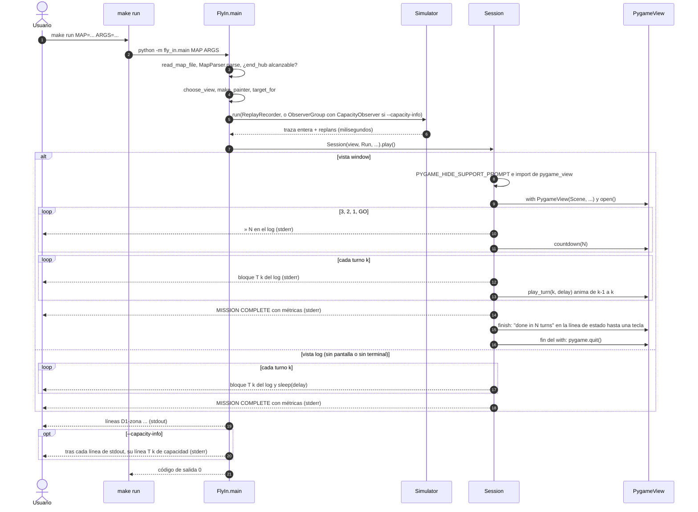
```mermaid
sequenceDiagram
    autonumber
    actor U as Usuario
    participant MK as make run
    participant FI as FlyIn.main
    participant SIM as Simulator
    participant SES as Session
    participant PV as PygameView
    U->>MK: make run MAP=... ARGS=...
    MK->>FI: python -m fly_in.main MAP ARGS
    FI->>FI: read_map_file, MapParser.parse, ¿end_hub alcanzable?
    FI->>FI: choose_view, make_painter, target_for
    FI->>SIM: run(ReplayRecorder, o ObserverGroup con CapacityObserver si --capacity-info)
    SIM-->>FI: traza entera + replans (milisegundos)
    FI->>SES: Session(view, Run, ...).play()
    alt vista window
        SES->>SES: PYGAME_HIDE_SUPPORT_PROMPT e import de pygame_view
        SES->>PV: with PygameView(Scene, ...) y open()
        loop 3, 2, 1, GO
            SES-->>U: » N en el log (stderr)
            SES->>PV: countdown(N)
        end
        loop cada turno k
            SES-->>U: bloque T k del log (stderr)
            SES->>PV: play_turn(k, delay) anima de k-1 a k
        end
        SES-->>U: MISSION COMPLETE con métricas (stderr)
        SES->>PV: finish: "done in N turns" en la línea de estado hasta una tecla
        SES->>PV: fin del with: pygame.quit()
    else vista log (sin pantalla o sin terminal)
        loop cada turno k
            SES-->>U: bloque T k del log y sleep(delay)
        end
        SES-->>U: MISSION COMPLETE con métricas (stderr)
    end
    FI-->>U: líneas D1-zona ... (stdout)
    opt --capacity-info
        FI-->>U: tras cada línea de stdout, su línea T k de capacidad (stderr)
    end
    FI-->>MK: código de salida 0
```

**Lo que hay que ver aquí:** la simulación termina **antes** de que se enseñe
nada (paso 6). Lo que dura es enseñarla, no calcularla. Por eso las métricas
de tiempo (`compute_ms`) no incluyen la animación. Y todo ocurre en **un solo
proceso y un solo hilo**: la terminal y la ventana van a la par porque las
mueve el mismo bucle.

## F2 — Los dos canales de salida: `stdout` y `stderr`

El subject corrige lo que sale por `stdout` (Cap. VII.5). Todo lo demás va por
`stderr` o a la ventana, así que `make run > salida.txt` deja un fichero que
solo tiene las líneas de turno, y `wc -l salida.txt` es el número de turnos.

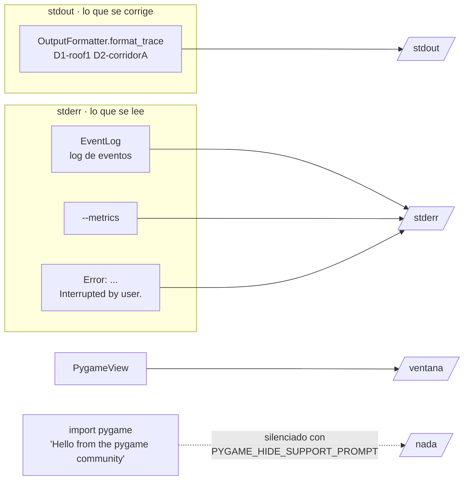
```mermaid
flowchart LR
    subgraph OUTCH["stdout · lo que se corrige"]
        OF["OutputFormatter.format_trace<br/>D1-roof1 D2-corridorA"]
    end
    subgraph ERRCH["stderr · lo que se lee"]
        EL["EventLog<br/>log de eventos"]
        MET["--metrics"]
        ERRM["Error: ...<br/>Interrupted by user."]
    end
    OF --> SO[/"stdout"/]
    EL --> SE[/"stderr"/]
    MET --> SE
    ERRM --> SE
    PV["PygameView"] --> WIN[/"ventana"/]
    PG["import pygame<br/>'Hello from the pygame community'"] -. "silenciado con<br/>PYGAME_HIDE_SUPPORT_PROMPT" .-> NUL[/"nada"/]
```

**Lo que hay que ver aquí:** pygame imprime un saludo **por `stdout`** al
importarse. Sin la variable `PYGAME_HIDE_SUPPORT_PROMPT`, la primera línea de
la salida sería ese saludo y la corrección fallaría. `Session` la define
justo antes de importar `pygame_view`, y
`test_pygame_never_writes_to_stdout` ejecuta el programa sin ella en el
entorno para comprobarlo.

## F3 — Frontera de excepciones y códigos de salida

`FlyIn.main` es el **único** sitio donde una excepción se convierte en un
mensaje para el usuario. Por debajo, cada capa traduce los errores de bajo
nivel a los suyos, con contexto.

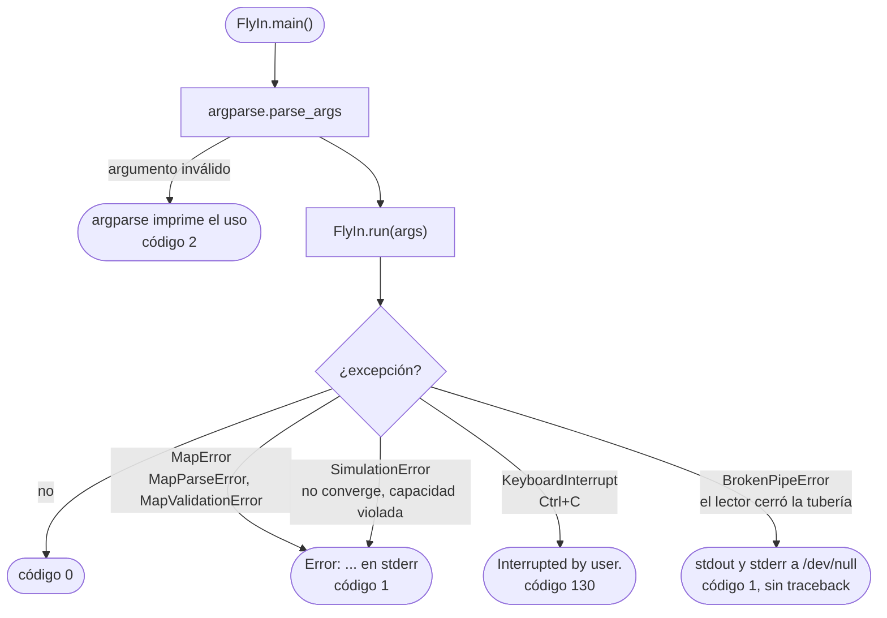
```mermaid
flowchart TD
    A(["FlyIn.main()"]) --> P["argparse.parse_args"]
    P -->|"argumento inválido"| X2(["argparse imprime el uso<br/>código 2"])
    P --> R["FlyIn.run(args)"]
    R --> E{"¿excepción?"}
    E -->|"no"| X0(["código 0"])
    E -->|"MapError<br/>MapParseError, MapValidationError"| X1(["Error: ... en stderr<br/>código 1"])
    E -->|"SimulationError<br/>no converge, capacidad violada"| X1
    E -->|"KeyboardInterrupt<br/>Ctrl+C"| X130(["Interrupted by user.<br/>código 130"])
    E -->|"BrokenPipeError<br/>el lector cerró la tubería"| XB(["stdout y stderr a /dev/null<br/>código 1, sin traceback"])
```

Dónde se traduce cada error de bajo nivel antes de llegar arriba:

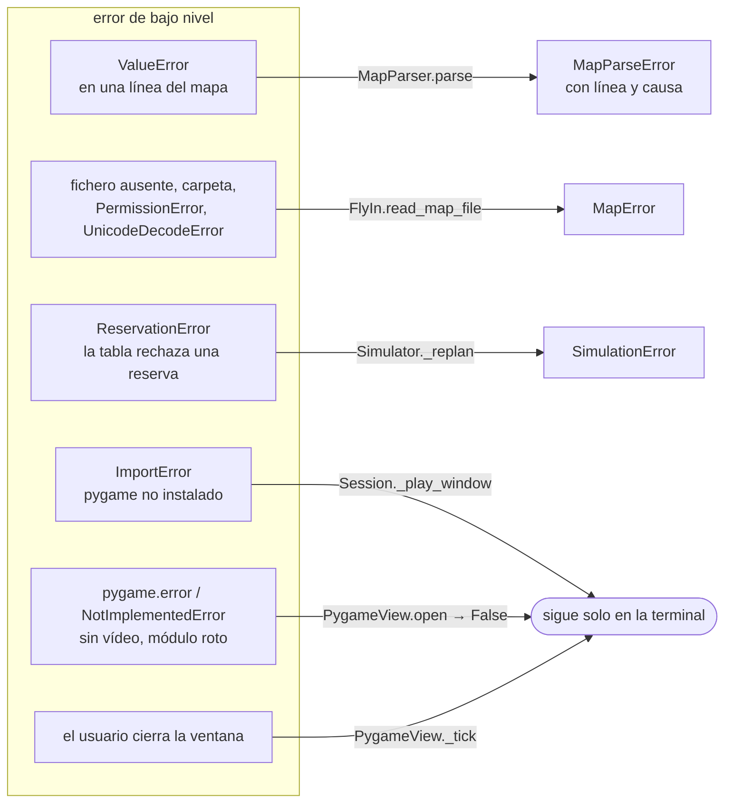
```mermaid
flowchart LR
    subgraph LOW["error de bajo nivel"]
        V["ValueError<br/>en una línea del mapa"]
        FNF["fichero ausente, carpeta,<br/>PermissionError, UnicodeDecodeError"]
        RE["ReservationError<br/>la tabla rechaza una reserva"]
        IE["ImportError<br/>pygame no instalado"]
        PE["pygame.error / NotImplementedError<br/>sin vídeo, módulo roto"]
        QE["el usuario cierra la ventana"]
    end
    V -->|"MapParser.parse"| MPE["MapParseError<br/>con línea y causa"]
    FNF -->|"FlyIn.read_map_file"| ME["MapError"]
    RE -->|"Simulator._replan"| SE["SimulationError"]
    IE -->|"Session._play_window"| TERM(["sigue solo en la terminal"])
    PE -->|"PygameView.open → False"| TERM
    QE -->|"PygameView._tick"| TERM
```

**Lo que hay que ver aquí:** los tres últimos casos **no son errores del
programa**. Que no haya pygame, que no haya vídeo o que el usuario cierre la
ventana no impide calcular ni imprimir la solución, así que se degradan a la
terminal en vez de abortar.

## F4 — La vida de un dron (máquina de estados)

`DroneState` dice qué hizo el dron en el último turno. Las transiciones las
aplica `Simulator._apply` en la fase 2.

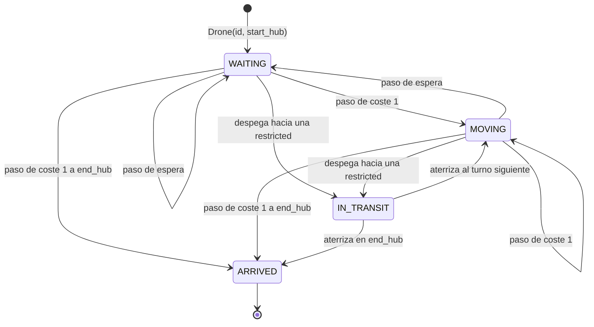
```mermaid
stateDiagram-v2
    [*] --> WAITING : Drone(id, start_hub)
    WAITING --> WAITING : paso de espera
    WAITING --> MOVING : paso de coste 1
    WAITING --> IN_TRANSIT : despega hacia una restricted
    WAITING --> ARRIVED : paso de coste 1 a end_hub
    MOVING --> MOVING : paso de coste 1
    MOVING --> WAITING : paso de espera
    MOVING --> IN_TRANSIT : despega hacia una restricted
    MOVING --> ARRIVED : paso de coste 1 a end_hub
    IN_TRANSIT --> MOVING : aterriza al turno siguiente
    IN_TRANSIT --> ARRIVED : aterriza en end_hub
    ARRIVED --> [*]
```

| Estado | Qué imprime ese turno | Dónde está |
|---|---|---|
| `WAITING` | nada (se omite, Cap. VII.5) | en `current_zone` |
| `MOVING` | `D<id>-<zona>` | en `current_zone`, la nueva |
| `IN_TRANSIT` | `D<id>-<conexión>` | **en ninguna zona**: en `transit_connection` |
| `ARRIVED` | `D<id>-<end_hub>` una vez; después nada | entregado, ya no se rastrea |

**Lo que hay que ver aquí:** `IN_TRANSIT` no tiene flecha hacia sí mismo. Es
la regla *"It can't wait extra turns on the connection"* (Cap. VII.3) escrita
como máquina de estados: el aterrizaje no se decide, lo impone
`Simulator._land`.

## F5 — Una replanificación, paso a paso

Ocurre al empezar cada media ventana (`T % (W // 2) == 0`) y también cuando a
un dron en tierra se le acaba la ruta.

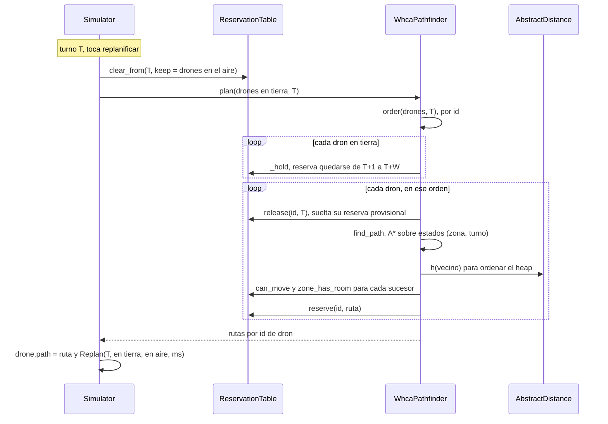
```mermaid
sequenceDiagram
    participant S as Simulator
    participant T as ReservationTable
    participant W as WhcaPathfinder
    participant H as AbstractDistance
    Note over S: turno T, toca replanificar
    S->>T: clear_from(T, keep = drones en el aire)
    S->>W: plan(drones en tierra, T)
    W->>W: order(drones, T), por id
    loop cada dron en tierra
        W->>T: _hold, reserva quedarse de T+1 a T+W
    end
    loop cada dron, en ese orden
        W->>T: release(id, T), suelta su reserva provisional
        W->>W: find_path, A* sobre estados (zona, turno)
        W->>H: h(vecino) para ordenar el heap
        W->>T: can_move y zone_has_room para cada sucesor
        W->>T: reserve(id, ruta)
    end
    W-->>S: rutas por id de dron
    S->>S: drone.path = ruta y Replan(T, en tierra, en aire, ms)
```

**Lo que hay que ver aquí:** los drones en el aire no se replanifican (no
pueden parar ni volver) y sus reservas sobreviven gracias a `keep`. La reserva
provisional (`_hold`) evita que el primero en planificar ocupe la zona de uno
que todavía no ha planificado.

## F6 — Quién observa la simulación en cada vista

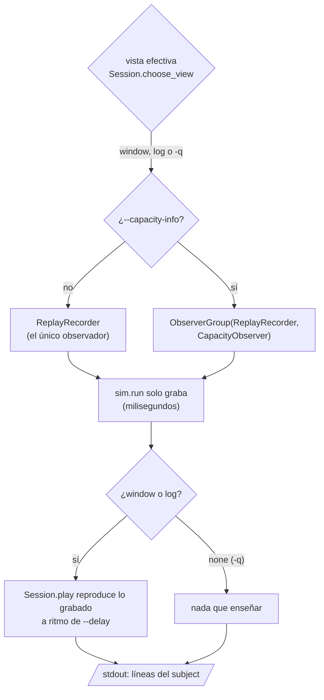
```mermaid
flowchart TD
    V{"vista efectiva<br/>Session.choose_view"} -->|"window, log o -q"| CI{"¿--capacity-info?"}
    CI -->|"no"| RR["ReplayRecorder<br/>(el único observador)"]
    CI -->|"sí"| GR["ObserverGroup(ReplayRecorder,<br/>CapacityObserver)"]
    RR --> RUN2["sim.run solo graba<br/>(milisegundos)"]
    GR --> RUN2
    RUN2 --> PLAY{"¿window o log?"}
    PLAY -->|"sí"| SES["Session.play reproduce lo grabado<br/>a ritmo de --delay"]
    PLAY -->|"none (-q)"| NOW["nada que enseñar"]
    SES --> OUT[/"stdout: líneas del subject"/]
    NOW --> OUT
```

**Lo que hay que ver aquí:** la ventana anima *entre* turnos, y para
interpolar necesita saber adónde va cada dron: por eso se graba primero y se
enseña después. El simulador descuenta el tiempo que pasa dentro de los
observadores, así que `compute_ms` es solo cálculo.

## F7 — Un solo hilo: el bucle de la ventana

No hay hilos ni procesos extra: la terminal y la ventana van a la par porque
las mueve el mismo bucle. Este es el ciclo de un turno con la ventana abierta:

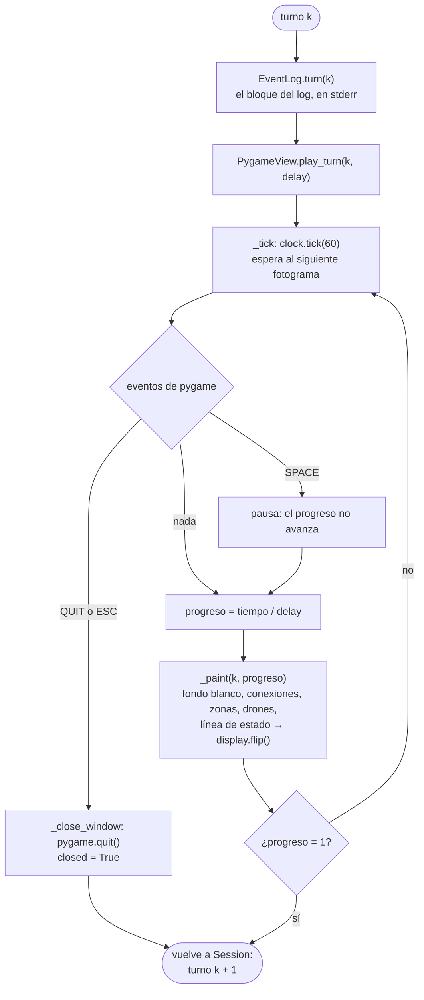
```mermaid
flowchart TD
    A(["turno k"]) --> L["EventLog.turn(k)<br/>el bloque del log, en stderr"]
    L --> PT["PygameView.play_turn(k, delay)"]
    PT --> T["_tick: clock.tick(60)<br/>espera al siguiente fotograma"]
    T --> EV{"eventos de pygame"}
    EV -->|"QUIT o ESC"| CL["_close_window: pygame.quit()<br/>closed = True"]
    CL --> BACK
    EV -->|"SPACE"| PA["pausa: el progreso no avanza"]
    EV -->|"nada"| PR
    PA --> PR["progreso = tiempo / delay"]
    PR --> PAINT["_paint(k, progreso)<br/>fondo blanco, conexiones, zonas, drones,<br/>línea de estado → display.flip()"]
    PAINT --> DONE{"¿progreso = 1?"}
    DONE -->|"no"| T
    DONE -->|"sí"| BACK(["vuelve a Session:<br/>turno k + 1"])
```

| Pieza | Para qué |
|---|---|
| `pygame.time.Clock.tick(60)` | Limita a 60 fotogramas por segundo y devuelve el tiempo del fotograma anterior (`dt`) |
| `pygame.event.get()` | Vacía la cola de eventos en cada fotograma. Si no se vacía, el sistema da la ventana por "no responde" |
| `closed` | Si el usuario cierra la ventana, `play_turn` y `finish` ya no hacen nada y `Session` sigue con la terminal |
| `pygame.display.flip()` | Enseña de golpe el fotograma dibujado en memoria (doble búfer): no se ve a medio pintar |

**Por qué un solo hilo:** pygame (SDL) exige que la ventana se maneje desde el
hilo que la creó, y con un solo bucle no puede haber condiciones de carrera
entre la terminal y la ventana. El ritmo lo marca el propio bucle: dibujar
un turno dura exactamente `--delay` segundos.

## F8 — Recursos y su liberación

El Cap. III.1 pide gestionar los recursos (ficheros, conexiones) sin fugas, a
ser posible con *context managers*.

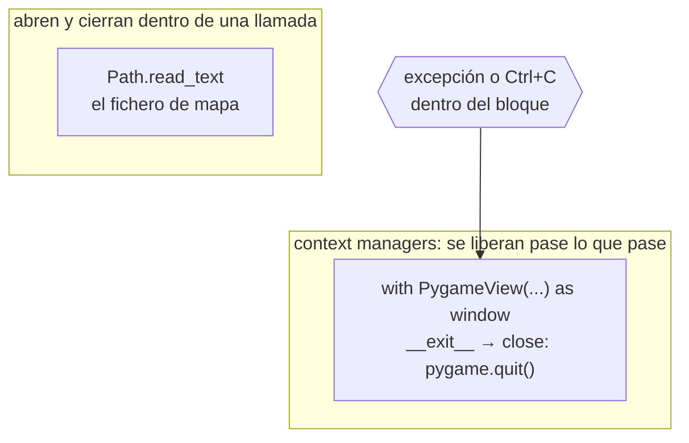
```mermaid
flowchart TD
    subgraph WITH["context managers: se liberan pase lo que pase"]
        PVW["with PygameView(...) as window<br/>__exit__ → close: pygame.quit()"]
    end
    subgraph AUTO["abren y cierran dentro de una llamada"]
        RT["Path.read_text<br/>el fichero de mapa"]
    end
    ERR{{"excepción o Ctrl+C<br/>dentro del bloque"}} --> PVW
```

| Recurso | Quién lo abre | Cómo se cierra |
|---|---|---|
| Ventana, vídeo y módulos de pygame | `PygameView.open` | `with` → `close()` → `pygame.quit()` (se puede llamar dos veces sin fallar) |
| Fichero de mapa | `Path.read_text` | Lo cierra la propia llamada |

---

# Subproyectos

## SP00 — Setup y Makefile

Qué hace cada regla del `Makefile`.

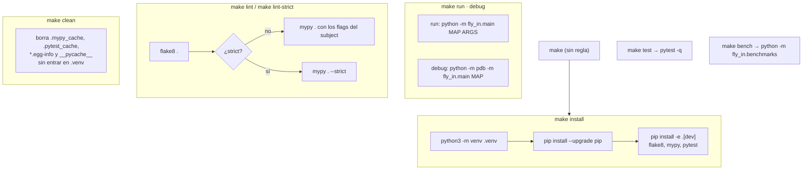
```mermaid
flowchart TD
    M["make (sin regla)"] --> INSTALL
    subgraph INSTALL["make install"]
        I1["python3 -m venv .venv"] --> I2["pip install --upgrade pip"] --> I3["pip install -e .[dev]<br/>flake8, mypy, pytest"]
    end
    subgraph RUN["make run · debug"]
        R1["run: python -m fly_in.main MAP ARGS"]
        R2["debug: python -m pdb -m fly_in.main MAP"]
    end
    subgraph LINT["make lint / make lint-strict"]
        L1["flake8 ."] --> L2{"¿strict?"}
        L2 -->|"no"| L3["mypy . con los flags del subject"]
        L2 -->|"sí"| L4["mypy . --strict"]
    end
    subgraph CLEAN["make clean"]
        C1["borra .mypy_cache, .pytest_cache,<br/>*.egg-info y __pycache__<br/>sin entrar en .venv"]
    end
    T["make test → pytest -q"]
    B["make bench → python -m fly_in.benchmarks"]
```

**Por qué `clean` no borra `.venv`:** el subject dice que `clean` borra
archivos temporales y cachés. El entorno no es temporal: borrarlo obliga a
reinstalar, y para borrarlo basta `rm -rf .venv`.

Cada regla escribe el comando real tal cual, sin envoltorios: lo que se ve
es lo que se ejecuta, y el código de salida es el del comando.

---

## SP01 — Modelo de dominio

### `Graph.add_zone(zone, role)`

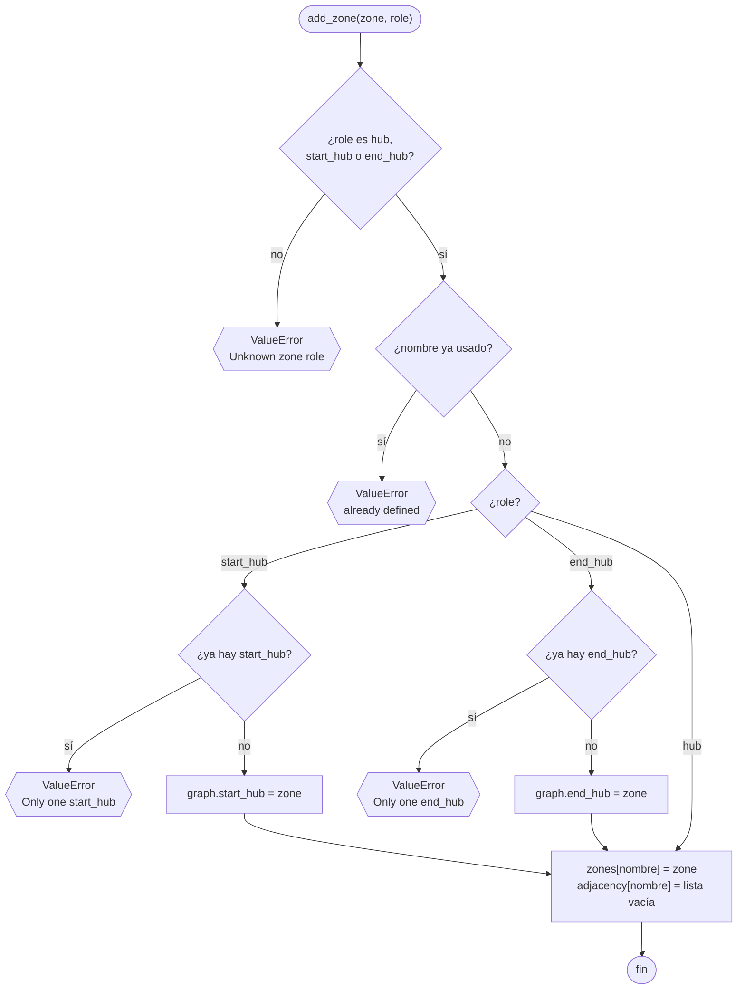
```mermaid
flowchart TD
    A(["add_zone(zone, role)"]) --> B{"¿role es hub,<br/>start_hub o end_hub?"}
    B -->|"no"| E1{{"ValueError<br/>Unknown zone role"}}
    B -->|"sí"| C{"¿nombre ya usado?"}
    C -->|"sí"| E2{{"ValueError<br/>already defined"}}
    C -->|"no"| D{"¿role?"}
    D -->|"start_hub"| D1{"¿ya hay start_hub?"}
    D1 -->|"sí"| E3{{"ValueError<br/>Only one start_hub"}}
    D1 -->|"no"| D2["graph.start_hub = zone"]
    D -->|"end_hub"| D3{"¿ya hay end_hub?"}
    D3 -->|"sí"| E4{{"ValueError<br/>Only one end_hub"}}
    D3 -->|"no"| D4["graph.end_hub = zone"]
    D -->|"hub"| F
    D2 --> F["zones[nombre] = zone<br/>adjacency[nombre] = lista vacía"]
    D4 --> F
    F --> G(["fin"])
```

### `Graph.add_connection(origin, destination, capacidad)`

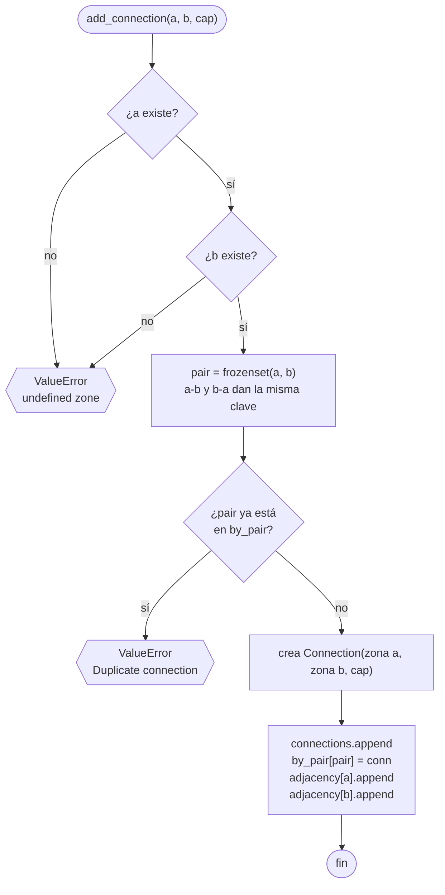
```mermaid
flowchart TD
    A(["add_connection(a, b, cap)"]) --> B{"¿a existe?"}
    B -->|"no"| E1{{"ValueError<br/>undefined zone"}}
    B -->|"sí"| C{"¿b existe?"}
    C -->|"no"| E1
    C -->|"sí"| D["pair = frozenset(a, b)<br/>a-b y b-a dan la misma clave"]
    D --> F{"¿pair ya está<br/>en by_pair?"}
    F -->|"sí"| E2{{"ValueError<br/>Duplicate connection"}}
    F -->|"no"| G["crea Connection(zona a, zona b, cap)"]
    G --> H["connections.append<br/>by_pair[pair] = conn<br/>adjacency[a].append<br/>adjacency[b].append"]
    H --> I(["fin"])
```

### Las dos consultas O(1)

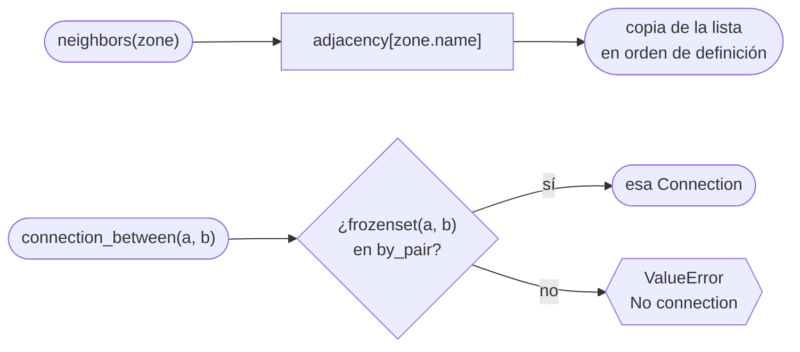
```mermaid
flowchart LR
    N(["neighbors(zone)"]) --> N1["adjacency[zone.name]"] --> N2(["copia de la lista<br/>en orden de definición"])
    CB(["connection_between(a, b)"]) --> CB1{"¿frozenset(a, b)<br/>en by_pair?"}
    CB1 -->|"sí"| CB2(["esa Connection"])
    CB1 -->|"no"| CB3{{"ValueError<br/>No connection"}}
```

### Métodos de `Zone` y `Connection`

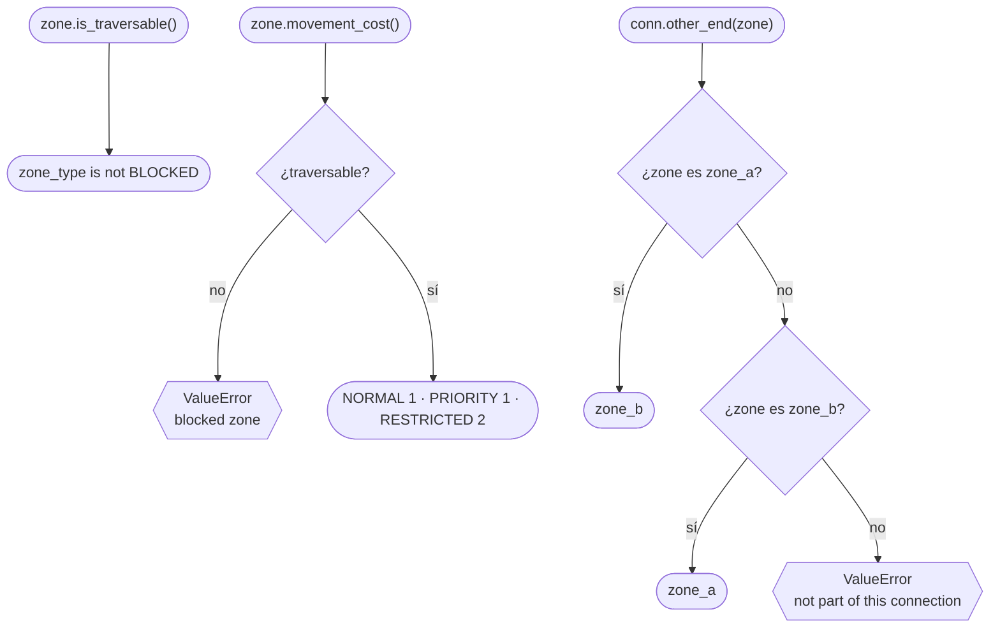
```mermaid
flowchart TD
    T(["zone.is_traversable()"]) --> T1(["zone_type is not BLOCKED"])
    MC(["zone.movement_cost()"]) --> MC1{"¿traversable?"}
    MC1 -->|"no"| MC2{{"ValueError<br/>blocked zone"}}
    MC1 -->|"sí"| MC3(["NORMAL 1 · PRIORITY 1 · RESTRICTED 2"])
    OE(["conn.other_end(zone)"]) --> OE1{"¿zone es zone_a?"}
    OE1 -->|"sí"| OE2(["zone_b"])
    OE1 -->|"no"| OE3{"¿zone es zone_b?"}
    OE3 -->|"sí"| OE4(["zone_a"])
    OE3 -->|"no"| OE5{{"ValueError<br/>not part of this connection"}}
```

**Por qué las reglas viven en `Graph` y no en el parser:** el parser mira una
línea cada vez y no recuerda las anteriores. `Graph` sí lo sabe todo, así que
es imposible construir un grafo inválido venga de donde venga (parser, test o
intérprete).

---

## SP02 — Parser

### `MapParser.parse(texto)`: el archivo entero

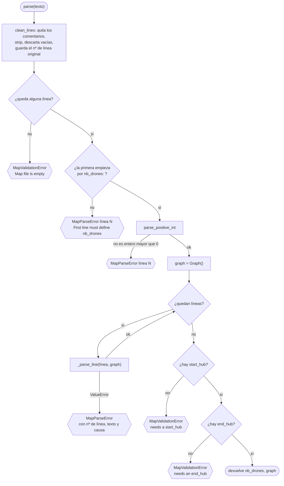
```mermaid
flowchart TD
    A(["parse(texto)"]) --> B["clean_lines: quita los comentarios,<br/>strip, descarta vacías,<br/>guarda el nº de línea original"]
    B --> C{"¿queda alguna línea?"}
    C -->|"no"| E0{{"MapValidationError<br/>Map file is empty"}}
    C -->|"sí"| D{"¿la primera empieza<br/>por nb_drones: ?"}
    D -->|"no"| E1{{"MapParseError línea N<br/>First line must define nb_drones"}}
    D -->|"sí"| F["parse_positive_int"]
    F -->|"no es entero mayor que 0"| E2{{"MapParseError línea N"}}
    F -->|"ok"| G["graph = Graph()"]
    G --> H{"¿quedan líneas?"}
    H -->|"sí"| I["_parse_line(línea, graph)"]
    I -->|"ValueError"| E3{{"MapParseError<br/>con nº de línea, texto y causa"}}
    I -->|"ok"| H
    H -->|"no"| J{"¿hay start_hub?"}
    J -->|"no"| E4{{"MapValidationError<br/>needs a start_hub"}}
    J -->|"sí"| K{"¿hay end_hub?"}
    K -->|"no"| E5{{"MapValidationError<br/>needs an end_hub"}}
    K -->|"sí"| L(["devuelve nb_drones, graph"])
```

**Por qué dos excepciones distintas:** `MapParseError` señala **una línea**
concreta. `MapValidationError` es un fallo del archivo **en conjunto** (vacío,
falta el start…): no hay una línea a la que apuntar. Las dos heredan de
`MapError`, que es lo único que captura `main`.

### `_parse_line`: una línea de zona o de conexión

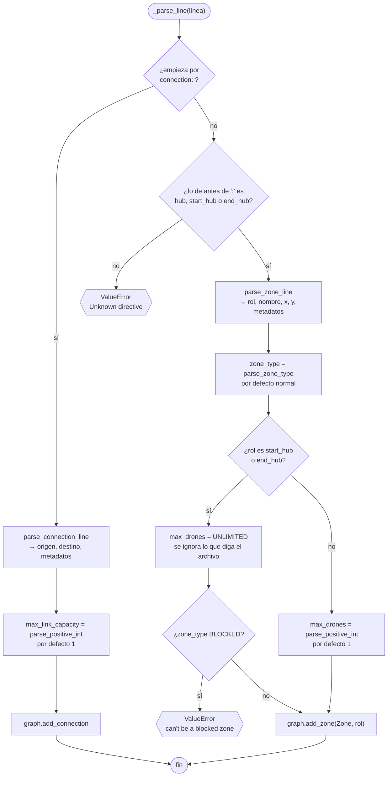
```mermaid
flowchart TD
    A(["_parse_line(línea)"]) --> B{"¿empieza por<br/>connection: ?"}
    B -->|"sí"| C["parse_connection_line<br/>→ origen, destino, metadatos"]
    C --> C1["max_link_capacity = parse_positive_int<br/>por defecto 1"]
    C1 --> C2["graph.add_connection"]
    C2 --> Z(["fin"])
    B -->|"no"| D{"¿lo de antes de ':' es<br/>hub, start_hub o end_hub?"}
    D -->|"no"| E1{{"ValueError<br/>Unknown directive"}}
    D -->|"sí"| E["parse_zone_line<br/>→ rol, nombre, x, y, metadatos"]
    E --> F["zone_type = parse_zone_type<br/>por defecto normal"]
    F --> G{"¿rol es start_hub<br/>o end_hub?"}
    G -->|"sí"| G1["max_drones = UNLIMITED<br/>se ignora lo que diga el archivo"]
    G1 --> G2{"¿zone_type BLOCKED?"}
    G2 -->|"sí"| E2{{"ValueError<br/>can't be a blocked zone"}}
    G2 -->|"no"| H
    G -->|"no"| G3["max_drones = parse_positive_int<br/>por defecto 1"]
    G3 --> H["graph.add_zone(Zone, rol)"]
    H --> Z
```

### `parse_zone_line` y `parse_connection_line`

```mermaid
flowchart TD
    subgraph ZL["parse_zone_line"]
        Z1["parte por el primer ':' → rol, resto"] --> Z2{"¿hay '[' en el resto?"}
        Z2 -->|"sí"| Z3["parse_metadata del bloque,<br/>claves permitidas: zone, color, max_drones"]
        Z2 -->|"no"| Z4
        Z3 --> Z4{"¿exactamente 3 campos:<br/>nombre x y?"}
        Z4 -->|"no"| ZE1{{"ValueError"}}
        Z4 -->|"sí"| Z5{"¿nombre contiene '-'?"}
        Z5 -->|"sí"| ZE2{{"ValueError"}}
        Z5 -->|"no"| Z6{"¿x e y son enteros?<br/>negativos permitidos"}
        Z6 -->|"no"| ZE3{{"ValueError"}}
        Z6 -->|"sí"| Z7(["rol, nombre, x, y, metadatos"])
    end
    subgraph CL["parse_connection_line"]
        C1["cuerpo tras 'connection:'"] --> C2{"¿hay '['?"}
        C2 -->|"sí"| C3["parse_metadata,<br/>clave permitida: max_link_capacity"]
        C2 -->|"no"| C4
        C3 --> C4{"¿partido por '-' da<br/>exactamente 2 trozos?"}
        C4 -->|"no"| CE1{{"ValueError"}}
        C4 -->|"sí"| C5{"¿algún nombre vacío?"}
        C5 -->|"sí"| CE2{{"ValueError"}}
        C5 -->|"no"| C6{"¿origen igual a destino?"}
        C6 -->|"sí"| CE3{{"ValueError"}}
        C6 -->|"no"| C7(["origen, destino, metadatos"])
    end
```

### `parse_metadata`: validación estricta de `[k=v ...]`

```mermaid
flowchart TD
    A(["parse_metadata(bloque, claves_permitidas)"]) --> B{"¿empieza por '['<br/>y acaba en ']'?"}
    B -->|"no"| E1{{"ValueError<br/>must be wrapped"}}
    B -->|"sí"| C{"¿quedan tokens?"}
    C -->|"no"| Z(["diccionario"])
    C -->|"sí"| D["token.partition('=')"]
    D --> F{"¿hay '=', clave<br/>no vacía y valor no vacío?"}
    F -->|"no"| E2{{"ValueError<br/>expected key=value"}}
    F -->|"sí"| G{"¿clave permitida<br/>en este tipo de línea?"}
    G -->|"no"| E3{{"ValueError<br/>Unknown metadata key"}}
    G -->|"sí"| H{"¿clave repetida?"}
    H -->|"sí"| E4{{"ValueError<br/>Duplicate metadata key"}}
    H -->|"no"| I["guarda clave → valor"]
    I --> C
```

**Por qué rechazar claves repetidas:** `[zone=blocked zone=normal]` haría la
zona transitable en silencio (gana la última). El subject exige metadatos
*"syntactically valid"*, y es mejor un error claro que un mapa que no hace lo
que parece.

---

## SP03 — CLI y errores

`FlyIn.main()` es la **frontera de excepciones**: ningún error sale como
traceback (el detalle de qué se captura y dónde está en
[F3](#f3--frontera-de-excepciones-y-códigos-de-salida)). `FlyIn.run()` es
el guion completo del programa:

```mermaid
flowchart TD
    A(["python -m fly_in.main mapa [opciones]"]) --> B["FlyIn.build_parser().parse_args()"]
    B --> B1{"¿argumentos válidos?<br/>window entero > 0, delay >= 0,<br/>view en auto/window/log"}
    B1 -->|"no"| X2(["argparse imprime el uso<br/>código 2"])
    B1 -->|"sí"| C["FlyIn.read_map_file"]
    C --> C1{"¿existe? ¿no es carpeta?<br/>¿permiso? ¿UTF-8?"}
    C1 -->|"no"| ERR
    C1 -->|"sí"| D["MapParser.parse"]
    D -->|"MapParseError o<br/>MapValidationError"| ERR
    D -->|"ok"| E["AbstractDistance(graph)"]
    E --> F{"¿start_hub puede<br/>llegar a end_hub?"}
    F -->|"no"| E1["lanza MapValidationError<br/>unreachable"] --> ERR
    F -->|"sí"| V["vista = Session.choose_view<br/>delay = --delay o el de la vista<br/>color = make_painter<br/>PAR = BenchmarkSuite.target_for"]
    V --> REC["sim.run(ReplayRecorder)"]
    REC --> MET["Metrics.from_trace"]
    MET --> SH{"¿vista window o log?"}
    SH -->|"sí"| PLAY["Session(...).play()"]
    SH -->|"no"| OUT
    PLAY --> OUT["print de cada línea de<br/>OutputFormatter.format_trace → stdout"]
    OUT --> M{"¿--metrics?"}
    M -->|"sí"| MP["print_metrics → stderr"]
    M -->|"no"| OK(["código 0"])
    MP --> OK
    ERR["captura MapError / SimulationError:<br/>'Error: …' por stderr"] --> X1(["código 1"])
    A -.->|"Ctrl+C en cualquier punto"| KI(["'Interrupted by user.'<br/>código 130"])
```

**Por qué `stdout` se escribe después de la animación:** si las líneas de
turno salieran mientras la animación va por el turno 3, el log de la terminal
y la solución se mezclarían en pantalla. Primero se enseña y al final se
imprime la solución de golpe. Con `make run > out.txt` el orden da igual: son
canales distintos.

**Por qué comprobar la alcanzabilidad aquí y no en SP08:** sin esta
comprobación, un mapa sin ruta posible haría que el simulador diera vueltas
hasta su límite de seguridad. Aquí se detecta al instante, con un mensaje que
dice exactamente qué pasa.

---

## SP04 — Dijkstra

### `find_path(origin, target)`: la ruta de un dron

```mermaid
flowchart TD
    A(["find_path(origen, destino)"]) --> B{"¿origen o destino<br/>BLOCKED?"}
    B -->|"sí"| N(["None"])
    B -->|"no"| C{"¿origen igual a destino?"}
    C -->|"sí"| C1(["lista con solo el origen"])
    C -->|"no"| D["heap = coste 0, -prio, contador, origen<br/>dist[origen] = 0, -prio<br/>visited = vacío"]
    D --> E{"¿heap vacío?"}
    E -->|"sí"| N
    E -->|"no"| F["saca el menor:<br/>1º coste, 2º más zonas priority,<br/>3º contador"]
    F --> G{"¿ya visitada?"}
    G -->|"sí"| E
    G -->|"no"| H["marca visitada"]
    H --> I{"¿es el destino?"}
    I -->|"sí"| R(["reconstruye la ruta<br/>siguiendo prev hacia atrás"])
    I -->|"no"| J["para cada conexión en<br/>graph.neighbors(actual)"]
    J --> K{"¿vecino BLOCKED?"}
    K -->|"sí"| J
    K -->|"no"| L["nuevo = coste + vecino.movement_cost()<br/>nueva_prio = prio - 1 si es PRIORITY"]
    L --> M{"¿vecino sin dist, o nuevo, nueva_prio<br/>mejor que dist[vecino]?"}
    M -->|"no"| J
    M -->|"sí"| O["dist[vecino] = nuevo<br/>prev[vecino] = actual<br/>push al heap"]
    O --> J
    J -->|"sin más conexiones"| E
```

**Por qué la clave es una tupla de tres:** `priority` cuesta lo mismo que
`normal`, así que la preferencia no puede ir en el coste sin romper "coste =
turnos". Va como **desempate**: Python compara tuplas elemento a elemento. El
contador final evita comparar dos `Zone`, que daría `TypeError`.

### `distances_from(origin, reverse)`: coste a todas las zonas

```mermaid
flowchart TD
    A(["distances_from(origen, reverse)"]) --> B{"¿origen BLOCKED?"}
    B -->|"sí"| V(["diccionario vacío"])
    B -->|"no"| C["dist[origen] = 0<br/>heap con el origen"]
    C --> D{"¿heap vacío?"}
    D -->|"sí"| R(["dist: nombre → coste mínimo"])
    D -->|"no"| E["saca el de menor coste"]
    E --> F{"¿coste mayor que dist[actual]?<br/>entrada obsoleta"}
    F -->|"sí"| D
    F -->|"no"| G["para cada vecino no BLOCKED"]
    G --> H{"¿reverse?"}
    H -->|"no, hacia delante"| H1["paso = vecino.movement_cost()<br/>coste de entrar en el vecino"]
    H -->|"sí, hacia atrás"| H2["paso = actual.movement_cost()<br/>coste de entrar en la zona de la que<br/>venimos, recorriendo al revés"]
    H1 --> I{"¿nuevo coste mejor?"}
    H2 --> I
    I -->|"sí"| J["actualiza dist y push"] --> G
    I -->|"no"| G
    G -->|"sin más vecinos"| D
```

**Por qué `reverse` suma el coste de `actual`:** el coste depende de la zona en
la que **entras**. Al recorrer desde `end_hub` hacia atrás, el paso de `vecino`
a `actual` en la ruta real es entrar en `actual`. Sumar el del vecino daría
costes desplazados una zona.

---

## SP05 — Heurística abstracta

```mermaid
flowchart TD
    A(["AbstractDistance(graph)"]) --> B{"¿graph.end_hub existe?"}
    B -->|"no"| B1["tabla vacía"]
    B -->|"sí"| C["Dijkstra(graph).distances_from(<br/>end_hub, reverse=True)"]
    C --> D["_dist: nombre → turnos mínimos<br/>de esa zona a end_hub"]
    D --> Q1(["h(zona)"])
    Q1 --> Q2{"¿zona en _dist?"}
    Q2 -->|"sí"| Q3(["_dist[zona]"])
    Q2 -->|"no"| Q4{{"KeyError"}}
    D --> R1(["is_reachable(zona)"]) --> R2(["zona in _dist"])
```

**Por qué una sola ejecución desde `end_hub` y no una por zona:** un Dijkstra
hacia atrás da de golpe la distancia real de **todas** las zonas al objetivo.
Lanzar uno desde cada zona costaría `V` veces más.

**Por qué no la distancia en línea recta entre coordenadas:** ignora las zonas
`blocked` y los callejones sin salida. La de Dijkstra es la real sin otros
drones: nunca sobreestima (es admisible) y conoce la topología.

**Por qué las inalcanzables no están en la tabla:** su ausencia **es** la
información. Guardarlas como `inf` metería un `float` en una suma de enteros
(`f = g + h`) y rompería mypy.

---

## SP06 — Tabla de reservas

### La convención de tiempo

```mermaid
flowchart LR
    I0(["instante 0<br/>todos en start"]) -->|"turno 1<br/>línea 1 de la salida"| I1(["instante 1"])
    I1 -->|"turno 2<br/>línea 2"| I2(["instante 2"])
    I2 -->|"turno 3<br/>línea 3"| I3(["instante 3"])
```

- Zona `(z, t)` = quién está en `z` **en la foto** `t`.
- Conexión `(c, t)` = quién está cruzando `c` **entre** la foto `t` y la `t+1`.

### Qué ocupa un movimiento que sale en el instante T

```mermaid
flowchart LR
    subgraph N["coste 1: normal o priority"]
        direction LR
        n0["T<br/>en origen<br/>conexión ✔"] --> n1["T+1<br/>en destino"]
    end
    subgraph R["coste 2: restricted"]
        direction LR
        r0["T<br/>en origen<br/>conexión ✔"] --> r1["T+1<br/>EN EL AIRE<br/>conexión ✔<br/>ninguna zona"] --> r2["T+2<br/>en destino"]
    end
```

### `can_move(frm, to, turn)`: la pregunta completa

```mermaid
flowchart TD
    A(["can_move(frm, to, T)"]) --> B["conn = graph.connection_between(frm, to)"]
    B -->|"no conectadas"| E{{"ValueError"}}
    B --> C{"¿to es BLOCKED?"}
    C -->|"sí"| F(["False"])
    C -->|"no"| D["cost = to.movement_cost()"]
    D --> G["para cada slot de T a T+cost-1"]
    G --> H{"¿cabe en la conexión<br/>en ese slot?"}
    H -->|"no"| F
    H -->|"sí"| I{"¿alguien va en sentido<br/>to → frm en ese slot?"}
    I -->|"sí, se cruzarían"| F
    I -->|"no"| G
    G -->|"todos los slots libres"| J{"¿cabe en la zona to<br/>en el instante T+cost?"}
    J -->|"no"| F
    J -->|"sí"| K(["True"])
```

**Por qué una sola función:** comprueba las tres cosas que ocupa un movimiento
(conexión, sentido y zona de llegada) en **todos** los instantes del trayecto.
Si SP07 hiciera las comprobaciones sueltas, podría olvidar una o comprobar solo
el primer instante de un tránsito `restricted`.

### `reserve_move` y `reserve_wait`: escribir sin dejar nada a medias

```mermaid
flowchart TD
    subgraph RM["reserve_move(id, frm, to, T)"]
        M1{"¿can_move(frm, to, T)?"} -->|"no"| ME{{"ReservationError<br/>no se ha tocado nada"}}
        M1 -->|"sí"| M2["para cada slot de T a T+cost-1:<br/>links[conn, slot] += id<br/>moves[frm, to, slot] += id"]
        M2 --> M3["zones[to, T+cost] += id"]
        M3 --> M4(["fin"])
    end
    subgraph RW["reserve_wait(id, zona, t)"]
        W1{"¿zone_has_room(zona, t)?"} -->|"no"| WE{{"ReservationError"}}
        W1 -->|"sí"| W2["zones[zona, t] += id"] --> W3(["fin"])
    end
    subgraph ADD["_add(tabla, clave, id), usado por ambos"]
        A1{"¿id ya está en esa clave?"} -->|"sí"| AE{{"ReservationError<br/>ya reservado"}}
        A1 -->|"no"| A2["añade id"]
    end
```

**Por qué primero pregunta y después escribe:** si escribiera la conexión y
luego descubriera que la zona de llegada está llena, quedaría una conexión
ocupada por un movimiento que nunca ocurre. Los demás drones esquivarían un
fantasma.

### `clear_from(turn, keep)`: replanificar

```mermaid
flowchart TD
    A(["clear_from(T, keep)"]) --> B["para zones, links y moves:<br/>construye un diccionario nuevo"]
    B --> C{"para cada clave:<br/>¿su instante es menor que T?"}
    C -->|"sí, es pasado"| D["se conserva entera"]
    C -->|"no, es futuro"| E["se conservan solo los ids<br/>que están en keep"]
    E --> F{"¿queda algún id?"}
    F -->|"sí"| G["se guarda la clave"]
    F -->|"no"| H["la clave desaparece"]
    D --> Z(["la tabla nueva sustituye a la vieja"])
    G --> Z
    H --> Z
```

### Por qué existe `keep`: un dron en el aire al replanificar

```mermaid
sequenceDiagram
    participant S as Simulator (SP08)
    participant T as ReservationTable
    participant D1 as D1 (en el aire)
    participant D2 as D2
    Note over D1: instante 4: despega hacia r (restricted)
    D1->>T: reserve_move(1, start, r, 4)<br/>conexión en 4 y 5, r en 6
    Note over S: instante 5: toca replanificar
    S->>T: clear_from(5, keep={1})
    Note over T: se borra el futuro de todos<br/>salvo D1: conexión en 5 y r en 6 siguen
    S->>D2: replanifica
    D2->>T: can_move(start, r, 5)?
    T-->>D2: False: conexión ocupada y r reservada en 6
    Note over D1: instante 6: aterriza en r con sitio garantizado
```

Sin `keep`, `clear_from(5)` borraría la llegada de D1. D2 podría ocupar `r` en
el 6, y D1 no tendría dónde aterrizar ni podría esperar en el aire.

### Cómo la usan SP07 y SP08

```mermaid
flowchart TD
    S0["Simulator, cada W/2 turnos<br/>o si a un dron se le acaba la ruta"] --> S1["clear_from(T, keep = drones en el aire)"]
    S1 --> H0["WhcaPathfinder.plan: _hold de todos<br/>reserve_wait de T+1 a T+W"]
    H0 --> S2["para cada dron, en orden de prioridad"]
    S2 --> RL["release(id, T)"]
    RL --> W1["WhcaPathfinder.find_path"]
    W1 -->|"expande vecinos"| Q1["can_move(zona, vecino, t)"]
    W1 -->|"expande 'esperar'"| Q2["zone_has_room(zona, t+1)"]
    W1 -->|"ruta elegida"| R1["reserve: reserve_move / reserve_wait<br/>con el id del dron"]
    R1 --> S2
```

El detalle de la conversación entre las tres piezas está en
[F5](#f5--una-replanificación-paso-a-paso).

---

## SP07 — WHCA\*

`WhcaPathfinder.plan(drones, turno)`: reserva provisional de todos, y después,
dron a dron, buscar y grabar. `find_path` es A\* sobre estados `(zona, turno)`.

```mermaid
flowchart TD
    A["plan(drones, T)"] --> B["order(drones, T)<br/>by_id por defecto"]
    B --> C["_hold: cada dron reserva<br/>quedarse en su zona T+1…T+W"]
    C --> D{"¿quedan drones?"}
    D -->|no| Z["devolver rutas"]
    D -->|sí| E["table.release(id, T)<br/>quita su reserva provisional"]
    E --> F["find_path(dron, T)"]
    F --> G["reserve(id, origen, ruta)"]
    G --> D

    F --> H["heap ← (zona actual, T)"]
    H --> I{"heap vacío?"}
    I -->|sí| J{"¿algún nodo<br/>tocó el borde?"}
    J -->|sí| K["ruta parcial hasta el<br/>mejor nodo del borde"]
    J -->|no| L["[esperar 1 turno]"]
    I -->|no| M["pop menor (f, prioridad, g, turn, tie)"]
    M --> N{"¿end_hub?"}
    N -->|sí| O["ruta completa"]
    N -->|no| P{"turn − T ≥ W?"}
    P -->|sí| Q["candidato a mejor"] --> I
    P -->|no| R{"¿(zona, turno)<br/>cerrado?"}
    R -->|sí| I
    R -->|no| S["vecinos con can_move<br/>+ esperar si zone_has_room"]
    S --> I
```

### Los criterios de orden (`PlanningOrders`)

`order` decide quién planifica primero, y por tanto quién elige antes en la
tabla. Son intercambiables: se pasan al constructor como `order=`.

```mermaid
flowchart LR
    O{"PlanningOrders"} --> I1["by_id<br/>id ascendente · por defecto"]
    O --> I2["nearest_first(h)<br/>menor h primero"]
    O --> I3["farthest_first(h)<br/>mayor h primero"]
    O --> I4["rotating<br/>por id, empezando en T mod n"]
    I1 --> R1(["140 turnos en los 10 mapas"])
    I2 --> R1
    I3 --> R3(["266 turnos: el de detrás ve<br/>al de delante 'quieto'"])
    I4 --> R4(["177 turnos: rompe la fila india"])
```

Las cifras son el total de turnos en los diez mapas oficiales con `W = 8`
(`make bench`).

---

## SP08 — Simulador

Un turno de `Simulator.run`.

```mermaid
flowchart TD
    A["turno T"] --> B{"¿quedan<br/>activos?"}
    B -->|no| Z["devolver traza"]
    B -->|sí| C{"T ≥ max_turns?"}
    C -->|sí| X{{"SimulationError<br/>nombra a los atascados"}}
    C -->|no| D{"T % (W//2) == 0<br/>o ruta agotada?"}
    D -->|sí| E["clear_from(T, keep=en el aire)<br/>plan(drones en tierra, T)"]
    D -->|no| F
    E --> F["FASE 1 · decidir<br/>en el aire: aterrizar<br/>en tierra: next_step(T)"]
    F --> G["FASE 2 · aplicar a la vez<br/>WAITING · MOVING · IN_TRANSIT · ARRIVED"]
    G --> H["_verify: recontar zonas<br/>y conexiones sin la tabla"]
    H -->|violación| Y{{"SimulationError"}}
    H --> I["traza += Move del turno"]
    I -.-> J["observer.on_turn"]
    I --> A
```

### Fase 1 y fase 2 por dentro

```mermaid
flowchart TD
    subgraph F1["FASE 1 · _decide: nadie se mueve todavía"]
        D0["para cada dron activo"] --> D1{"¿in_transit?"}
        D1 -->|"sí"| D2["_land: aterriza en path[0]<br/>Move(arrives=True)<br/>sin elección posible"]
        D1 -->|"no"| D3["step = next_step(T)"]
        D3 -->|"None"| DX{{"SimulationError<br/>sin plan"}}
        D3 --> D4{"¿step.connection?"}
        D4 -->|"None"| D5["esperar: sin Move"]
        D4 -->|"sí"| D6["Move(arrives = coste 1)"]
    end
    subgraph F2["FASE 2 · _apply: todos a la vez"]
        A1{"¿Move?"} -->|"no"| A2["path.pop · WAITING"]
        A1 -->|"arrives=False"| A3["IN_TRANSIT<br/>transit_connection = conexión"]
        A1 -->|"arrives=True"| A4["path.pop · current_zone = destino"]
        A4 --> A5{"¿destino es end_hub?"}
        A5 -->|"sí"| A6["ARRIVED"]
        A5 -->|"no"| A7["MOVING"]
    end
    F1 --> F2
    F2 --> V["_verify: cuenta drones por zona<br/>y Move por conexión"]
```

**Por qué dos fases:** si cada dron se moviera en cuanto decide, el resultado
dependería del orden de la lista: D1 podría ver una zona libre porque D2 ya
se había ido *en este mismo turno*, y otras veces no. Con dos fases todos
deciden contra la misma foto (Cap. VII.3: *"Drones moving out of a zone free
up capacity for that same turn"* ya lo modela la tabla de reservas). Hay un
test que invierte la lista de drones y exige la misma salida en todos los
mapas.

---

## SP09 — Formato de salida

```mermaid
flowchart LR
    T["traza: List[List[Move]]"] --> A["por turno"]
    A --> B{"¿sin movimientos?"}
    B -->|sí| C["sin línea"]
    B -->|no| D["ordenar por id"]
    D --> E{"move.arrives?"}
    E -->|sí| F["D‹id›-‹zona›"]
    E -->|no| G["D‹id›-‹conexión›"]
    F --> H["unir con un espacio"]
    G --> H
    H --> OUT[/"stdout"/]
```

---

## SP10 — Visualización

La visualización tiene dos vistas: la ventana pygame (con el log en la
terminal) y el log solo. Esta sección sigue el camino de
los datos, desde qué vista se elige hasta el último píxel de la ventana. La
defensa en formato pregunta y respuesta está en
[13-defensa-visualizacion.md](../defensa/13-defensa-visualizacion.md).

| Diagrama | Pieza | Fichero |
|---|---|---|
| [10.1](#101-qué-vista-se-enseña) | Qué vista se enseña | `session.py` |
| [10.2](#102-sessionplay-y-sus-salidas-de-emergencia) | `Session.play` y sus salidas de emergencia | `session.py` |
| [10.3](#103-_play_log-la-terminal-y-la-ventana-a-la-par) | `_play_log`: la terminal y la ventana a la par | `session.py` |
| [10.4](#104-scene-de-la-grabación-a-los-fotogramas) | `Scene`: de la grabación a los fotogramas | `recorder.py`, `scene.py` |
| [10.5](#105-la-vida-de-la-ventana) | La vida de la ventana | `pygame_view.py` |
| [10.6](#106-un-fotograma-de-la-ventana) | Un fotograma de la ventana | `pygame_view.py` |
| [10.7](#107-dónde-se-dibuja-cada-dron) | Dónde se dibuja cada dron | `pygame_view.py` |
| [10.8](#108-projection-del-mapa-a-los-píxeles) | `Projection`: del mapa a los píxeles | `pygame_view.py` |
| [10.9](#109-eventlogturn-un-bloque-del-log) | `EventLog.turn` | `event_log.py` |
| [10.10](#1010-colores-del-nombre-al-código-ansi) | Colores: del nombre al código ANSI | `palette.py` |
| [10.11](#1011-clases-de-la-visualización) | Clases de la visualización | todo el paquete |

### 10.1 Qué vista se enseña

`Session.choose_view(requested, quiet, interactive)`, más el ritmo que usa
`FlyIn.run`:

```mermaid
flowchart TD
    A(["choose_view(--view, -q, ¿stderr es terminal?)"]) --> Q{"¿-q / --quiet?"}
    Q -->|"sí"| NONE(["none: sin visualización"])
    Q -->|"no"| R{"¿--view distinto de auto?"}
    R -->|"sí"| EXP(["esa vista: window o log"])
    R -->|"no"| T{"¿stderr es terminal?"}
    T -->|"no: tubería, fichero, CI"| LOG(["log"])
    T -->|"sí"| D{"Session.display_available()<br/>macOS, Windows,<br/>DISPLAY o WAYLAND_DISPLAY"}
    D -->|"no"| LOG
    D -->|"sí"| WIN(["window"])
```

```mermaid
flowchart LR
    V["vista"] --> DL{"¿--delay?"}
    DL -->|"sí"| DV["ese valor"]
    DL -->|"no"| DD["por vista:<br/>window 0.8 s · log 0.25 s"]
    DV --> P{"¿terminal o vista window?"}
    DD --> P
    P -->|"sí"| PACE["pace = delay"]
    P -->|"no"| ZERO["pace = 0<br/>nadie está mirando"]
```

**Lo que hay que ver aquí:** `auto` **nunca** intenta abrir una ventana sin
terminal. Así `make run > out.txt` sigue animando (stderr es la terminal),
pero un test, una tubería o una corrección automática no abren nada.

### 10.2 `Session.play` y sus salidas de emergencia

```mermaid
flowchart TD
    A(["Session(view, run, paint, stream, pace).play()"]) --> V{"¿view == window?"}
    V -->|"no"| LOGO["log.briefing('terminal log')"]
    V -->|"sí"| ENV["PYGAME_HIDE_SUPPORT_PROMPT = 1<br/>(el saludo de pygame iría a stdout)"]
    ENV --> IMP["from ... import PygameView"]
    IMP -->|"ImportError"| N1["aviso: pygame is not installed"] --> LOGO
    IMP -->|"ok"| SC["Scene(grafo, posiciones, líneas, replans)"]
    SC --> W["with PygameView(scene, ...) as window"]
    W --> OP{"window.open()"}
    OP -->|"False: sin vídeo,<br/>módulo roto"| N2["aviso: cannot open a window"] --> LOGO
    OP -->|"True"| BR["log.briefing('◉ WINDOW ...')"]
    BR --> CD["por cada 3, 2, 1, GO:<br/>log.countdown y window.countdown"]
    CD --> PL["_play_log(window)"]
    PL --> FI["log.finish(métricas)"]
    FI --> WF{"¿la ventana sigue abierta?"}
    WF -->|"sí"| CARD["window.finish: 'done in N turns'<br/>hasta una tecla o 20 s"]
    WF -->|"no"| EXIT
    CARD --> EXIT(["fin del with: pygame.quit()"])
    LOGO --> PL2["_play_log(None)"] --> FI2(["log.finish(métricas)"])
```

**Por qué el final espera una tecla con un límite:** el último fotograma
(con `done in N turns (target T)` en la línea de estado) es para mirarlo,
así que no desaparece solo al instante. Pero `stdout` se imprime
cuando termina la sesión, y el programa no puede quedarse esperando para
siempre a alguien que no está mirando: a los 20 s se cierra sola. Con
`--delay 0` no espera nada.

### 10.3 `_play_log`: la terminal y la ventana a la par

```mermaid
flowchart TD
    A(["_play_log(window)"]) --> G["agrupa las replanificaciones por instante"]
    G --> LOOP{"¿quedan turnos?"}
    LOOP -->|"sí, turno k"| LG["log.turn(k, moves, posiciones k,<br/>replans del instante k-1)"]
    LG --> W{"¿hay ventana abierta?"}
    W -->|"sí"| PT["window.play_turn(k, pace)<br/>la animación dura pace segundos"] --> LOOP
    W -->|"no"| CL{"¿se cerró durante la partida?"}
    CL -->|"sí, la primera vez"| NOTE["aviso: window closed · terminal only"] --> SL
    CL -->|"no"| SL{"¿pace > 0?"}
    SL -->|"sí"| SLEEP["sleep(pace)"] --> LOOP
    SL -->|"no"| LOOP
    LOOP -->|"no"| Z(["fin"])
```

**Lo que hay que ver aquí:** el bloque del turno `k` se escribe **justo
antes** de animarlo, y la animación dura lo mismo que el `sleep` que habría
sin ventana. Así la terminal y la ventana enseñan el mismo turno a la vez, y
el ritmo es idéntico con ventana o sin ella.

### 10.4 `Scene`: de la grabación a los fotogramas

`ReplayRecorder.on_turn` guarda la posición de cada dron tras cada turno, y
`Scene` la convierte, una sola vez, en lo que la ventana necesita:

```mermaid
flowchart LR
    subgraph REC["ReplayRecorder._positions(drones)"]
        D{"dron"} -->|"no activo"| PD["['d']<br/>entregado"]
        D -->|"en el aire"| PA["['a', origen, destino]"]
        D -->|"en tierra"| PZ["['z', zona]"]
    end
    REC --> POS["positions[k]: un dict por fotograma<br/>positions[0] = todos en start<br/>lines[k]: la línea de stdout"]
    POS --> SC["Scene"]
    SC --> SP["spots[k][dron]: Spot<br/>punto del mapa, en el aire,<br/>entregado, hueco en el anillo"]
    SC --> OC["occupants[k]: drones por zona"]
    SC --> DL["delivered[k]"]
    SC -.-> US["used[k], airborne[k], replan_turns<br/>(no los dibuja la ventana mínima)"]
```

**Por qué precalcular:** la ventana dibuja 60 veces por segundo. Todo lo que
depende solo de la simulación (dónde está cada dron, qué conexiones se usan,
cuántos se han entregado) se calcula una vez al empezar, y el bucle de dibujo
solo consulta listas. Además, `scene.py` no importa pygame: se prueba sin
pantalla (`test_scene_*`).

### 10.5 La vida de la ventana

```mermaid
stateDiagram-v2
    [*] --> CREADA : PygameView(scene, ...)
    CREADA --> ABIERTA : open() = True
    CREADA --> CERRADA : open() = False
    ABIERTA --> CUENTA_ATRAS : countdown(3, 2, 1, GO) en la línea de estado
    CUENTA_ATRAS --> ANIMANDO : play_turn(1, delay)
    ANIMANDO --> ANIMANDO : play_turn(k, delay)
    ANIMANDO --> PAUSA : SPACE
    PAUSA --> ANIMANDO : SPACE
    ANIMANDO --> RESUMEN : finish(métricas, 20 s)
    RESUMEN --> CERRADA : tecla, 20 s o fin del with
    ABIERTA --> CERRADA : QUIT o ESC
    CUENTA_ATRAS --> CERRADA : QUIT o ESC
    ANIMANDO --> CERRADA : QUIT o ESC
    PAUSA --> CERRADA : QUIT o ESC
    CERRADA --> [*]
```

**Lo que hay que ver aquí:** desde cualquier estado se puede cerrar, y cerrar
es definitivo: `_close_window` llama a `pygame.quit()` en el acto (la ventana
desaparece ya) y pone `closed = True`. A partir de ahí `play_turn` y `finish`
no hacen nada, y la terminal sigue sola.

### 10.6 Un fotograma de la ventana

`_paint(turn, progress, status)` dibuja por capas, de atrás hacia delante: lo
que se dibuja después tapa a lo anterior.

```mermaid
flowchart TD
    A(["_paint(k, progreso, status)"]) --> E["eased = _ease(progreso)<br/>smoothstep: arranca y frena suave"]
    E --> OC["ocupación que se enseña:<br/>la de k-1 hasta mitad de viaje, luego la de k"]
    OC --> L1["1 · fondo blanco"]
    L1 --> L3["2 · conexiones: gris, grosor según capacidad,<br/>a trazos hacia restricted"]
    L3 --> L4["3 · zonas: círculo pastel con borde fino,<br/>nombre y ocupados/max debajo; rojo si está llena"]
    L4 --> L5["4 · drones: punto vivo con borde oscuro y número"]
    L5 --> L7["5 · línea de estado: mapa, turno, entregados,<br/>teclas o el texto de status"]
    L7 --> F(["pygame.display.flip()"])
```

Qué dice cada elemento (la respuesta a *"how does your visual representation
enhance understanding"*):

| Elemento | Qué regla hace visible |
|---|---|
| `ocupados/max_drones` bajo cada zona; borde y etiqueta en rojo al llenarse | `max_drones` (VII.2): por qué un dron espera |
| Dron parado en el punto medio de la conexión durante dos turnos | Coste 2 de `restricted` y *"MUST reach its destination during the next turn"* (VII.3) |
| Grosor de la conexión | `max_link_capacity` |
| Color por tipo (amarillo, naranja, gris oscuro con cruz) y trazos hacia `restricted` | Tipos `priority`, `restricted` y `blocked` (VI) |
| Entregados junto a `end_hub` y en la línea de estado; `done in N turns (target T)` al final | Progreso y benchmark (VII.7) |

### 10.7 Dónde se dibuja cada dron

```mermaid
flowchart TD
    A(["dron d, fotogramas k-1 y k"]) --> B{"¿entregado en los dos?"}
    B -->|"sí"| NO(["no se dibuja"])
    B -->|"no"| P["_spot_pixel en k-1 y en k"]
    P --> S{"¿solo en una zona normal?"}
    S -->|"sí"| C["el centro de la zona"]
    S -->|"no: hub o varios drones"| R["su hueco en un anillo alrededor<br/>12 por anillo, anillos concéntricos"]
    C --> I
    R --> I["posición = interpolación de los dos píxeles<br/>con eased (en el aire: el punto medio de la conexión)"]
    I --> DL{"¿se entrega en k?"}
    DL -->|"sí"| SH["en el último 30 % del viaje<br/>se encoge dentro del objetivo"]
    DL -->|"no"| DR
    SH --> DR["_draw_drone: círculo del color del dron<br/>(oscurecido si es muy claro), borde oscuro y número"]
```

### 10.8 `Projection`: del mapa a los píxeles

```mermaid
flowchart LR
    M["coordenadas del fichero<br/>x a la derecha, y hacia arriba"] --> SP["span_x, span_y<br/>(0 si todos en fila)"]
    SP --> FIT["fit_x = ancho útil / span_x<br/>fit_y = alto útil / span_y<br/>(sin los márgenes)"]
    FIT --> SC["escala por eje: la que cabe,<br/>como mucho 2.5 veces la del otro eje<br/>y como mucho 170 px por unidad"]
    SC --> CEN["centra el mapa en el área útil"]
    CEN --> PT["point(x, y) =<br/>origen + (x - min_x) · escala_x,<br/>origen + (max_y - y) · escala_y"]
    SC --> RAD["radio de zona = 0.3 × separación,<br/>entre 10 y 26 px"]
```

**Por qué dos escalas:** los mapas oficiales son mucho más anchos que altos
(el challenger mide 23 × 4 unidades). Con una sola escala quedaría una tira
fina en mitad de la ventana. Dejar que el eje corto se estire (hasta 2,5
veces) aprovecha la pantalla sin deformar el mapa hasta hacerlo
irreconocible.

### 10.9 `EventLog.turn`: un bloque del log

```mermaid
flowchart TD
    A(["turn(k, moves, positions, replans)"]) --> H["cabecera ── Tk ─── ▸ línea de stdout<br/>recortada con … si no cabe"]
    H --> R{"¿replan en el instante k-1?"}
    R -->|"sí"| RP["⟳ replan · N drones planned ·<br/>M kept in flight · ms"]
    R -->|"no"| MV
    RP --> MV["cada Move, ordenado por id"]
    MV --> K{"tipo de movimiento"}
    K -->|"llega a end_hub"| K1["★ DELIVERED + barra n/total"]
    K -->|"arrives=False"| K2["◆ takes off → zona via conexión<br/>(2 turns in the air)"]
    K -->|"llega a restricted"| K3["◆ lands on zona"]
    K -->|"otro"| K4["→ zona (priority)"]
    K1 --> HO
    K2 --> HO
    K3 --> HO
    K4 --> HO["holding at zona: D.. agrupados<br/>más de 12 → '… +N'"]
    HO --> CA{"¿alguna zona se ha llenado<br/>en este turno?"}
    CA -->|"sí"| AL["⚠ zona is FULL (cap/cap)<br/>solo al llenarse, no cada turno"]
    CA -->|"no"| Z(["fin"])
    AL --> Z
```

### 10.10 Colores: del nombre al código ANSI

```mermaid
flowchart TD
    A(["Palette.resolve(color, frame)"]) --> N{"¿None?"}
    N -->|"sí"| NONE(["None → color por tipo de zona"])
    N -->|"no"| K["minúsculas y sin espacios"]
    K --> T{"¿en la tabla NAMED?"}
    T -->|"sí"| RGB1(["ese RGB"])
    T -->|"no"| RB{"¿rainbow?"}
    RB -->|"sí"| RGB2(["hue(frame × 0.07)<br/>cambia cada fotograma"])
    RB -->|"no"| HX{"¿#rrggbb?"}
    HX -->|"sí"| RGB3(["ese RGB"])
    HX -->|"no"| HS(["hue(sha256(nombre)[0] / 256)<br/>estable entre ejecuciones"])
```

```mermaid
flowchart TD
    P(["Painter(texto, fg, bg, bold)"]) --> E{"¿color activado?<br/>terminal y sin NO_COLOR"}
    E -->|"no"| PLAIN(["el texto tal cual"])
    E -->|"sí"| TC{"¿COLORTERM truecolor/24bit?"}
    TC -->|"sí"| C24["ESC[38;2;r;g;bm"]
    TC -->|"no"| C16["el más cercano de los 16<br/>colores estándar"]
    C24 --> RS(["texto + ESC[0m siempre"])
    C16 --> RS
```

**Lo que hay que ver aquí:** el subject dice que cualquier palabra es un color
válido (Cap. VI, *"no fixed list"*). Ninguna rama lanza una excepción: un
metadato decorativo nunca tumba el programa.

La ventana usa la misma `Palette.resolve` para el `color=` de cada zona y lo
mezcla un 62 % con blanco (`PASTEL`): sobre el fondo blanco, la zona queda
como fondo y el dron (saturado, con borde oscuro) destaca encima. Los drones
muy claros se oscurecen con `PygameView._on_white`.

### 10.11 Clases de la visualización

```mermaid
classDiagram
    direction TB
    class Session {
        +view
        +run Run
        +choose_view(requested, quiet, interactive)$ str
        +display_available()$ bool
        +play()
        -_play_window() bool
        -_play_log(window)
    }
    class AnimatedView {
        <<Protocol>>
        +closed bool
        +play_turn(turn, seconds)
    }
    class Run {
        <<dataclass frozen>>
        graph, nb_drones, trace, recorder
        metrics, replans, title, window, target
    }
    class EventLog {
        +briefing(view)
        +countdown(value)
        +turn(k, moves, positions, replans)
        +finish(metrics, replans)
        +plural(n, word)$ str
    }
    class ReplayRecorder {
        +positions
        +lines
        +on_turn(turn, moves, drones)
    }
    class Scene {
        +spots
        +occupants
        +used
        +delivered
        +replan_turns
        +newly_delivered(k) list
    }
    class Spot {
        <<dataclass frozen>>
        anchor, zone, airborne
        delivered, slot, crowd
    }
    class PygameView {
        +closed bool
        +open() bool
        +countdown(value, seconds)
        +play_turn(turn, seconds)
        +finish(metrics, hold)
        +close()
        +#95;#95;enter#95;#95;()
        +#95;#95;exit#95;#95;()
    }
    class Projection {
        +radius
        +point(map_point) pixel
    }
    class Painter
    class Palette {
        +resolve(name, frame)$ RGB
        +drone_color(id)$ RGB
    }
    Session *-- EventLog
    Session o-- Run
    Session ..> Scene : crea
    Session ..> PygameView : with
    AnimatedView <|.. PygameView
    Run o-- ReplayRecorder
    Scene *-- Spot
    Scene ..> ReplayRecorder : lee
    PygameView --> Scene
    PygameView *-- Projection
    PygameView ..> Palette
    EventLog --> Painter
    EventLog ..> Palette
    Painter ..> Palette
```

---

## SP11 — Benchmarks y entrega

```mermaid
flowchart LR
    M[/"maps/oficial_maps/*"/] --> B["make bench<br/>BenchmarkSuite.report()"]
    B --> T1["tabla oficial<br/>turnos · objetivo · tiempo · métricas"]
    B --> T2["12 configuraciones<br/>W ∈ {4, 8, 16} × 4 órdenes"]
    T2 --> D["decisión: W = 8, orden por id"]
    T1 --> R["README.md<br/>(inglés, 1.ª línea literal)"]
    D --> R
    R --> C["copia limpia:<br/>install · test · lint-strict"]
    B --> EX{"¿algún mapa<br/>por encima del objetivo?"}
    EX -->|"sí"| E1(["código 1"])
    EX -->|"no"| E0(["código 0"])
```

`BenchmarkSuite.target_for(ruta)` reconoce un mapa oficial por su nombre de
fichero y da su objetivo: es el **PAR** que enseñan las tres vistas.
